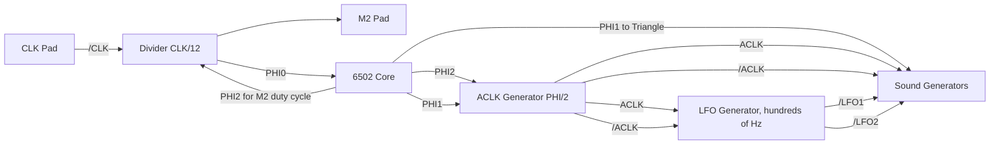

# Timing Generator


The timing generator contains the following components:
- ACLK generator
- Software timer (also known as `Frame Counter`)
- Also implements Daisy-chain interrupt forwarding from DPCM and mixing in its own timer interrupt if needed

## Clock Distribution

The following are the distinctive features of the APU clocks distribution.


|Feature|Description|
|---|---|
|1|/CLK signal from the CLK pad for the divider|
|2|Divider, to obtain the PHI0 clock signal for the core|
|3|PHI0 clock signal (CLK ÷ 12)|
|4|PHI1 clock signal ("left" half of the CPU cycle: "Set Read/Write mode and address")|
|5|PHI2 clock signal ("right" half of the CPU cycle: "Read/Write data")|
|6|PHI2 signal for modulation of M2 signal duty cycle|
|7|M2 signal for external devices|
|8|PHI1 signal for register operations (register operations are inactive during PHI1)|
|9|Output of ACLK and /ACLK signals from the ACLK generator (PHI ÷ 2)|
|10|Output of low frequency oscillation signals /LFO1 and /LFO2 for audio generators|
|11|PHI1 signal is additionally used by the triangle channel to smooth out the "steps" of the signal|
|12|"Others /ACLKs"|

Full size image: https://github.com/emu-russia/breaks/blob/master/Docs/APU/2A03_ACLK_Distrib.png

Simplified chart:




## ACLK Generator

The ACLK generator is used to generate an internal ACLK clock signal (APU CLK), based on the 6502 CPU clock frequency.


The `ACLK` and `/ACLK` signals are not complementary and have an overlap:


|APU|OSC frequency|CLK|PHI|ACLK|
|---|---|---|---|---|
|2A03|21477272 Hz|~46.56 ns|~558.73 ns|~1117.46 ns|
|2A07|26601712 Hz|~37.59 ns|~601.46 ns|~1202.93 ns|

## Software Timer

From the official documentation we know that this component is called `Soft CLK`.

The purpose of this device is to provide the programmer with a tool to add periodic actions to the game program, repeated about every frame.

Soft CLK features:
- Operating modes (normal and extended)
- Generating interrupts
- Timing the remaining APU tone generators with low-frequency signals (`/LFO1`, `/LFO2`)


### Programming Model

Soft CLK is controlled by register $4017 (write-only):
- $4017\[6\]: Mask SoftCLK interrupt (1: interrupt disable, 0: enable)
- $4017\[7\]: LFO Mode (0: normal mode, 1: extended mode)

Bit $4015\[6\] contains the interrupt status.

### Soft CLK Control


- /R4015 and W4017: come from the register selector when reading $4015 and writing to $4017 registers respectively
- D6 and D7: bits 6 and 7 of the internal data bus
- /LFO1 and /LFO2: low frequency output signals
- DMCINT: DPCM interrupt signal
- INT: Joint SoftCLK or DPCM interrupt signal
- RES: internal reset signal (derived from /RES pin)

Soft CLK Counter Control:


Logic:


|Frequency of LFO signals|Mode=0|Mode=1|Where the signal is routed|
|---|---|---|---|
|LFO1|~240 Hz|~192 Hz|Square 0/1, Noise, Triangle|
|LFO2|~120 Hz|~96 Hz|Square 0/1, Length Counters|

### Soft CLK Counter (LFSR)


The outputs of the shift register (in complementary form) are fed to the decoder input (PLA).

### PLA

```
111110
000001
011100
100011
000110
111001
000100
111011
001100
110011
100000
011111
101000
010111
001010
110101
000010
111101
010100
101011
011000
100111
001100
110011
110010
001101
011010
100101
000010
111101
```

The placement is topological. 1 means there is a transistor, 0 means there is no transistor.


Features of using PLA:
- Output 3 is used to generate an interrupt and is simultaneously skipped in Mode=1. Therefore interrupts are only available in Mode=0
- Output 4 is used only in Mode=1
- Output 5 is used to protect against a value of 0 on the LFSR and does not affect the generation of LFO signals
- The PLA outputs, which are involved in the generation of LFO signals, are activated in turn (0,1,2,3 for Mode=0 and 0,1,2,4 for Mode=1)

Table of activation sequence of PLA outputs and duration between activations (number of PHI1 cycles):

|NTSC 2A03|||||
|---|---|---|---|---|
|nLFO1  mode4|PLA0   (7457 )|PLA1 (7457 )|PLA2 (7457 )|PLA3  (7457 )  (SET LFSR)|
|nLFO2  mode4|no|PLA1 (14913)|no|PLA3  (14913) (SET LFSR)|
|nLFO1  mode5|PLA0   (7457 )|PLA1 (7457 )|PLA2 (7457 )|PLA4  (14913) (SET LFSR)|
|nLFO2  mode5|no|PLA1 (14913)|no|PLA4  (22367) (SET LFSR)|

|PAL 2A07|||||
|---|---|---|---|---|
|nLFO1 mode4|PLA0  (8313)|PLA1 (8313)|PLA2 (8313)|PLA3  (8313)   (SET LFSR)|
|nLFO2 mode4|no|PLA1 (16625)|no|PLA3  (16625) (SET LFSR)|
|nLFO1 mode5|PLA0  (8313)|PLA1 (8313)|PLA2 (8313)|PLA4  (16625) (SET LFSR)|
|nLFO2 mode5|no|PLA1 (16625)|no|PLA4  (24939) (SET LFSR)|

(the table does not take into account the slightly floating number of cycles for the last output)

## Other /ACLKs

There are "other" /ACLKs in different parts of the APU.

At first a "other" /ACLK was found in the DPCM/DMA circuit, but then it turned out that they are also found in other parts of the APU. Therefore, these signals are called in order of 2, 3, 4, etc.

In the diagrams :warning: sign marks the places where other `/ACLK` is used.

## /ACLK2

In the very center of the DPCM circuitry is a circuit to produce the "other" /ACLK that is used in [DPCM](dpcm.md) as well as in [sprite DMA](dma.md).
This signal can be found in our circuits as `/ACLK2`.


### /ACLK3

Used for [square wave sound generators](square.md), and more specifically for the $4002/$4003/$4006/$4007 registers.


For the first square channel (Square 0 = A), the signal is called `/ACLK3A`.

For the second square channel (Square 1 = B) the signal is called `/ACLK3B`.

But in the general schematic for the two channels, the signal is simply marked as `/ACLK3`.

### /ACLK4

Used in the [noise generator](noise.md) and [length counter](length.md) control circuitry.


### /ACLK5

Used in I/O latches that generate OUTx signals for the corresponding output terminals.


