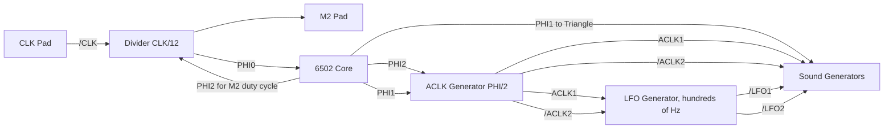

# APU

This section is simply a compilation of all subsections to make it easier to use in neural networks for their fine-tuning.

TODO: Duplicate all image in ASCII art so that they are understood by LLMs which can't analyse pictures.

## APU Contents

- [Overview](#apu-overview)
- [Pinout](#apu-pinout)
- [Common elements of APU circuitry](#common-elements-of-apu-circuitry)
- [6502 Core Binding](#6502-core-binding)
- [Timing Generator](#timing-generator)
- [Register Operations](#register-operations)
- [Sound Generators](#sound-generators)
	- [Length Counters](#length-counters)
	- [Square Channels](#square-channels)
	- [Triangle Channel](#triangle-channel)
	- [Noise Channel](#noise-channel)
	- [Delta Modulation Channel (DPCM)](#differential-pulse-code-modulation-dpcm-channel)
	- [DAC](#dac)
- [Sprite DMA](#sprite-dma-oam-dma)
- [Test Pattern](#test-pattern)

Appendix:

- [Visual 2A03 Signal Mapping](#visual-2a03-signal-mapping)
- [Waves](#waves)
- [Cycles](#apu-cycles)
- [Synchronous analysis](#synchronous-analysis)
- [APU Verilog Model]()

# APU Overview

:warning: At this moment our Wiki is massively renaming /ACLK=ACLK1 and ACLK=/ACLK2 signals to comply with Visual2A03, so there is no misunderstanding. Please be understanding if you find the old signal designations somewhere (/ACLK and ACLK). This will all be renamed in time.

**APU** is the unofficial name for the specialized NES CPU.

The official name is just CPU, but we will stick to the unofficial term.

The chip was developed by Ricoh, chip names are RP2A03 for NTSC and RP2A07 for PAL.


The APU includes:
- MOS 6502 processor core, with disabled decimal correction (BCD) circuit
- Input clock frequency divider
- Software Timer (commonly known as `Frame counter`)
- Sound generators: 2 square channels, 1 triangle, 1 noise generator, Delta PCM
- DMA for sampling DPCM samples
- DACs to convert digital outputs of synthesized sound to analog levels
- DMA to send sprites (hardwired to external PPU register $2004) and dedicated DMA controller
- I/O ports (which are usually used to receive data from controllers in NES)
- Debug registers (not available on Retail consoles)

The DAC makes the APU a semi-analog circuit.

Also to be taken into account is the fact that the 6502 core which is part of the APU is controlled by a DMA controller and therefore is a "common" device sharing the bus with other devices which use DMA.


## Note on Transistor Circuits

The transistor circuits for each component are chopped up into component parts so that they don't take up too much space.

To keep you from getting lost, each section includes a special "locator" at the beginning that marks the approximate location of the component being studied.

An example of a locator:


## Note on Logic Circuits

The logic circuits are mostly made in the Logisim program. The following element is used to denote DLatch:

|DLatch (transistor circuit)|DLatch (logic equivalent)|
|---|---|
|||

For convenience, the logical variant of DLatch has two outputs (`out` and `/out`), since the current value of DLatch (out) is often used as an input of a NOR operation.

# APU Pinout

The study of any IC begins with the pinout.

|Our wiki|Official designations|
|---|---|
|||

|Name|Number|Direction|Description|
|---|---|---|---|
|AUX A|1|APU =>|DAC output of square channels|
|AUX B|2|APU =>|DAC output for the remaining channels (triangle, noise, and DPCM)|
|/RES|3|APU =>|Reset signal|
|A0-A15|4-19|APU =>|Address bus|
|GND|20| |Ground|
|D0-D7|28-21|APU <=>|Data bus|
|CLK|29|=> APU|Master clock|
|DBG|30|=> APU|Debug mode (DBG=1: Enable debug registers, DBG=0: Disable debug registers)|
|M2|31|APU =>|Modified PHI2 6502 core output|
|/IRQ|32|=> APU|Maskable interrupt signal|
|/NMI|33|=> APU|Non-maskable interrupt signal|
|R/W|34|APU =>|Data bus direction (R/W=1: read, R/W=0: write)|
|/IN1|35|APU =>|Read I/O port associated with register $4017|
|/IN0|36|APU =>|Read I/O port associated with register $4016|
|OUT2|37|APU =>|Write to the I/O port associated with register bit $4016\[2\]|
|OUT1|38|APU =>|Write to the I/O port associated with register bit $4016\[1\]|
|OUT0|39|APU =>|Write to the I/O port associated with register bit $4016\[0\]|
|VCC|40| |Power +5V|

## AUX A/B

Considered in the [DAC](#dac) section.

## /RES


From the external `/RES` signal you get the internal reset signal `RES`.

## A0-A15


The value from the internal address bus is directly output to pins A0-A15 (without buffering). During reset (`RES` = 1) - pins A0-A15 are disabled (`z`).

## D0-D7


- `RD` and `WR` are two complementary signals
- When `RD` equals 1 pins D0-D7 act as input
- When `WR` is 1 pins D0-D7 act as output

The internal and external data buses are connected directly (without buffering).

## CLK


## M2


Circuit for obtaining the `NotDBG_RES` signal:


For some reason the circuit contains a disabled "comb" of transistors, which is a chain of inverters of the internal `RES` signal.

In debug mode (when DBG=1) - the external signal M2 is not touched during reset. In regular mode (for Retail consoles) - during reset the external signal M2 is in `z` state (Open-drain).

The M2 duty cycle is made so that the top level of M2 becomes active 1.5 CLK (3 half cycles) before the top level of the PHI2 core. Thus external devices start their bus activity before the built-in 6502 core. When set to read mode, external devices can "advance" the data for the processor. When write mode is set, external devices can "preemptively" free the bus for the processor.

## DBG


## /IRQ


The logic design of this contact is a bit redundant. The value of the /IRQ input terminal generates the value of the internal signal /IRQ (with the same name).

## /NMI


The /NMI contact design is not different from the /IRQ terminal design.

## R/W


The output value of the R/W contact is derived from the internal `RW` signal, and during reset R/W is disabled (when /RES contact = 0 and internal RES line = 1), that is, it has a Z (high-impedance) value.

A small tri-state logic controls the disconnection of the R/W pin.

Some of the push/pull inverters used to delay the R/W line are disabled. Apparently the designers adjusted the propagation delay to trigger the signal.
This same delay line also slows down the internal R/W signal a bit.

## Input/Output Ports

|/INx|OUTx|
|---|---|
|||

The design is not different from the D0-D7 terminals design, except that the analog of the `RD` signal is the internal reset signal (`RES`) and the analog of the `WR` signal is always connected to VCC (equal to 1, i.e. the pin always works as output).

During reset (RES = 1) the In/Out terminals are disconnected. During reset the terminal circuit operates similarly to the D0-D7 terminal circuit, with RD = WR = 1, and this signal value disconnects the terminal (`z`).

- The output value for pins `OUT0-2` is derived from the internal signals `OUT0-2` (with the same name).
- The output value for pins `/IN0-1` is the internal signals `/R4016` and `/R4017` from the register selector.

Circuit for producing OUTx signals:


## Pads Schematics

Truly unidirectional terminals:


Terminals using BIDIR circuit:


As mentioned above, only the data bus uses all the features of the bidirectional terminal. The other pads based on the BIDIR circuit are redundant.

BIDIR pad schematic:


# Common elements of APU circuitry

This section describes APU modules that are used relatively often in different units.

## Register Bit

The register bit:


Used in:
- IO Ports ($4016)
- SoftCLK Regs ($4017)
- Square 0/1 Freq Regs ($4002/$4003, $4006/$4007)
- Square 0/1 Shift/Control Reg ($4001, $4005)
- Square 0/1 Volume/Control Reg ($4000, $4004)
- Triangle Reg ($4008)
- Noise Regs ($400C, $400E)
- Noise Random LFSR
- DPCM Regs ($4010, $4012, $4013)
- DPCM Sample Buffer
- OAM DMA Address (high bits)

## Counters

|Counter name|Counter direction|Bit depth|Counter reset|Output carry|Output value|
|---|---|---|---|---|---|
|Square Sweep|Down|3|yes|yes|no|
|Square Freq|Down|11|yes|yes|no|
|Square Duty|Down|3|yes or W4003(7)|no|yes|
|Square Decay|Down|4|yes|yes|no|
|Square Envelope|Down|4|yes|yes|yes|
|Triangle Freq|Down|11|yes|yes|no|
|Triangle Linear|Down|7|yes|yes|no|
|Triangle Output|Up|5|yes|no|yes|
|Noise Decay|Down|4|yes|yes|no|
|Noise Envelope|Down|4|yes|yes|yes|
|DPCM Address|Up|15|yes|no|yes|
|DPCM Sample bit|Up|3|yes|yes|no|
|DPCM Sample length|Down|12|yes|yes|no|
|DPCM Output|Reversible|6|yes|yes|yes|
|OAM DMA (low bits)|Up|8|yes or W4014|yes|yes|
|Length|Down|8|yes|yes|no|

### Up Counter

The bit of the `up` counter:


### Down Counter

The bit of the `down` counter:


### Reversible (Up/Down) Counter

The bit of the `reversible` counter:


## Load/Step Circuit

This typical circuit is often used to produce "Load" and "Step" signals for various counters.


# 6502 Core Binding


This section describes the features of the core and the surrounding auxiliary logic designed to integrate with the rest of the components.

The 6502 core and surrounding logic includes the following entities:
- Master clock signal and clock divider
- Binding the terminals of the 6502 core to the rest of the APU
- 6502 core

## Signals

|Signal|From|Where to|Description|
|---|---|---|---|
|CLK|CLK Pad|Divider|Input CLK|
|/M2|Divider|M2 Pad|Intermediate signal for M2 terminal ( inverse polarity)|
|DBG|DBG Pad|Test|1: Activation of test mode. In 2A03 the debug registers become available. In 2A07 it is converted to RDY2 signal (DBG=1 -> RDY2=0), essentially acting as a debugging WAIT|
|NotDBG_RES|Test|M2 Pad|Intermediate signal for controlling the M2 terminal under reset and test mode conditions|
|RES|/RES Pad|All|Global reset signal. Spreads to almost all corners of the APU|
|R/W|CPU Core|DMABuffer, Reg Select, OAM DMA, DPCM DMA|6502 core terminal. When applied to DMA it is used to detect CPU read cycle, to set RDY terminal appropriately|
|/NMI|/NMI Pad|CPU Core|From the /NMI terminal, the signal goes almost immediately to the core (not counting the intermediate inverters)|
|INT|SoftCLK|IRQ Combine|Combined DPCM and/or Timer interrupt from SoftCLK (which acts also as a Daisy Chain)|
|/IRQ|/IRQ Pad|IRQ Combine|The external interrupt signal is combined with the INT signal from SoftCLK|
|/IRQ_INT|IRQ Combine|CPU Core|Combined interrupt signal for the core|
|PHI0|Divider|CPU Core|Base clock signal for the core|
|PHI1|CPU Core|SoftCLK, Triangle|The first half of the core cycle|
|PHI2|CPU Core|SoftCLK|The second half of the core cycle|
|RW|DMABuffer|R/W Pad|The external R/W terminal is controlled by the DMABuffer circuit|
|WR|DMABuffer|External DataBus Pads|1: Write mode for external data bus terminals|
|RD|DMABuffer|External DataBus Pads|1: Read mode for external data bus terminals|
|RDY|OAM DMA|CPU Core|Readiness signal for the core. The core readiness is controlled by the OAM DMA circuit|
|RDY2|Test|CPU Core|An additional test signal for core readiness. In 2A03 it is always 1. In 2A07 it can be controlled externally using the DBG Pad|
|SPR/PPU|OAM DMA|DMABuffer|DMABuffer mode (1: Write to register $2004, 0: Read the next byte for OAM DMA from memory)|
|/DBGRD|Reg Select|DMABuffer|0: The APU register is read and the test mode is enabled (DBG=1)|
|CPU_A\[15:0\]|CPU Core|Reg Predecode, Address Mux|The 6502 core address bus. Participates in selecting the APU registers address space and for address multiplexing|
|A\[15:0\]|Address Mux|External Address Pads|Output value from the address multiplexer for AB terminals. Also involved in selecting a specific APU register|
|D\[7:0\]|Internal DataBus|External DataBus Pads|Internal data bus, to which the 6502 core is also connected|

As you can see the signals associated with the core are very tightly twisted. Yes, this part in APU is the most complicated, in sound generators everything is much simpler and more straightforward.

## Divider

The divider is a Johnson counter.


(The diagram is placed "on its side" for convenience).

General purpose schematic:


Schematic for 2A03:


The shift register bit of the divider:


## Connecting the 6502 and APU

This section discusses the connections between the 6502 core terminals and the APU.

### /NMI and /IRQ

Auxiliary logic for NMI and IRQ processing:

|Circuit|Description|
|---|---|
||Just intermediate inverters|
||/IRQ_INT: Combination of external and internal interrupt.|

/NMI terminal:


/IRQ terminal:


### RDY


Next to the RDY input there is another transistor, which in the NTSC APU is always open (RDY2=1). The PAL APU uses the /DBG signal (inversion of the signal from the external DBG terminal) instead of the constant RDY2 signal.

### /RES


There is an inverter on the /RES terminal input to invert the internal `RES` signal.

### PHI0, PHI1, PHI2

Generation of internal PHI signals:


Generation of external PHI signals:

|PHI1|PHI2|
|---|---|
|||

Nothing unusual.

### SO


The SO terminal is always connected to `1`. Technically this is fine, because the SO input has a falling edge detector.

### R/W


Nothing unusual.

The `RW` signal does not come directly from the terminal `R/W` of the 6502 core, but is obtained in the buffer circuit for sprite DMA (see below).

### SYNC

The SYNC terminal is not connected to anything (floating):


### D0-D7

The 6502 core terminals connect directly to the internal data bus D0-D7.

Signal `RD` schematic:


Buffer for sprite DMA:


Not very appropriate, but I have to say it here, because in addition to storing data for the sprite DMA this circuit also produces the `WR` signal for the external data bus pads, as well as the `RW` signal.

:warning: It just so happens that the 6502 core signal `R/W` is very similar in name to the `RW` signal which goes to the external R/W pad. Don't get confused :smiley:


### A0-A15

The outputs of the 6502 core address bus are associated with the internal CPU_A0-15 signals.

For CPU_A14 there is additionally an inverter that is used in the APU register address predecoding circuitry.

## Embedded 6502 Core

The 6502 core looks like a downsized copy of the original MOS processor.

After detailed study of 2A03 circuit following results were obtained:
- No differences were found in the instruction decoder
- Flag D works as expected, it can be set or reset by CLD/SED instructions; it is used in the regular way during interrupt processing (saved on stack) and after execution of PHP/PLP, RTI instructions.
- Random logic, responsible for generating the two control signals `/DAA` (decimal addition adjust) and `/DSA` (decimal subtraction adjust) works unchanged.

The difference lies in the fact that the control signals `/DAA` and `/DSA`, which enable decimal correction, are disconnected from the circuit, by cutting 5 pieces of polysilicon (see picture). Polysilicon marked as purple, missing pieces marked as cyan.

|Original circuit of the 6502|Missing poly in the APU|
|---|---|
|||

As result decimal carry circuit and decimal-correction adders do not work. Therefore, the embedded processor of APU always considers add/sub operands as binary numbers, even if the D flag is set.

The research process: http://youtu.be/Gmi1DgysGR0

The key parts of the analysis (decoder, random logic, flags and ALU) are shown in the following image:


To understand more about the differences in the operation of the BCD circuit, it is recommended to study the design of the 6502 ALU.

# Timing Generator


The timing generator contains the following components:
- ACLK generator
- Software timer (also known as `Frame Counter`)
- Also implements Daisy-chain interrupt forwarding from DPCM and mixing in its own timer interrupt if needed

## Clock Distribution

The following are the distinctive features of the APU clocks distribution.


|Feature|Description|
|---|---|
|1|/CLK signal from the CLK pad for the divider|
|2|Divider, to obtain the PHI0 clock signal for the core|
|3|PHI0 clock signal (CLK ÷ 12)|
|4|PHI1 clock signal ("left" half of the CPU cycle: "Set Read/Write mode and address")|
|5|PHI2 clock signal ("right" half of the CPU cycle: "Read/Write data")|
|6|PHI2 signal for modulation of M2 signal duty cycle|
|7|M2 signal for external devices|
|8|PHI1 signal for register operations (register operations are inactive during PHI1)|
|9|Output of ACLK1 and /ACLK2 signals from the ACLK generator (PHI ÷ 2)|
|10|Output of low frequency oscillation signals /LFO1 and /LFO2 for audio generators|
|11|PHI1 signal is additionally used by the triangle channel to smooth out the "steps" of the signal|
|12|"Others ACLK2"|

Full size image: https://github.com/emu-russia/breaks/blob/master/Docs/APU/2A03_ACLK_Distrib.png

Simplified chart:




## ACLK Generator

The ACLK generator is used to generate an internal ACLK clock signal (APU CLK), based on the 6502 CPU clock frequency.


The `ACLK1` and `/ACLK2` signals are not complementary and do not overlap:


|APU|OSC frequency|CLK|PHI|ACLK|
|---|---|---|---|---|
|2A03|21477272 Hz|~46.56 ns|~558.73 ns|~1117.46 ns|
|2A07|26601712 Hz|~37.59 ns|~601.46 ns|~1202.93 ns|

## Software Timer

From the official documentation we know that this component is called `Soft CLK`.

The purpose of this device is to provide the programmer with a tool to add periodic actions to the game program, repeated about every frame.

Soft CLK features:
- Operating modes (normal and extended)
- Generating interrupts
- Timing the remaining APU tone generators with low-frequency signals (`/LFO1`, `/LFO2`)


### Programming Model

Soft CLK is controlled by register $4017 (write-only):
- $4017\[6\]: Mask SoftCLK interrupt (1: interrupt disable, 0: enable)
- $4017\[7\]: LFO Mode (0: normal mode, 1: extended mode)

Bit $4015\[6\] contains the interrupt status.

### Soft CLK Control


- /R4015 and W4017: come from the register selector when reading $4015 and writing to $4017 registers respectively
- D6 and D7: bits 6 and 7 of the internal data bus
- /LFO1 and /LFO2: low frequency output signals
- DMCINT: DPCM interrupt signal
- INT: Joint SoftCLK or DPCM interrupt signal
- RES: internal reset signal (derived from /RES pin)

Soft CLK Counter Control:


Logic:


|Frequency of LFO signals|Mode=0|Mode=1|Where the signal is routed|
|---|---|---|---|
|LFO1|~240 Hz|~192 Hz|Square 0/1, Noise, Triangle|
|LFO2|~120 Hz|~96 Hz|Square 0/1, Length Counters|

### Soft CLK Counter (LFSR)


The outputs of the shift register (in complementary form) are fed to the decoder input (PLA).

### PLA

```
111110
000001
011100
100011
000110
111001
000100
111011
001100
110011
100000
011111
101000
010111
001010
110101
000010
111101
010100
101011
011000
100111
001100
110011
110010
001101
011010
100101
000010
111101
```

The placement is topological. 1 means there is a transistor, 0 means there is no transistor.


Features of using PLA:
- Output 3 is used to generate an interrupt and is simultaneously skipped in Mode=1. Therefore interrupts are only available in Mode=0
- Output 4 is used only in Mode=1
- Output 5 is used to protect against a value of 0 on the LFSR and does not affect the generation of LFO signals
- The PLA outputs, which are involved in the generation of LFO signals, are activated in turn (0,1,2,3 for Mode=0 and 0,1,2,4 for Mode=1)

Table of activation sequence of PLA outputs and duration between activations (number of PHI1 cycles):

|NTSC 2A03|||||
|---|---|---|---|---|
|nLFO1  mode4|PLA0   (7457 )|PLA1 (7457 )|PLA2 (7457 )|PLA3  (7457 )  (SET LFSR)|
|nLFO2  mode4|no|PLA1 (14913)|no|PLA3  (14913) (SET LFSR)|
|nLFO1  mode5|PLA0   (7457 )|PLA1 (7457 )|PLA2 (7457 )|PLA4  (14913) (SET LFSR)|
|nLFO2  mode5|no|PLA1 (14913)|no|PLA4  (22367) (SET LFSR)|

|PAL 2A07|||||
|---|---|---|---|---|
|nLFO1 mode4|PLA0  (8313)|PLA1 (8313)|PLA2 (8313)|PLA3  (8313)   (SET LFSR)|
|nLFO2 mode4|no|PLA1 (16625)|no|PLA3  (16625) (SET LFSR)|
|nLFO1 mode5|PLA0  (8313)|PLA1 (8313)|PLA2 (8313)|PLA4  (16625) (SET LFSR)|
|nLFO2 mode5|no|PLA1 (16625)|no|PLA4  (24939) (SET LFSR)|

(the table does not take into account the slightly floating number of cycles for the last output)

## Other ACLK2

There are "other" ACLK2 in different parts of the APU. This is essentially an inversion of the /ACLK2 signal used "in place". But to separate them, they are numbered in ascending order: 2, 3, etc.

At first a "other" ACLK2 was found in the DPCM/DMA circuit, but then it turned out that they are also found in other parts of the APU. Therefore, these signals are called in order of 2, 3, 4, etc.

In the diagrams :warning: sign marks the places where other `ACLK2` is used.

## ACLK2

In the very center of the DPCM circuitry is a circuit to produce the "other" ACLK2 that is used in [DPCM](#differential-pulse-code-modulation-dpcm-channel) as well as in [sprite DMA](#sprite-dma-oam-dma).
This signal can be found in our circuits as `ACLK2`.


### ACLK3

Used for [square wave sound generators](#square-channels), and more specifically for the $4002/$4003/$4006/$4007 registers.


For the first square channel (Square 0 = A), the signal is called `ACLK3A`.

For the second square channel (Square 1 = B) the signal is called `ACLK3B`.

But in the general schematic for the two channels, the signal is simply marked as `ACLK3`.

### ACLK4

Used in the [noise generator](#noise-channel) and [length counter](#length-counters) control circuitry.


### ACLK5

Used in I/O latches that generate OUTx signals for the corresponding output terminals.


# Register Operations


|Signal|From|Where to|Description|
|---|---|---|---|
|R/W|CPU Core|DMABuffer, Reg Select, OAM DMA, DPCM DMA|6502 core terminal. When applied to DMA it is used to detect CPU read cycle, to set RDY terminal appropriately|
|/DBGRD|Reg Select|DMABuffer|0: The APU register is read and the test mode is enabled (DBG=1)|
|CPU_A\[15:0\]|CPU Core|Reg Predecode, Address Mux|The 6502 core address bus. Participates in selecting the APU registers address space and for address multiplexing|
|A\[15:0\]|Address Mux|External Address Pads|Output value from the address multiplexer for AB terminals. Also involved in selecting a specific APU register|
|/REGRD|Reg Predecode|Reg Select|0: The APU register is being read from the 6502 core side|
|/REGWR|Reg Predecode|Reg Select|0: Writing to the APU register on the 6502 core side|
|/R4015|Reg Select|SoftCLK, DMABuffer, Length, DPCM|0: Read register $4015. Note that this operation is additionally tracked in the DMABuffer.|
|/R4016|Reg Select|IOPorts|0: Read register $4016|
|/R4017|Reg Select|IOPorts|0: Read register $4017|
|/R4018|Reg Select|Test|0: Read debug register $4018 (2A03 only)|
|/R4019|Reg Select|Test|0: Read debug register $4019 (2A03 only)|
|/R401A|Reg Select|Test|0: Read debug register $401A (2A03 only)|
|W4000|Reg Select|Square0|1: Write register $4000|
|W4001|Reg Select|Square0|1: Write register $4001|
|W4002|Reg Select|Square0|1: Write register $4002|
|W4003|Reg Select|Square0|1: Write register $4003|
|W4004|Reg Select|Square1|1: Write register $4004|
|W4005|Reg Select|Square1|1: Write register $4005|
|W4006|Reg Select|Square1|1: Write register $4006|
|W4007|Reg Select|Square1|1: Write register $4007|
|W4008|Reg Select|Triangle|1: Write register $4008|
|W400A|Reg Select|Triangle|1: Write register $400A|
|W400B|Reg Select|Triangle|1: Write register $400B|
|W400C|Reg Select|Noise|1: Write register $400C|
|W400E|Reg Select|Noise|1: Write register $400E|
|W400F|Reg Select|Noise|1: Write register $400F|
|W4010|Reg Select|DPCM|1: Write register $4010|
|W4011|Reg Select|DPCM|1: Write register $4011|
|W4012|Reg Select|DPCM|1: Write register $4012|
|W4013|Reg Select|DPCM|1: Write register $4013|
|W4014|Reg Select|OAM DMA|1: Write register $4014|
|W4015|Reg Select|Length, DPCM|1: Write register $4015|
|W4016|Reg Select|IOPorts|1: Write register $4016|
|W4017|Reg Select|SoftCLK|1: Write register $4017|
|W401A|Reg Select|Test, Triangle|1: Write debug register $401A (2A03 only)|
|SQA\[3:0\]|Square0|AUX A|Output digital value of the Square0 sound generator|
|SQB\[3:0\]|Square1|AUX A|Output digital value of the Square1 sound generator|
|TRI\[3:0\]|Triangle|AUX B|Output digital value of the Triangle sound generator|
|RND\[3:0\]|Noise|AUX B|Output digital value of the Noise sound generator|
|DMC\[6:0\]|DPCM|AUX B|Output digital value of the DPCM sound generator|
|LOCK|Lock FF|Square0, Square1, Triangle, Noise, DPCM|To lock the volume of the audio generators so that you can read the value using the debug registers|

Pre-decoder, to select the address space of the APU registers:


- PDSELR: Intermediate signal to form the 12-nor element to produce the `/REGRD` signal
- PDSELW: Intermediate signal to form the 12-nor element to produce the `/REGWR` signal

R/W decoder for register operations:


Selecting a register operation:


:warning: The APU registers address space is selected by the value of the CPU address bus (`CPU_Ax`). But the choice of register is made by the value of the address, which is formed at the address multiplexer of DMA-controller (signals A0-A4).

Bitmask:

```
101010110100
110010110100
101100110100
001100110101

110011001100
010100101011
001100101011
010101001011
010010101011

001011001011
010011001011
001011010011
001101001011
001010101011

001010110011
010011001101
001100110011
010010101101
010100110011

010101010011
001101010011
110101001100
010100101101
101101001100

001100101101
001101001101
001010101101
010101001101
001011001101
```

The bit mask is topological. 1 means there is a transistor, 0 means no transistor.


## Debug Interface

:warning: The debug hookup is only available in 2A03. The PAL version of the APU (2A07) does not contain any debugging mechanisms (except RDY2).

Auxiliary circuits for internal `DBG` signal:

|Amplifying inverter|Intermediate inverter|/DBGRD Signal|
|---|---|---|
||||

Transistor circuits for reading debugging values of sound generators:

|Channel|Circuit|Register operation|Value|Where|
|---|---|---|---|---|
|Square 0||/R4018|SQA\[3:0\]|D\[3:0\]|
|Square 1||/R4018|SQB\[3:0\]|D\[7:4\]|
|Triangle||/R4019|TRI\[3:0\]|D\[3:0\]|
|Noise||/R4019|RND\[3:0\]|D\[7:4\]|
|DPCM||/R401A|DMC\[6:0\]|D\[6:0\]|

Register operations with debug values are available only when DBG = 1.

Circuit for reading the debug value:


LOCK circuit:

|||
|---|---|

The `LOCK` signal is used to suspend or disconnect the audio generators from the output so that the current volume values are latched and can be read using the debug registers.

# Sound Generators

The APU contains the following audio channels (official designations):
- Sound A: Rectangular pulse tone generator (Square 0)
- Sound B: Rectangular pulse tone generator (Square 1)
- Sound C: Triangular tone generator
- Sound D: Noise generator
- Sound E: Channel for sample playback using delta modulation (direct playback of PCM samples is also available)

All circuits for generating sound are, for the most part, various counters controlled by simple control circuits.


(In addition to the audio generators themselves, the diagram also shows the OAM DMA, as it interacts closely with the DPCM DMA).

## Timing

The sound generators are clocked by the following signals:
- PHI1/2: CPU Core clock frequency
- ACLK: Audio CLK. Two times slower PHI, with a special non-overlapping phase pattern
- LFO1/2: Low frequency oscillation signals (on the order of hundreds of Hertz)

The developers decided to use PHI1 for the triangle channel instead of ACLK to smooth out the "stepped" signal.

## Sweep

Sweep is a time-constant increase or decrease in signal frequency (period). It affects pitch (tonality).

The word `Sweep` does not translate into other languages.

In APU it is used only in square channels.


## Envelope

Envelope is the constant fading of the signal amplitude (as applied to APU audio generators).

Envelope is a special case of ADSR, and specifically is a Decay component.

In APU it is used in square channels and noise generator.


## Duty

Duty is a change in the duty cycle of a square wave signal.

In APU it is used only in square channels.


# Length Counters


The schematics of all four counters are identical, the only difference is in the signals (see below). For this reason, only the Square0 counter is shown in the drawings.

## Signals

|Signal|From where|Where to|Description|
|---|---|---|---|
|/LFO2|SoftCLK|Length Counters|Low frequency oscillation signal|
|SQA_LC|Square 0|Length Counters|Input carry for Square0 LC|
|SQB_LC|Square 1|Length Counters|Input carry for Square1 LC|
|TRI_LC|Triangle|Length Counters|Input carry for Triangle LC|
|RND_LC|Noise|Length Counters|Input carry for Noise LC|
|NOSQA|Length Counters|Square 0|Square0 LC does not count / disabled|
|NOSQB|Length Counters|Square 1|Square1 LC does not count / disabled|
|NOTRI|Length Counters|Triangle|Triangle LC does not count / disabled|
|NORND|Length Counters|Noise|Noise LC does not count / disabled|

|Counter|Input carry signal|End of count signal|Load counter signal|
|---|---|---|---|
|Square0|SQA_LC|NOSQA|W4003|
|Square1|SQB_LC|NOSQB|W4007|
|Triangle|TRI_LC|NOTRI|W400B|
|Noise|RND_LC|NORND|W400F|

## Length Decoder


|Decoder In|Decoder Out|
|---|---|
|0|0x9|
|1|0xfd|
|2|0x13|
|3|0x1|
|4|0x27|
|5|0x3|
|6|0x4f|
|7|0x5|
|8|0x9f|
|9|0x7|
|10|0x3b|
|11|0x9|
|12|0xd|
|13|0xb|
|14|0x19|
|15|0xd|
|16|0xb|
|17|0xf|
|18|0x17|
|19|0x11|
|20|0x2f|
|21|0x13|
|22|0x5f|
|23|0x15|
|24|0xbf|
|25|0x17|
|26|0x47|
|27|0x19|
|28|0xf|
|29|0x1b|
|30|0x1f|
|31|0x1d|

The first stage of the decoder (5-to-32 demultiplexer):

```
1010101010
1001101010
1010011010
1001011010
1010100110
1001100110
1010010110
1001010110

1010101001
1001101001
1010011001
1001011001
1010100101
1001100101
1010010101
1001010101

0110101010
0101101010
0110011010
0101011010
0110100110
0101100110
0110010110
0101010110

0110101001
0101101001
0110011001
0101011001
0110100101
0101100101
0110010101
0101010101
```

The bit mask is topological. 1 means there is a transistor, 0 means no transistor.


The second stage of the decoder:

```
01000111
00100111
01100111
00010111
01010111
00110111
01110111
00001111

01001111
00101111
01101111
00011111
01011111
00111111
01111111
01000000

00000111
00001111
00011101
00000010
00000101
00001011
00010111
00101111

01100111
01001111
00100011
00000110
00001101
00011011
00110111
01101111
```

The bit mask is topological. 1 means there is a transistor, 0 means no transistor.


## Length Counter Control


## Length Counter

The usual down counter.


# Square Channels


The APU contains two square wave tone generators. The circuits mirror each other, so let's consider only the tone generator of the first square channel (SQUARE 0, located on the right side).

The difference between SQUARE0 and SQUARE1 is the input carry design for the adder:
- For SQUARE0, the input carry is connected to Vdd.
- For SQUARE1 the input carry is connected to the `INC` signal

Sometimes instead of Square0/Square1 we have the designation SquareA/SquareB.


## Frequency Reg


## Shift Reg

Contains the shift value for the shifter (0...7).


## Barrel Shifter

Shifts the 12-bit value to the right with the sign (the msb bit shifts to the right and fills all other bits). The most significant bit is then discarded, forming an 11-bit result.


## Adder

A distinctive feature of the adder is the complementary layout of the a/b signals between the bits and the complementary carry chain, as well as the inverse polarity of the result (`#sum`) and output carry (`#COUT`).


## Frequency Counter


## Envelope

Decay Counter:


Envelope Counter:


The circuit is identical to the Envelope circuit in the noise generator.


|EnvelopeUnit Signal|Square0 Channel|Square1 Channel|
|---|---|---|
|WR_Reg|W4000|W4004|
|WR_LC|W4003|W4007|
|LC|SQA/LC|SQB/LC|

## Sweep

|Signal/Group|From Where|Where To|Description|
|---|---|---|---|
|DO_SWEEP|Sweep|Freq Reg|The main signal that controls the Sweep process of the frequency value loaded in the Freq Reg. The signal is set only during PHI1, so as not to conflict with the register writes by the CPU, which only occur during PHI2.|
|SR\[2:0\], SRZ|Shift Reg|Sweep,Shifter|Determines the shift magnitude of the source frequency. If SR=0, the DO_SWEEP signal is never generated (obviously)|
|DEC (and its complement INC)|Dir Reg|Sweep,Shifter,Adder|Defines the direction of frequency step (DEC=1: frequency decreases, DEC=0: frequency increases)|
|#COUT|Adder|Sweep|Adder output carry (inverse polarity)|
|SW_OVF|Sweep|Sweep,Output|Equals 1 when INC=1 and adder output carry is active. When SW_OVF=1 - DO_SWEEP is 0. That is the Sweep process does not happen at frequency overflow (obviously)|
|SW_UVF|Adder|Sweep,Output|1: Frequency value is less than 4 (Freq Reg bits \[10:2\] are zeros). When SW_UVF=1 - DO_SWEEP is 0. That is, when the frequency is too low it makes no sense to do Sweep|
|NOSQ|Length Counter|Common|1: The length counter has finished counting/deactivated. When the length counter is disabled the DO_SWEEP signal is never generated (obviously)|
|/LFO2|SoftCLK|Common|Low-frequency oscillation signal (inverse polarity). When applied to Sweep - it resets the Sweep counter with a value from the Sweep Reg|
|SCO|Sweep|Sweep|Sweep Counter output carry. While Sweep Counter is counting - DO_SWEEP is 0|
|SWRELOAD|Sweep|Sweep|1: Perform a Sweep Counter restart|
|SWDIS|Register WR1\[3\]|Sweep|1: Disable Sweep process, DO_SWEEP is always 0|

By carefully examining and understanding all the signals that are used in the Sweep Unit you can get a picture of what is going on:
- The main driver of the Sweep process is the DO_SWEEP signal. When this signal is activated the frequency modulation process in the Freq Reg is started using the shift register and the adder
- The Sweep counter iterates with the low frequency oscillation signal `/LFO2`
- The Sweep counter is overloaded by itself with the value from the Sweep Reg register, at the same time the DO_SWEEP signal is triggered (if all conditions are met, see below)

Sweep does NOT occur under the following conditions (in the schematic it is a large NOR):
- Sweep is disabled by the appropriate control register (SWDIS)
- A square channel length counter has finished counting or has been disabled (NOSQ)
- The magnitude value of the Shift Reg is 0 (SRZ)
- Frequency value led to an overflow of the adder, in the frequency increase mode (SW_OVF)
- Frequency value is less than 4 (SW_UVF)
- Sweep counter has not completed its work (SCO=0)
- Low-frequency oscillation signal is not active (/LFO2=1)


Sweep Counter:


## Duty

Duty Counter:


Principle of operation:
- The FLOAD signal used to load the frequency counter is simultaneously used to iterate the Duty counter
- Loading the length counter clears the Duty counter of the corresponding square channel
- Frequency counter output carry (FCO signal) is the input carry for the Duty counter
- When the `DUTY` signal is 0 at the output of the square generator is also 0

Table of DUTY signal values depending on Duty counter values and Duty register settings (d):

|Duty counter value|d=0 (12.5%)|d=1 (25%)|d=2 (50%)|d=3 (75%)|
|---|---|---|---|---|
|7|1|1|1|0|
|6|0|1|1|0|
|5|0|0|1|1|
|4|0|0|1|1|
|3|0|0|0|1|
|2|0|0|0|1|
|1|0|0|0|1|
|0|0|0|0|1|

## Output


# Triangle Channel


## Signals

|Signal|Description|
|---|---|
|/LFO1|Low-frequency oscillation signal 1/4 period (inverse polarity)|
|NOTRI|Triangle LC does not count / is disabled|
|TRI/LC|Input carry for Triangle LC|
|TCO|Output carry from a Linear Counter|
|FOUT|Output carry from Frequency Counter|
|TLOAD|Load Linear Counter|
|TSTEP|Step Frequency Counter|
|FLOAD|Load Frequency Counter|
|FSTEP|Step Frequency Counter|
|TTSTEP|Step Output Counter|

The developers decided to use PHI1 for the triangular channel in some places instead of ACLK to smooth out the "stepped" signal.

## Triangle Control


## Linear Counter

7-bit DownCounter.


## Frequency Counter

11-bit DownCounter.


## Output

5-bit UpCounter. The most significant bit controls the direction of the "saw".


# Noise Channel


## Frequency Reg


A variation of the register with an additional reset (immediately on the latch) is used.

## Decoder


The first stage of the decoder (4-to-16 demultiplexer):

```
00000000 11111111
11111111 00000000
00001111 00001111
11110000 11110000
00110011 00110011
11001100 11001100
01010101 01010101
10101010 10101010
```

The second stage of the decoder:

```
11101111 11111111
10001011 11110111
00111100 11001111
11111110 11110011
01100111 00011111
11110010 00000011
11111111 11000111
11011110 11100001
11011001 01111111
11000001 00010000
11011010 00000111
```

The bit mask is topological. 1 means there is a transistor, 0 means no transistor.

|||
|---|---|

|Decoder In|Decoder Out|
|---|---|
|0|0x002|
|1|0x00a|
|2|0x0aa|
|3|0x2bb|
|4|0x139|
|5|0x173|
|6|0x063|
|7|0x067|
|8|0x1a9|
|9|0x106|
|10|0x227|
|11|0x062|
|12|0x642|
|13|0x20f|
|14|0x300|
|15|0x140|

## Frequency LFSR


## Random LFSR


The shift register design for Random LFSR is different in that the value is stored in a register (static memory), because significant time can pass between shifts of the value and therefore you can not use shift registers on a dynamic memory (DLatch).

## Envelope


The circuit is identical to the Envelope of square channels. On the transistor circuit the labels of the intermediate signals may be different, but don't pay attention to this, the context should be clear.


|EnvelopeUnit Signal|Noise Channel|
|---|---|
|WR_Reg|W400C|
|WR_LC|W400F|
|LC|RND/LC|

## Output


# Differential Pulse-code Modulation (DPCM) Channel


This device is used to generate PCM audio:
- The $4011 output register is a reverse counter that counts down if the next bitstream bit is 0 or up if the next bitstream bit is 1
- It is also possible to load a value directly into the $4011 register for Direct Playback
- Everything else is a set of counters and control logic to organize the DMA process
- DPCM DMA does not use [sprite DMA](#sprite-dma-oam-dma) facilities, but instead arranges its own buffer to store the selected PCM sample. The `RUNDMC` control signal is used to intercept control over sprite DMA.

The difference between DMC DMA and Sprite DMA is that DMC DMA interrupts the processor (RDY = 0) only while the next sample is fetched.


Inputs:

|Signal|From where|Description|
|---|---|---|
|ACLK1|Soft CLK|APU Clock (first core cycle)|
|/ACLK2|Soft CLK|APU Clock (second core cycle, complement)|
|PHI1|CPU|First half of the CPU cycle. It is used only to detect the Read Cycle of the 6502 core and to load samples. All internal counters and most of the control circuits are clocked by ACLK.|
|RES|RES Pad|External reset signal|
|R/W|CPU|CPU data bus mode (1: Read, 0: Write)|
|LOCK|Core|The LOCK signal is used to temporarily suspend the sound generators so that their values can be fixed in the debug registers|
|W401x|Reg Select|1: $401x register write operation|
|/R4015|Reg Select|0: $4015 register read operation|

Outputs:

|Signal|Where|Description|
|---|---|---|
|#DMC/AB|Address MUX|0: Gain control of the address bus to read the DPCM sample|
|RUNDMC|SPR DMA|1: DMC is minding its own business and hijacks DMA control|
|DMCRDY|SPR DMA|1: DMC Ready. Used to control processor readiness (RDY)|
|DMCINT|Soft CLK|1: DMC interrupt is active|
|DMC Out|DAC|Output value for DAC|
|DMC Address|Address MUX|Address for reading the DPCM sample|

DMC internal state control signals:

|Signal|From where|Where to|Description|
|---|---|---|---|
|DSLOAD|DPCM Control|Sample Counter, DPCM Address Counter|Load value into Sample Counter and simultaneously into DPCM Address Counter|
|DSSTEP|DPCM Control|Sample Counter, DPCM Address Counter|Perform Sample Counter decrement and DPCM Address Counter increment simultaneously|
|BLOAD|DPCM Control|Sample Buffer|Load value into Sample Shift Register|
|BSTEP|DPCM Control|Sample Buffer|Perform a Sample Shift Register bit shift|
|NSTEP|DPCM Control|Sample Bit Counter|Perform Sample Bit Counter increment|
|DSTEP|DPCM Control|DPCM Output|Increment/decrement the DPCM Output counter|
|PCM|DPCM Control|Sample Buffer|Load new sample value into Sample Buffer. The signal is active when PHI1 = 0 and the address bus is captured (imitating CPU reading)|
|LOOP|$4010\[6\]|DPCM Control|1: DPCM looped playback|
|/IRQEN|$4010\[7\]|DPCM Control|0: Enable interrupt from DPCM|
|DOUT|DPCM Output|DPCM Control|DPCM Out counter has finished counting|
|/NOUT|Sample Bit Counter|DPCM Control|0: Sample Bit Counter has finished counting|
|SOUT|Sample Counter|DPCM Control|Sample Counter has finished counting|
|DFLOAD|LFSR|DPCM Control|Frequency LFSR finished counting and reloaded itself|
|n_BOUT|Sample Buffer|DPCM Output|The next bit value pushed out of the Sample Buffer shift register (inverted value)|

The majority of control signals are of the same nature:
- xLOAD: Load new value
- xSTEP: Perform some action
- xOUT: Counter finished counting

An exception is the DFLOAD command: Frequency LFSR reloads itself after counting, but at the same time signals to the main control unit.

## DPCM Control Summary


## DPCM Control Register ($4010)

|||
|---|---|

## DPCM Interrupt Control

|||
|---|---|

## DPCM Enable Control

|||
|---|---|

## DPCM DMA Control

|||
|---|---|

## DPCM Sample Counter Control


(The second part of the circuit also controls the Sample Bit Counter)


## DPCM Sample Buffer Control


## DPCM Sample Counter Register ($4013)

|||
|---|---|

## DPCM Sample Counter

Down counter is used.

|||
|---|---|

## DPCM Sample Buffer

|||
|---|---|

Shift register:

|||
|---|---|

## DPCM Sample Bit Counter

Up counter is used.

|||
|---|---|

## DPCM Decoder


PLA1 is a regular 4-in-16 demultiplexer and PLA2 generates the input value to load into the LFSR.

|Decoder In|Decoder Out|
|---|---|
|0|0x173|
|1|0x08A|
|2|0x143|
|3|0x0DB|
|4|0x1EE|
|5|0x03F|
|6|0x07D|
|7|0x1D1|
|8|0x009|
|9|0x0DC|
|10|0x0F1|
|11|0x0F9|
|12|0x08D|
|13|0x189|
|14|0x18E|
|15|0x156|

|PLA1|PLA2|
|---|---|
|||

The first stage of the decoder (4-to-16 demultiplexer):

```
10101010
01101010
10011010
01011010
10100110
01100110
10010110
01010110

10101001
01101001
10011001
01011001
10100101
01100101
10010101
01010101
```

The second stage of the decoder:

```
100101010
100011100
011011100
010011101
011000001
011100001
110001001
011011111

011101000
010000011
000000111
100010000
001001001
001111010
101011101
001100010
```

The bit mask is topological. 1 means there is a transistor, 0 means no transistor.

## DPCM Frequency Counter LFSR

|||
|---|---|

LFSR:

|||
|---|---|

## DPCM Address Register ($4012)

|||
|---|---|

## DPCM Address Counter

Up counter is used.

|Low|High|
|---|---|
|||

DMC_A15 input is connected to Vdd in the address multiplexer:


## DPCM Output ($4011)

Reversible counter is used.


# DAC


The DAC does not use separate pins for "analog" VDD/GND, but uses common VDD/GND. The DAC power supply is wired in a star topology.

@ttlworks made a good description of the DAC:


Source: http://forum.6502.org/viewtopic.php?p=94693#p94693

## AUX A/B Terminals

Inside the microcircuit the pads for the terminals are not loaded in any way and are just pads.

Outside on the board there are usually small pull-down resistors to GND (usually 100 ohms on each AUX output).

## Square 0/1


Maximum amplitude measurements of DAC AUX A:
- RP2A03G chip
- External resistance 75 Ohm (unusual, but does not affect the essence of what is happening much)
- The dac_square.nes demo was used (https://github.com/bbbradsmith/nes-audio-tests)
- SQA = 0xf, SQB = 0xf


Results:
- Maximum AUX A voltage: 272 mV
- You can see that the lower level also has a small voltage relative to ground (the moment is controversial, because the probe can introduce its own distortions)

Credits: @HardWrMan

## Triangle/Noise/DPCM


TBD.

# Sprite DMA (OAM DMA)


This component acts as a small DMA controller, which besides sprite DMA also handles address bus arbitration and processor readiness control (RDY).


The sprite DMA is very closely tied in with the [DMC DMA](#differential-pulse-code-modulation-dpcm-channel) and is "slave" to it (as long as the RUNDMC signal is `1` the sprite DMA is in standby mode).

Unfortunately, the sprite DMA destination address cannot be configured and is hardwired to PPU register $2004.

Note on PHI and ACLK: PHI1 is only used to detect the Read Cycle of the 6502 core and PHI2 (PHI1 complement) to load data into the DMA Buffer. All other parts (registers, counters and control circuits) are clocked by ACLK.

## OAM DMA Address

Low address bits:

|||
|---|---|

High address bits:

|||
|---|---|

The :warning: sign mark the places where the constant address of the PPU $2004 register is formed.

## OAM DMA Control


The :warning: sign indicate "Other ACLK2".

Logic:


Control signals for interaction with DMC:
- RUNDMC: The DMC is doing its thing. Until it finishes, the sprite DMA is in standby mode
- #DMC/AB: DMC occupies the address bus
- DMCRDY: DMC Ready. If the DMC is not ready - the RDY signal is also forced to 0.

Processor control signals:
- PHI1 and R/W: Sprite DMA can only start if the processor goes into a read cycle (PHI1 = 0 and R/W = 1). Without this condition the `DOSPR` control signal will not be active. This is done to delay the start of the DMA because the RDY clearing is ignored on the 6502 write cycles.


|STA T0 PHI1|STA T0 PHI2|STA T1 PHI1|STA T1 PHI2|
|---|---|---|---|
|||||

Signals affecting the DMA process:
- W4014: Writing to register $4014 clears the lower part of the address and puts the value to be written into the higher part. The DMA process then starts.
- SPRS: Increment the low-order part of the address ("Step")
- SPRE: End DMA execution ("End")

Immediately after the start of sprite DMA the SPR/PPU and SPR/CPU control signals alternate their values so that the value is first read from memory into the sprite buffer and then written to the PPU register $2004.

## OAM DMA Buffer


Logic:


## Address MUX

The address multiplexer is used to arbitrate the external address bus. The control signals are used to select who is "using" the address bus now:

- SPR/CPU: Memory address to read during sprite DMA
- SPR/PPU: A constant address value is set for writing to the PPU register $2004
- #DMC/AB: The address bus is controlled by the DMC circuitry to perform DMC DMA
- Default (CPU/AB): The address bus is controlled by the CPU

Address multiplexer control:


The multiplexer itself consists of 16 repeating circuits, for each bit:


Logic:


# Test Pattern


## 2A03G

The test pattern for the 2A03G does not stand out as interesting:


## 2A07A

The test pattern for the 2A07A does not stand out in any interesting way:


# Visual 2A03 Signal Mapping

Visual 2A03: http://www.qmtpro.com/~nes/chipimages/visual2a03/

|Breaks signal name|Visual 2A03 signal name|
|---|---|
|External terminals||
|CLK|node: 11669 clk_in|
|/NMI|node: 10331 nmi|
|/IRQ|node: 10488 irq|
|/RES|node: 10004 res|
|DBG|node: 11214 dbg|
|/IN0|node: 10006 joy1|
|/IN1|node: 10029 joy2|
|OUT0|node: 10007 out0|
|OUT1|node: 10008 out1|
|OUT2|node: 10005 out2|
|M2|node: 10743 phi2|
|R/W|node: 10092 rw|
|D0-7|db0-7|
|A0-15|ab0-15|
|Internal signals||
|/CLK|node: 11267|
|PHI0|node: 11235 clk0|
|PHI1|node: 10357 clk1out|
|PHI2|node: 10843 clk2out|
|RDY|node: 10758 rdy|
|RDY2| |
|ACLK1|node: 11434 apu_clk1|
|/ACLK2|node: 10533 apu_/clk2|
|RES|node: 10057 _res|
|/M2|node: 11200|
|/NMI|node: 10458 _nmi|
|/IRQ|node: 10701 _irq|
|INT|node: 10775 irq_internal|
|/LFO1|node: 10293 frm_quarter|
|/LFO2|node: 10563 frm_half|
|R/W (Core)|node: 10756 __rw|
|SPR/CPU|node: 11099 ab_use_spr_r|
|SPR/PPU|node: 10764 ab_use_spr_w|
|RW (DMABuf)|node: 10844 _rw|
|RD|node: 11133 rw_buf|
|WR|node: 10938 dbe|
|#DMC/AB|node: 11411 /ab_use_pcm|
|RUNDMC|node: 11515|
|DMCINT|node: 10753 pcm_irq_out|
|DMCRDY|node: 11483 pcm_dma_/rdy|
|/R4015|node: 10749 /r4015|
|/R4016|node: 13474 /r4016|
|/R4017|node: 13444 /r4017|
|/R4018|node: 10527 /r4018|
|/R4019|node: 10759 /r4019|
|/R401A|node: 10763 /r401a|
|W4000|node: 13322 w4000|
|W4001|node: 10559 w4001|
|W4002|node: 10134 w4002|
|W4003|node: 13264 w4003|
|W4004|node: 13290 w4004|
|W4005|node: 10580 w4005|
|W4006|node: 10133 w4006|
|W4007|node: 13273 w4007|
|W4008|node: 13348 w4008|
|W400A|node: 13371 w400a|
|W400B|node: 13398 w400b|
|W400C|node: 13300 w400c|
|W400E|node: 13436 w400e|
|W400F|node: 13415 w400f|
|W4010|node: 13514 w4010|
|W4011|node: 13375 w4011|
|W4012|node: 13491 w4012|
|W4013|node: 13457 w4013|
|W4014|node: 13542 w4014|
|W4015|node: 13356 w4015|
|W4016|node: 10174 w4016|
|W4017|node: 13520 w4017|
|W401A|node: 10773 w401a|
|SQA/LC|node: 11748 sq0_len_reload|
|SQB/LC|node: 11752 sq1_len_reload|
|TRI/LC|node: 11750 tri_len_reload|
|RND/LC|node: 11747 noi_len_reload|
|NOSQA|node: 10524 sq0_silence|
|NOSQB|node: 10522 sq1_silence|
|NOTRI|node: 11346 tri_silence|
|NORND|node: 11696 noi_silence|
|DBG|node: 10946 dbg_en|
|/DBGRD|node: 10839|
|LOCK|node: 10658 snd_halt|
|SQA0-3|sq0_out0-3|
|SQB0-3|sq1_out0-3|
|TRI0-3|tri_out0-3|
|RND0-3|noi_out0-3|
|DMC0-6|pcm_out0-6|
|Internal buses||
|D0-7|_db0-7|
|DMC_A0-15|pcm_+a0-15|
|SPR_A0-15|spr_a0-15|
|CPU_A0-15|__ab0-15|
|A0-15|_ab0-15|

# Waves

This section contains signal timings for different APU units. Circuit engineers like to look thoughtfully at these.

The timeline is respected more or less accurately only for SoftCLK LFO signals, in other cases the timescale is chosen arbitrarily (it makes no sense to make it accurate).

The sources of all the tests that were used to make the diagrams are in the folder `/HDL/Framework/Icarus`.

## CLK Divider


The external `CLK` pad, the `PHI0` signal for the core, and the signal of the external `M2` pad are shown.

## ACLK Generator

Under reset conditions:


Without reset:


## SoftCLK counter (LFSR)


## SoftCLK PLA, low frequency oscillation signals (LFO) and interrupts

Mode = 0:


Mode = 1:


## Register Operations Decoder

Read Registers:


Write Registers:


## Length Counters Decoder


## Length Counter


The diagram shows the essence of the operation, with some peculiarities:
- The phase pattern for the ACLK is respected
- The LFO2 frequency that controls the counter counting is not scaled, but synthetically shortened
- The main purpose is to show that after the end of the countdown the circuit generates a `NotCount` signal (which corresponds to the NOSQA/NOSQB/NOTRI/NORND signals for the four real counters)
- Before starting the counter, the value 0b1001 (9) is loaded into the counter, which after processing on the decoder corresponds to the value 0x07.

## Envelope Unit


:warning: The simulation of LFO generation is artificially tweaked to trigger more frequently.

## Square Barrel Shifter


## Square Adder

Full Adder (single bit):


The summation result was somewhere in the middle:


The summation of the maximum values:


## Square Sweep Unit


With this test we are trying to get the Sweep Unit to generate the DO_SWEEP signal as it should be for the Sweep process to work.

That is, we need to organize the artificial generation of /LFO2 signal (not too slow, as in real conditions, to speed up the process)
and check that the DO_SWEEP signal is generated as it should be.

For this test it does not matter what happens to the Freq Reg, shifter, adder and all other parts of the square wave generator.


:warning: The simulation of LFO generation is artificially tweaked to trigger more frequently.

## Square Duty Unit


Check the DUTY signal generation, depending on the different Duty register settings and Duty counter values.

The generation of the FLOAD signal (to iterate the Duty counter) is artificially accelerated.


## DPCM Decoder


## Noise Decoder


## DPCM Output


## Square Output


```
W4015 <= 0000000 1  (SQA Length counter enable: 1)
W4000 <= 10 0 0 0110 (D=2, Length Counter #carry in=0, ConstVol=0, Vol=6)
W4001 <= 1 001 0 010 (Sweep=1, Period=1, Negative=0, Magnitude=2^2)
W4002 <= 0110 1001  (Freq Lo=0x69)
W4003 <= 11111 010  (Length=11111, Freq Hi=2)
```

## Triangle Output


```
W4015 <= 00000 1 00  (Triangle Length counter enable: 1)
W4008 <= 0 0001111 (Triangle length counter #carry in: 0, Linear counter reload: 0xf)
W400A <= 0110 1001  (Freq Lo=0x69)
W400B <= 11111 010  (Length=11111, Freq Hi=2)
```

## Noise Output


```
W4015 <= 0000 1 000  (Noise Length counter enable: 1)
W400C <= xx 0 0 0110 (Noise Length counter #carry: 0, Constant: 0, Env: 6)
W400E <= 0 xxx 0111 (Loop: 0, Period: 7)
W400F <= 11111 xxx (Length: 11111)
```

## OAM DMA

Test bench setup:


Start of OAM DMA (aligned to ACLK1):


Start of OAM DMA (unaligned to ACLK1, 1 additional CPU cycle required):


Completing an OAM DMA:


## Both DMA

Test bench setup:


Starting DPCM DMA (writing to registers $400x and several iterations of the process):


Start of OAM DMA (write to register $4014)


Moment of intersection of DPCM DMA and OAM DMA:


Moment of intersection of DPCM DMA and OAM DMA (close-up version of a particular moment):


Completing an OAM DMA:


Some lull after the OAM DMA ends and the next DPCM DMA begins:


Regular DPCM DMA versus interleaved OAM DMA:


It can be seen that part of the DPCM DMA cycles are reserved for a possible OAM DMA transfer, since it is impossible to do two reads simultaneously. Therefore there is a "window" at the beginning of the DPCM transfer after which a possible active OAM DMA is suppressed by the RUNDMC signal.

# APU Cycles

Cycles in circuit engineering are a "favorite" topic. While combinatorial circuits are a regular "cascade" of gates, some sequential circuits can be twisted as loops. Cycles are especially hard to debug, simulate, and generally understand.

This section is about cycles (or as we call them, "uroboros"). No categories, everything. The cycles are numbered for the convenience of discussion.

This section is recommended for thoughtful study after you have done all the basic APU chapters.

## Cycle 1


## Cycle 2


## Cycle 3


## Cycle 4


## Cycle 5


## Cycle 6


## Cycle 7


## Cycle 8


## Cycle 9


## Cycle 10


## Cycle 11


## Cycle 12


## Cycle 13


# Synchronous analysis

TBD.

# APU Verilog Model

```verilog

module APU(AUX_A, AUX_B, n_RES, A, D, CLK, DBG, M2, n_IRQ, n_NMI, RnW, n_IN0, n_IN1, OUT0, OUT1, OUT2);

	output [7:0] AUX_A;
	output [14:0] AUX_B;
	input n_RES;
	output [15:0] A;
	inout [7:0] D;
	input CLK;
	input DBG;
	output M2;
	input n_IRQ;
	input n_NMI;
	output RnW;
	output n_IN0;	
	output n_IN1;
	output OUT0;
	output OUT1;
	output OUT2;	

	// Wires

	wire n_CLK;
	wire PHI0;
	wire PHI1;
	wire PHI2;
	wire nACLK2;
	wire ACLK1;
	wire n_M2;

	wire RES;
	wire DBG_frompad;
	wire n_IRQINT;

	wire RW_fromcore;
	wire RW;
	wire RD;
	wire WR;

	wire n_R4018;
	wire n_R401A;
	wire n_R4015;
	wire W4002;
	wire W4001;
	wire W4005;
	wire W4006;
	wire W4008;
	wire W400A;
	wire W400B;
	wire W400E;
	wire W4013;
	wire W4012;
	wire W4010;
	wire W4014;
	wire n_R4019;
	wire W401A;
	wire W4003;
	wire W4007;
	wire W4004;
	wire W400C;
	wire W4000;
	wire W4015;
	wire W4011;
	wire W400F;
	wire n_R4017;
	wire n_R4016;
	wire W4016;
	wire W4017;

	wire Timer_Int;
	wire nLFO1;
	wire nLFO2;

	wire SQA_LC;
	wire SQB_LC;
	wire TRI_LC;
	wire RND_LC;
	wire NOSQA;
	wire NOSQB;
	wire NOTRI;
	wire NORND;

	wire n_DMCAB;
	wire RUNDMC;
	wire DMCRDY;
	wire DMCINT;
	wire [15:0] DMC_Addr;

	wire SPR_PPU;
	wire RDY_tocore;

	wire [7:0] DB;
	wire [15:0] Addr_fromcore;
	wire [15:0] Addr_topad;

	wire n_DBGRD;
	wire DebugLock;

	wire [3:0] SQA;
	wire [3:0] SQB;
	wire [3:0] RND;
	wire [3:0] TRI;
	wire [6:0] DMC;

	// Module instantiation

	ApuPadsLogic pads(
		.CLKPad(CLK),
		.n_CLK_frompad(n_CLK),
		.n_RESPad(n_RES),
		.RES_frompad(RES),
		.n_IRQPad(n_IRQ),
		.Timer_Int(Timer_Int),
		.n_IRQ_tocore(n_IRQINT),
		.n_M2_topad(n_M2),
		.M2Pad(M2),
		.DBGPad(DBG),
		.DBG_frompad(DBG_frompad),
		.RD(RD),
		.WR(WR),
		.DB(DB),
		.DPads(D),
		.RW_topad(RW),
		.RWPad(RnW),
		.Addr_topad(Addr_topad),
		.APads(A) );

	Core core(
		.core_PHI0(PHI0),
		.core_PHI1(PHI1),
		.core_PHI2(PHI2),
		.core_nNMI(n_NMI),
		.core_nIRQ(n_IRQINT),
		.core_nRES(~RES),
		.core_RDY(RDY_tocore), 
		.core_SO(1'b1),
		.core_RnW(RW_fromcore),
		.core_DPads(DB),
		.core_APads(Addr_fromcore) );

	CLK_Divider div(
		.n_CLK_frompad(n_CLK),
		.PHI0_tocore(PHI0),
		.PHI2_fromcore(PHI2),
		.n_M2_topad(n_M2) );

	ACLKGen aclk(
		.PHI1(PHI1),
		.PHI2(PHI2),
		.nACLK2(nACLK2),
		.ACLK1(ACLK1),
		.RES(RES) );

	SoftTimer softclk (
		.PHI1(PHI1),
		.ACLK1(ACLK1),
		.nACLK2(nACLK2),
		.RES(RES),
		.n_R4015(n_R4015),
		.W4017(W4017),
		.DB(DB),
		.DMCINT(DMCINT),
		.INT_out(Timer_Int),
		.nLFO1(nLFO1),
		.nLFO2(nLFO2) );

	DMABuffer sprdma_buf(
		.PHI2(PHI2),
		.SPR_PPU(SPR_PPU),
		.DB(DB),
		.RnW_fromcore(RW_fromcore),
		.RW_topad(RW),
		.n_R4015(n_R4015),
		.n_DBGRD(n_DBGRD),
		.WR_topad(WR),
		.RD_topad(RD) );

	ApuRegsDecoder regs(
		.PHI1(PHI1), 
		.Addr_fromcore(Addr_fromcore),
		.Addr_frommux(Addr_topad),
		.RnW_fromcore(RW_fromcore),
		.DBG_frompad(DBG_frompad), 
		.n_R4018(n_R4018),
		.n_R401A(n_R401A),
		.n_R4015(n_R4015),
		.W4002(W4002),
		.W4001(W4001),
		.W4005(W4005),
		.W4006(W4006),
		.W4008(W4008),
		.W400A(W400A),
		.W400B(W400B),
		.W400E(W400E),
		.W4013(W4013),
		.W4012(W4012),
		.W4010(W4010),
		.W4014(W4014),
		.n_R4019(n_R4019),
		.W401A(W401A),
		.W4003(W4003),
		.W4007(W4007),
		.W4004(W4004),
		.W400C(W400C),
		.W4000(W4000),
		.W4015(W4015),
		.W4011(W4011),
		.W400F(W400F),
		.n_R4017(n_R4017),
		.n_R4016(n_R4016),
		.W4016(W4016),
		.W4017(W4017),
		.n_DBGRD(n_DBGRD) );

	IOPorts io(
		.nACLK2(nACLK2),
		.ACLK1(ACLK1),
		.W4016(W4016),
		.n_R4016(n_R4016),
		.n_R4017(n_R4017),
		.DB(DB),
		.RES(RES),
		.OUT0_Pad(OUT0),
		.OUT1_Pad(OUT1),
		.OUT2_Pad(OUT2),
		.nIN0_Pad(n_IN0),
		.nIN1_Pad(n_IN1) );

	Sprite_DMA sprdma(
		.ACLK1(ACLK1),
		.nACLK2(nACLK2),
		.PHI1(PHI1),
		.RES(RES),
		.RnW(RW_fromcore),
		.W4014(W4014),
		.DB(DB), 
		.RUNDMC(RUNDMC),
		.n_DMCAB(n_DMCAB),
		.DMCRDY(DMCRDY),
		.DMC_Addr(DMC_Addr),
		.CPU_Addr(Addr_fromcore),
		.Addr(Addr_topad),
		.RDY_tocore(RDY_tocore),
		.SPR_PPU(SPR_PPU) );

	LengthCounters length(
		.nACLK2(nACLK2),
		.ACLK1(ACLK1),
		.RES(RES),
		.DB(DB),
		.n_R4015(n_R4015),
		.W4015(W4015),
		.nLFO2(nLFO2), 
		.W4003(W4003),
		.W4007(W4007),
		.W400B(W400B),
		.W400F(W400F),
		.SQA_LC(SQA_LC),
		.SQB_LC(SQB_LC),
		.TRI_LC(TRI_LC),
		.RND_LC(RND_LC),
		.NOSQA(NOSQA),
		.NOSQB(NOSQB),
		.NOTRI(NOTRI),
		.NORND(NORND) );

	SquareChan sqa(
		.nACLK2(nACLK2),
		.ACLK1(ACLK1), 
		.RES(RES),
		.DB(DB),
		.WR0(W4000),
		.WR1(W4001),
		.WR2(W4002),
		.WR3(W4003),
		.nLFO1(nLFO1),
		.nLFO2(nLFO2),
		.SQ_LC(SQA_LC),
		.NOSQ(NOSQA),
		.LOCK(DebugLock), 
		.AdderCarryMode(1'b1),
		.SQ_Out(SQA) );

	SquareChan sqb(
		.nACLK2(nACLK2),
		.ACLK1(ACLK1),
		.RES(RES),
		.DB(DB),
		.WR0(W4004),
		.WR1(W4005),
		.WR2(W4006),
		.WR3(W4007),
		.nLFO1(nLFO1),
		.nLFO2(nLFO2),
		.SQ_LC(SQB_LC),
		.NOSQ(NOSQB),
		.LOCK(DebugLock), 
		.AdderCarryMode(1'b0),
		.SQ_Out(SQB) );
	
	NoiseChan noise(
		.ACLK1(ACLK1),
		.nACLK2(nACLK2), 
		.RES(RES),
		.DB(DB),
		.W400C(W400C),
		.W400E(W400E),
		.W400F(W400F),
		.nLFO1(nLFO1),
		.RND_LC(RND_LC),
		.NORND(NORND),
		.LOCK(DebugLock),
		.RND_out(RND) );

	TriangleChan triangle (
		.PHI1(PHI1),
		.ACLK1(ACLK1),
		.RES(RES),
		.DB(DB),
		.W4008(W4008),
		.W400A(W400A),
		.W400B(W400B),
		.W401A(W401A),
		.nLFO1(nLFO1),
		.TRI_LC(TRI_LC),
		.NOTRI(NOTRI),
		.LOCK(DebugLock),
		.TRI_Out(TRI) );

	DPCMChan dpcm(
		.PHI1(PHI1),
		.ACLK1(ACLK1),
		.nACLK2(nACLK2), 
		.RES(RES),
		.DB(DB),		
		.RnW(RW_fromcore),
		.LOCK(DebugLock),
		.W4010(W4010),
		.W4011(W4011),
		.W4012(W4012),
		.W4013(W4013),
		.W4015(W4015),
		.n_R4015(n_R4015), 
		.n_DMCAB(n_DMCAB),
		.RUNDMC(RUNDMC),
		.DMCRDY(DMCRDY),
		.DMCINT(DMCINT),
		.DMC_Addr(DMC_Addr),
		.DMC_Out(DMC) );

	DAC_Square auxa(
		.SQA(SQA),
		.SQB(SQB),
		.AUX_A(AUX_A) );

	DAC_Others auxb(
		.TRI(TRI),
		.RND(RND),
		.DMC(DMC),
		.AUX_B(AUX_B) );

	Test dbg(
		.ACLK1(ACLK1),
		.RES(RES),
		.DB(DB),
		.W401A(W401A),
		.n_R4018(n_R4018),
		.n_R4019(n_R4019),
		.n_R401A(n_R401A),
		.SQA_in(SQA),
		.SQB_in(SQB),
		.TRI_in(TRI),
		.RND_in(RND),
		.DMC_in(DMC),
		.LOCK(DebugLock) );

endmodule // APU

// It looks a little sloppy, but if you'd seen the silicon, you'd understand why.

module ApuPadsLogic(
	CLKPad, n_CLK_frompad,
	n_RESPad, RES_frompad,
	n_IRQPad, Timer_Int, n_IRQ_tocore,
	n_M2_topad, M2Pad,
	DBGPad, DBG_frompad,
	RD, WR, DB, DPads,
	RW_topad, RWPad,
	Addr_topad, APads);

	input CLKPad;				// CLK Input Pad
	output n_CLK_frompad; 		// Output intermediate signal /CLK for divider
	input n_RESPad;				// Input Pad /RES
	output RES_frompad;			// Value from /RES pad (inverted for convenience)
	input n_IRQPad; 			// Input Pad /RES
	input Timer_Int; 			// Timer interrupt (combined with DMC interrupt)
	output n_IRQ_tocore; 		// Signal /IRQ for 6502 core
	input n_M2_topad;			// Output signal #M2 from the divider for pad M2
	output M2Pad;				// Input Pad /RES
	input DBGPad; 				// DBG Input Pad (2A03 Test Mode)
	output DBG_frompad; 		// Value from the DBG pad to the APU internals
	input RD; 					// Internal signal for data bus mode (read/write)
	input WR; 					// Internal signal for data bus mode (read/write)
	inout [7:0] DB;				// Internal data bus
	inout [7:0] DPads; 			// External data bus pads
	input RW_topad; 			// The value for the R/W pad (obtained in the ...mm...sprite DMA buffer)
	output RWPad; 				// Output Pad R/W
	input [15:0] Addr_topad; 	// Value for address bus pads
	output [15:0] APads;		// External address bus pads

	// Connect all

	not (RES_frompad, n_RESPad);

	wire [15:0] ax;
	pnor addr_out [15:0] (
		.a0(Addr_topad),
		.a1({16{RES_frompad}}),
		.x(ax) );
	bustris addr_tris [15:0] (
		.a(ax),
		.n_x(APads),
		.n_en(RES_frompad) );

	bustris data_tris_in [7:0] (
		.a(~DPads),
		.n_x(DB),
		.n_en(WR) );
	wire [7:0] dx;
	pnor data_out [7:0] (
		.a0(DB),
		.a1({8{RD}}),
		.x(dx) );    
	bustris data_tris_out [7:0] (
		.a(dx),
		.n_x(DPads),
		.n_en(RD) );

	wire rw;
	nor (rw, RW_topad, RES_frompad);
	bustris rw_tris (
		.a(rw),
		.n_x(RWPad),
		.n_en(RES_frompad) );

	not (n_CLK_frompad, CLKPad);

	assign DBG_frompad = DBGPad;

	wire nDBG;
	not (nDBG, DBG_frompad);

	wire NotDBG_RES;
	nor (NotDBG_RES, ~nDBG, ~RES_frompad);
	wire m2;
	nor (m2, n_M2_topad, NotDBG_RES);
	bufif0 (M2Pad, m2, NotDBG_RES);		// data_out, data_in, ctrl

	nor (n_IRQ_tocore, ~n_IRQPad, Timer_Int);

endmodule // PadsLogic


module Core(
	core_PHI0, core_PHI1, core_PHI2,
	core_nNMI, core_nIRQ, core_nRES, core_RDY, 
	core_SO, core_RnW, core_SYNC, core_DPads, core_APads);

	input core_PHI0;
	output core_PHI1;
	output core_PHI2;

	input core_nNMI;
	input core_nIRQ;
	input core_nRES;
	input core_RDY;

	input core_SO;
	output core_RnW;
	output core_SYNC;
	inout [7:0] core_DPads;
	output [15:0] core_APads;

	Core6502 embedded_6502 (
		.n_NMI(core_nNMI),
		.n_IRQ(core_nIRQ),
		.n_RES(core_nRES),
		.PHI0(core_PHI0),
		.PHI1(core_PHI1),
		.PHI2(core_PHI2),
		.RDY(core_RDY),
		.SO(core_SO),
		.RnW(core_RnW),
		.SYNC(core_SYNC),
		.A(core_APads),
		.D(core_DPads) );

endmodule // Core

module CLK_Divider(n_CLK_frompad, PHI0_tocore, PHI2_fromcore, n_M2_topad);

	input n_CLK_frompad;
	output PHI0_tocore;
	input PHI2_fromcore;
	output n_M2_topad;

	wire [5:0] sout;
	wire rst;
	wire q;
	wire nq;
	wire nval_4;

	DivPhaseSplitter phase_split (
		.n_clk(n_CLK_frompad),
		.q(q),
		.nq(nq) );

	assign PHI0_tocore = ~sout[5];
	nor (rst, PHI0_tocore, sout[4]);

	DivSRBit sr0 (.q(q), .nq(nq), .rst(rst), .sin(PHI0_tocore), .sout(sout[0]));
	DivSRBit sr1 (.q(q), .nq(nq), .rst(rst), .sin(sout[0]), .sout(sout[1]));
	DivSRBit sr2 (.q(q), .nq(nq), .rst(rst), .sin(sout[1]), .sout(sout[2]));
	DivSRBit sr3 (.q(q), .nq(nq), .rst(rst), .sin(sout[2]), .sout(sout[3]));
	DivSRBit sr4 (.q(q), .nq(nq), .rst(1'b0), .sin(sout[3]), .sout(sout[4]), .n_val(nval_4));
	DivSRBit sr5 (.q(q), .nq(nq), .rst(1'b0), .sin(sout[4]), .sout(sout[5]));

	nor (n_M2_topad, nval_4, PHI2_fromcore);

endmodule // CLK_Divider

module DivSRBit(q, nq, rst, sin, n_val, sout);

	input q;
	input nq;
	input rst;
	input sin;
	output n_val;
	output sout;

	wire out_val;

	dlatch in_latch (
		.d(sin),
		.en(q),
		.nq(n_val) );

	dlatch out_latch (
		.d(n_val),
		.en(nq),
		.q(out_val) );

	nor (sout, out_val, rst);

endmodule // DivSRBit

module DivPhaseSplitter(n_clk, q, nq);

	input n_clk;
	output q;
	output nq;

	(* keep = "true" *) wire not1_out;
	(* keep = "true" *) wire not2_out;

	assign not1_out = ~n_clk;
	assign not2_out = ~not1_out;

	nor (nq, not1_out, q);
	nor (q, nq, not2_out);

endmodule // DivPhaseSplitter


module ACLKGen(PHI1, PHI2, ACLK1, nACLK2, RES);

	input PHI1;
	input PHI2;
	output ACLK1;
	output nACLK2;
	input RES;

	wire n_latch1_out;
	wire n_latch2_out;
	wire latch1_in;

	dlatch phi1_latch (
		.d(latch1_in),
		.en(PHI1),
		.nq(n_latch1_out) );

	dlatch phi2_latch (
		.d(n_latch1_out),
		.en(PHI2),
		.nq(n_latch2_out) );

	nor (latch1_in, RES, n_latch2_out);

	wire n1;
	nor (n1, ~PHI1, latch1_in);
	nor (ACLK1, ~PHI1, n_latch2_out);
	not (nACLK2, n1);

endmodule // ACLKGen

module SoftTimer(
	PHI1, ACLK1, nACLK2,
	RES, n_R4015, W4017, DB, DMCINT, INT_out, nLFO1, nLFO2);

	input PHI1;
	input ACLK1;
	input nACLK2;

	input RES;
	input n_R4015;
	input W4017;
	inout [7:0] DB;
	input DMCINT;
	output INT_out;
	output nLFO1;
	output nLFO2;

	wire n_mode;
	wire mode;
	wire [5:0] PLA_out;
	wire Z2;
	wire F1;				// 1: Reset LFSR
	wire F2;				// 1: Perform the LFSR step
	wire sin;
	wire [14:0] sout;
	wire [14:0] n_sout;

	// SoftCLK control circuits have a very conventional division, because they are "scattered" in an even layer on the chip and it is difficult to determine their boundaries

	SoftCLK_Control ctrl (
		.PHI1(PHI1),
		.ACLK1(ACLK1),
		.RES(RES),
		.DB(DB),
		.DMCINT(DMCINT),
		.n_R4015(n_R4015),
		.W4017(W4017),
		.PLA_in(PLA_out),
		.n_mdout(n_mode),
		.mdout(mode),
		.Timer_Int(INT_out) );

	SoftCLK_LFSR_Control lfsr_ctrl (
		.ACLK1(ACLK1),
		.nACLK2(nACLK2),
		.RES(RES),
		.W4017(W4017),
		.n_mode(n_mode),
		.mode(mode),
		.PLA_in(PLA_out),
		.C13(sout[13]),
		.C14(sout[14]),
		.Z2(Z2),
		.F1(F1),
		.F2(F2),
		.sin_toLFSR(sin) );

	SoftCLK_LFSR lfsr (
		.ACLK1(ACLK1),
		.F1_Reset(F1),
		.F2_Step(F2),
		.sin(sin),
		.sout(sout),
		.n_sout(n_sout) );

	SoftCLK_PLA pla (
		.s(sout),
		.ns(n_sout),
		.md(mode),
		.PLA_out(PLA_out) );

	// LFO Output

	wire tmp1;
	nor (tmp1, PLA_out[0], PLA_out[1], PLA_out[2], PLA_out[3], PLA_out[4], Z2);
	wire tmp2;
	nor (tmp2, tmp1, nACLK2);
	assign nLFO1 = ~tmp2;

	wire tmp3;
	nor (tmp3, PLA_out[1], PLA_out[3], PLA_out[4], Z2);
	wire tmp4;
	nor (tmp4, tmp3, nACLK2);
	assign nLFO2 = ~tmp4;

endmodule // SoftTimer

module SoftCLK_Control(
	PHI1, ACLK1,
	RES, DB, DMCINT, n_R4015, W4017, PLA_in,
	n_mdout, mdout, Timer_Int);

	input PHI1;
	input ACLK1;

	input RES;
	inout [7:0] DB;
	input DMCINT;
	input n_R4015;
	input W4017;
	input [5:0] PLA_in;

	inout n_mdout;
	output mdout;
	output Timer_Int;

	wire R4015_clear;
	wire mask_clear;
	wire intff_out;
	wire n_intff_out;
	wire int_sum;
	wire int_latch_out;

	nor (R4015_clear, n_R4015, PHI1);

	RegisterBit mode (.d(DB[7]), .ena(W4017), .ACLK1(ACLK1), .nq(n_mdout) );
	RegisterBit mask (.d(DB[6]), .ena(W4017), .ACLK1(ACLK1), .q(mask_clear) );
	rsff_2_4 int_ff (.res1(RES), .res2(R4015_clear), .res3(mask_clear), .s(n_mdout & PLA_in[3]), .q(intff_out), .nq(n_intff_out) );
	dlatch md_latch (.d(n_mdout), .en(ACLK1), .nq(mdout) );
	dlatch int_latch (.d(n_intff_out), .en(ACLK1), .q(int_latch_out) );
	bustris int_status (.a(int_latch_out), .n_x(DB[6]), .n_en(n_R4015) );

	nor (int_sum, intff_out, DMCINT);
	assign Timer_Int = ~int_sum;

endmodule // SoftCLK_Control

module SoftCLK_LFSR_Control(
	ACLK1, nACLK2,
	RES, W4017, n_mode, mode, PLA_in, C13, C14,
	Z2, F1, F2, sin_toLFSR);

	input ACLK1;
	input nACLK2;

	input RES;
	input W4017;
	inout n_mode;
	input mode;
	input [5:0] PLA_in;
	input C13;
	input C14;

	output Z2;
	output F1;
	output F2;
	output sin_toLFSR;

	wire Z1;

	// LFSR control

	wire t1;
	nor (t1, PLA_in[3], PLA_in[4], Z1);
	nor (F1, t1, nACLK2);
	nor (F2, ~t1, nACLK2);

	// LFO control

	wire z1_out;
	wire z2_out;
	wire zff_out;
	wire zff_set;
	nor (zff_set, z1_out, nACLK2);
	dlatch z1 (.d(zff_out), .en(ACLK1), .q(z1_out), .nq(Z1) );
	dlatch z2 (.d(n_mode), .en(ACLK1), .q(z2_out) );
	rsff_2_3 z_ff (.res1(RES), .res2(W4017), .s(zff_set), .q(zff_out) );
	nor (Z2, z1_out, z2_out);

	// LFSR shift in

	wire tmp1;
	nor (tmp1, C13, C14, PLA_in[5]);
	nor (sin_toLFSR, C13 & C14, tmp1);

endmodule // SoftCLK_LFSR_Control

module SoftCLK_LFSR_Bit(
	ACLK1,
	sin, F1, F2,
	sout, n_sout);

	input ACLK1;

	input sin;
	input F1;
	input F2;

	output sout;
	output n_sout;

	wire inlatch_out;
	dlatch in_latch (
		.d(F2 ? sin : (F1 ? 1'b1 : 1'bz)),
		.en(1'b1), .nq(inlatch_out));
	dlatch out_latch (.d(inlatch_out), .en(ACLK1), .q(n_sout), .nq(sout));

endmodule // SoftCLK_LFSR_Bit

module SoftCLK_LFSR(
	ACLK1, F1_Reset, F2_Step, sin,
	sout, n_sout);

	input ACLK1;
	input F1_Reset;
	input F2_Step;
	input sin;

	output [14:0] sout;
	output [14:0] n_sout;

	SoftCLK_LFSR_Bit bits [14:0] (
		.ACLK1(ACLK1),
		.sin({sout[13:0],sin}),
		.F1(F1_Reset),
		.F2(F2_Step),
		.sout(sout),
		.n_sout(n_sout) );

endmodule // SoftCLK_LFSR

module SoftCLK_PLA(s, ns, md, PLA_out);

	input [14:0] s;
	input [14:0] ns;
	input md; 			// For PLA[3]
	output [5:0] PLA_out;

	nor (PLA_out[0], ns[0], s[1], s[2], s[3], s[4], ns[5], ns[6], s[7], s[8], s[9], s[10], s[11], ns[12], s[13], s[14]);
	nor (PLA_out[1], ns[0], ns[1], s[2], s[3], s[4], s[5], s[6], s[7], s[8], ns[9], ns[10], s[11], ns[12], ns[13], s[14]);
	nor (PLA_out[2], ns[0], ns[1], s[2], s[3], ns[4], s[5], ns[6], ns[7], s[8], s[9], ns[10], ns[11], s[12], ns[13], s[14]);
	nor (PLA_out[3], ns[0], ns[1], ns[2], ns[3], ns[4], s[5], s[6], s[7], s[8], ns[9], s[10], ns[11], s[12], s[13], s[14], md);	// ⚠️
	nor (PLA_out[4], ns[0], s[1], ns[2], s[3], s[4], s[5], s[6], ns[7], ns[8], s[9], s[10], s[11], ns[12], ns[13], ns[14]);
	nor (PLA_out[5], s[0], s[1], s[2], s[3], s[4], s[5], s[6], s[7], s[8], s[9], s[10], s[11], s[12], s[13], s[14]);

endmodule // SoftCLK_PLA


module DMABuffer(PHI2, SPR_PPU, DB, RnW_fromcore, RW_topad, n_R4015, n_DBGRD, WR_topad, RD_topad);

	input PHI2;
	input SPR_PPU;
	inout [7:0] DB;
	input RnW_fromcore;
	output RW_topad;
	input n_R4015;
	input n_DBGRD;
	output WR_topad;
	output RD_topad;

	wire PPU_SPR;
	assign PPU_SPR = ~SPR_PPU;

	nor (RW_topad, ~RnW_fromcore, SPR_PPU);
	assign RD_topad = RW_topad;
	nand (WR_topad, n_R4015, n_DBGRD, RW_topad);

	wire [7:0] spr_buf_out;

	dlatch spr_buf [7:0] (
		.d(DB),
		.en(PHI2),
		.nq(spr_buf_out) );

	bustris spr_tris [7:0] (
		.a(spr_buf_out),
		.n_x(DB),
		.n_en(PPU_SPR) );

endmodule // DMABuffer


module ApuRegsDecoder (
	PHI1, 
	Addr_fromcore, Addr_frommux, RnW_fromcore, DBG_frompad, 
	n_R4018, n_R401A, n_R4015, W4002, W4001, W4005, W4006, W4008, W400A, W400B, W400E, W4013, W4012, W4010, W4014,
	n_R4019, W401A, W4003, W4007, W4004, W400C, W4000, W4015, W4011, W400F, n_R4017, n_R4016, W4016, W4017,
	n_DBGRD);

	input PHI1;

	// ⚠️ The APU registers address space is selected by the value of the CPU address bus (CPU_Ax). But the choice of register is made by the value of the address, which is formed at the address multiplexer of DMA-controller (signals A0-A4).

	input [15:0] Addr_fromcore;
	input [15:0] Addr_frommux;
	input RnW_fromcore;
	input DBG_frompad;

	output n_R4018;
	output n_R401A;
	output n_R4015;
	output W4002;
	output W4001;
	output W4005;
	output W4006;
	output W4008;
	output W400A;
	output W400B;
	output W400E;
	output W4013;
	output W4012;
	output W4010;
	output W4014;

	output n_R4019;
	output W401A;
	output W4003;
	output W4007;
	output W4004;
	output W400C;
	output W4000;
	output W4015;
	output W4011;
	output W400F;
	output n_R4017;
	output n_R4016;
	output W4016;
	output W4017;

	output n_DBGRD;

	// Check that the CPU address falls in the APU registers mapped to the address space.

	wire [15:0] CpuA;
	assign CpuA = Addr_fromcore;

	wire REGWR;
	wire nREGWR;
	nor (REGWR, CpuA[5], CpuA[6], CpuA[7], CpuA[8], CpuA[9], CpuA[10], CpuA[11], CpuA[12], CpuA[13], ~CpuA[14], CpuA[15], RnW_fromcore);
	assign nREGWR = ~REGWR;

	wire REGRD;
	wire nREGRD;
	nor (REGRD, CpuA[5], CpuA[6], CpuA[7], CpuA[8], CpuA[9], CpuA[10], CpuA[11], CpuA[12], CpuA[13], ~CpuA[14], CpuA[15], ~RnW_fromcore);
	assign nREGRD = ~REGRD;

	nand (n_DBGRD, DBG_frompad, ~nREGRD);

	// PLA

	wire [28:0] pla;

	ApuRegs_PLA regs_pla (
		.nREGRD(nREGRD),
		.nREGWR(nREGWR),
		.A(Addr_frommux[4:0]),
		.nA(~Addr_frommux[4:0]),
		.pla(pla) );

	// Select a register index.
	// Note that during PHI1 all write operations are disabled.

	nand(n_R4018, DBG_frompad, pla[0]);
	nand(n_R401A, DBG_frompad, pla[2]);
	not(n_R4015, pla[4]);
	nor(W4002, PHI1, ~pla[6]);
	nor(W4001, PHI1, ~pla[8]);
	nor(W4005, PHI1, ~pla[10]);
	nor(W4006, PHI1, ~pla[12]);
	nor(W4008, PHI1, ~pla[14]);
	nor(W400A, PHI1, ~pla[16]);
	nor(W400B, PHI1, ~pla[18]);
	nor(W400E, PHI1, ~pla[20]);
	nor(W4013, PHI1, ~pla[22]);
	nor(W4012, PHI1, ~pla[24]);
	nor(W4010, PHI1, ~pla[26]);
	nor(W4014, PHI1, ~pla[28]);

	nand(n_R4019, DBG_frompad, pla[1]);
	wire w401a_temp;
	nand (w401a_temp, DBG_frompad, pla[3]);
	nor(W401A, PHI1, w401a_temp);
	nor(W4003, PHI1, ~pla[5]);
	nor(W4007, PHI1, ~pla[7]);
	nor(W4004, PHI1, ~pla[9]);
	nor(W400C, PHI1, ~pla[11]);
	nor(W4000, PHI1, ~pla[13]);
	nor(W4015, PHI1, ~pla[15]);
	nor(W4011, PHI1, ~pla[17]);
	nor(W400F, PHI1, ~pla[19]);
	not(n_R4017, pla[21]);
	not(n_R4016, pla[23]);
	nor(W4016, PHI1, ~pla[25]);
	nor(W4017, PHI1, ~pla[27]);

endmodule // ApuRegsDecoder

module ApuRegs_PLA(nREGRD, nREGWR, A, nA, pla);

	input nREGRD;
	input nREGWR;
	input [4:0] A;
	input [4:0] nA;
	output [28:0] pla;

	nor (pla[0], nREGRD, A[0], A[1], A[2], nA[3], nA[4]);
	nor (pla[1], nREGRD, nA[0], A[1], A[2], nA[3], nA[4]);
	nor (pla[2], nREGRD, A[0], nA[1], A[2], nA[3], nA[4]);
	nor (pla[3], nREGWR, A[0], nA[1], A[2], nA[3], nA[4]);

	nor (pla[4], nREGRD, nA[0], A[1], nA[2], A[3], nA[4]);
	nor (pla[5], nREGWR, nA[0], nA[1], A[2], A[3], A[4]);
	nor (pla[6], nREGWR, A[0], nA[1], A[2], A[3], A[4]);
	nor (pla[7], nREGWR, nA[0], nA[1], nA[2], A[3], A[4]);
	nor (pla[8], nREGWR, nA[0], A[1], A[2], A[3], A[4]);

	nor (pla[9],  nREGWR, A[0], A[1], nA[2], A[3], A[4]);
	nor (pla[10], nREGWR, nA[0], A[1], nA[2], A[3], A[4]);
	nor (pla[11], nREGWR, A[0], A[1], nA[2], nA[3], A[4]);
	nor (pla[12], nREGWR, A[0], nA[1], nA[2], A[3], A[4]);
	nor (pla[13], nREGWR, A[0], A[1], A[2], A[3], A[4]);

	nor (pla[14], nREGWR, A[0], A[1], A[2], nA[3], A[4]);
	nor (pla[15], nREGWR, nA[0], A[1], nA[2], A[3], nA[4]);
	nor (pla[16], nREGWR, A[0], nA[1], A[2], nA[3], A[4]);
	nor (pla[17], nREGWR, nA[0], A[1], A[2], A[3], nA[4]);
	nor (pla[18], nREGWR, nA[0], nA[1], A[2], nA[3], A[4]);

	nor (pla[19], nREGWR, nA[0], nA[1], nA[2], nA[3], A[4]);
	nor (pla[20], nREGWR, A[0], nA[1], nA[2], nA[3], A[4]);
	nor (pla[21], nREGRD, nA[0], nA[1], nA[2], A[3], nA[4]);
	nor (pla[22], nREGWR, nA[0], nA[1], A[2], A[3], nA[4]);
	nor (pla[23], nREGRD, A[0], nA[1], nA[2], A[3], nA[4]);

	nor (pla[24], nREGWR, A[0], nA[1], A[2], A[3], nA[4]);
	nor (pla[25], nREGWR, A[0], nA[1], nA[2], A[3], nA[4]);
	nor (pla[26], nREGWR, A[0], A[1], A[2], A[3], nA[4]);
	nor (pla[27], nREGWR, nA[0], nA[1], nA[2], A[3], nA[4]);
	nor (pla[28], nREGWR, A[0], A[1], nA[2], A[3], nA[4]);

endmodule // ApuRegs_PLA

// APU I/O interface.

// It is moved to a separate module so as not to be confused with the other pads.

module IOPorts(
	nACLK2, ACLK1, W4016, n_R4016, n_R4017, DB, RES, 
	OUT0_Pad, OUT1_Pad, OUT2_Pad, nIN0_Pad, nIN1_Pad);

	input nACLK2;
	input ACLK1;
	input W4016;
	input n_R4016;
	input n_R4017;
	inout [7:0] DB;
	input RES;

	output OUT0_Pad;
	output OUT1_Pad;
	output OUT2_Pad;
	output nIN0_Pad;
	output nIN1_Pad;

	wire [2:0] OUT_topad;
	wire [1:0] IN_topad;

	// The output value for pins /IN0-1 is the internal signals /R4016 and /R4017 from the register selector.

	assign IN_topad[0] = n_R4016;
	assign IN_topad[1] = n_R4017;

	OutPort out_ports [2:0] (
		.DB_bit(DB[2:0]),
		.W4016(W4016),
		.nACLK2(nACLK2),
		.ACLK1(ACLK1),
		.OUT_val(OUT_topad) );

	IOPad out_pads [2:0] (
		.bit_val(OUT_topad[2:0]),
		.res(RES),
		.pad({OUT2_Pad, OUT1_Pad, OUT0_Pad}) );

	IOPad in_pads [1:0] (
		.bit_val(IN_topad[1:0]),
		.res(RES),
		.pad({nIN1_Pad, nIN0_Pad}) );

endmodule // IOPorts

module OutPort(DB_bit, W4016, nACLK2, ACLK1, OUT_val);

	inout DB_bit;
	input W4016;
	input nACLK2;
	input ACLK1;
	output OUT_val;

	wire ff_out;
	wire ACLK5;

	assign ACLK5 = ~nACLK2;		// Other ACLK

	RegisterBit out_ff (
		.d(DB_bit),
		.ena(W4016),
		.ACLK1(ACLK1),
		.q(ff_out) );

	wire n_latch_out;

	dlatch out_latch (
		.d(ff_out),
		.en(ACLK5),
		.nq(n_latch_out) );

	assign OUT_val = ~n_latch_out;

endmodule // OutPort

module IOPad(bit_val, res, pad);

	input bit_val;
	input res;
	output pad;

	wire n1;
	nor (n1, bit_val, res);

	bustris io_tris(
		.a(n1),
		.n_x(pad),
		.n_en(res) );

endmodule // IOPad

// Sprite DMA

// This component acts as a small DMA controller, which besides sprite DMA also handles address bus arbitration and processor readiness control (RDY).

module Sprite_DMA(
	ACLK1, nACLK2, PHI1,
	RES, RnW, W4014, DB, 
	RUNDMC, n_DMCAB, DMCRDY, DMC_Addr, CPU_Addr,
	Addr, RDY_tocore, SPR_PPU);

	input ACLK1;
	input nACLK2;
	input PHI1;					// Sprite DMA can only start if the processor goes into a read cycle (PHI1 = 0 and R/W = 1)
								// This is done to delay the start of the DMA because the RDY clearing is ignored on the 6502 write cycles.

	input RES;
	input RnW;
	input W4014;				// Writing to register $4014 clears the lower part of the address and puts the value to be written into the higher part. The DMA process then starts.
	inout [7:0] DB;

	input RUNDMC;				// As long as the RUNDMC signal is 1 the sprite DMA is in standby mode
	input n_DMCAB;				// The address bus is controlled by the DMC circuitry to perform DMC DMA
	input DMCRDY;				// DMC Ready. If the DMC is not ready - the RDY signal is also forced to 0.
	input [15:0] DMC_Addr;
	input [15:0] CPU_Addr;

	output [15:0] Addr;
	output RDY_tocore;
	output SPR_PPU;				// A constant address value is set for writing to the PPU register $2004

	wire SPRDmaEnd;				// End DMA execution ("End")
	wire SPRDmaStep;			// Increment the low-order part of the address ("Step")
	wire [15:0] SPR_Addr;
	wire SPR_CPU;				// Memory address to read during sprite DMA

	SPRDMA_AddrLowCounter dma_addr_low (
		.ACLK1(ACLK1),
		.Clear(RES),
		.Step(SPRDmaStep),
		.Load(W4014),
		.EndCount(SPRDmaEnd),
		.AddrLow(SPR_Addr[7:0]) );

	SPRDMA_AddrHigh dma_addr_high (
		.ACLK1(ACLK1),
		.SetAddr(W4014),
		.DB(DB),
		.AddrHigh(SPR_Addr[15:8]) );

	SPRDMA_Control sprdma_ctl (
		.PHI1(PHI1),
		.RnW(RnW),
		.ACLK1(ACLK1), 
		.nACLK2(nACLK2),
		.RES(RES),
		.W4014(W4014),
		.RUNDMC(RUNDMC),
		.DMCReady(DMCRDY),
		.SPRE(SPRDmaEnd),
		.SPRS(SPRDmaStep),
		.RDY(RDY_tocore),
		.SPR_PPU(SPR_PPU),
		.SPR_CPU(SPR_CPU) );

	Address_MUX addr_mux (
		.SPR_CPU(SPR_CPU),
		.SPR_PPU(SPR_PPU),
		.n_DMCAB(n_DMCAB),
		.DMC_Addr(DMC_Addr),
		.SPR_Addr(SPR_Addr),
		.CPU_Addr(CPU_Addr),
		.AddrOut(Addr) );

endmodule // Sprite_DMA

module SPRDMA_AddrLowCounter(ACLK1, Clear, Step, Load, EndCount, AddrLow);

	input ACLK1;
	input Clear;
	input Step;
	input Load;
	output EndCount;
	output [7:0] AddrLow;

	wire [7:0] cc; 		// Carry chain

	CounterBit cnt [7:0] (
		.ACLK1(ACLK1),
		.clear(Clear),
		.step(Step),
		.load(Load),
		.cin({cc[6:0], 1'b1}),
		.d(8'h00),
		.q(AddrLow),
		.cout(cc) );

	assign EndCount = cc[7];

endmodule // SPRDMA_AddrLowCounter

module SPRDMA_AddrHigh(ACLK1, SetAddr, DB, AddrHigh);

	input ACLK1;
	input SetAddr;
	inout [7:0] DB;
	output [7:0] AddrHigh;

	RegisterBit val_hi [7:0] (
		.d(DB),
		.ena(SetAddr),
		.ACLK1(ACLK1),
		.q(AddrHigh) );

endmodule // SPRDMA_AddrHigh

module SPRDMA_Control(PHI1, RnW, ACLK1, nACLK2, RES, W4014, RUNDMC, DMCReady, SPRE, SPRS, RDY, SPR_PPU, SPR_CPU);

	input PHI1;
	input RnW;
	input ACLK1;
	input nACLK2;
	input RES;
	input W4014;
	
	input RUNDMC;
	input DMCReady;

	input SPRE;
	output SPRS;

	output RDY;
	output SPR_PPU;			// DMA Buffer -> PPU
	output SPR_CPU;			// RAM -> DMA Buffer

	wire ACLK2 = ~ACLK2;
	wire NOSPR;
	wire DOSPR;
	wire spre_out;
	wire dospr_out;
	wire StopDma;
	wire StartDma;
	wire n_StartDma;
	wire toggle;

	nor (SPRS, NOSPR, RUNDMC, ~ACLK2);

	dlatch spre_latch (.d(SPRE), .en(ACLK1), .q(spre_out) );
	dlatch nospr_latch (.d(StopDma), .en(ACLK1), .nq(NOSPR) );
	dlatch dospr_latch (.d(n_StartDma), .en(ACLK2), .q(dospr_out) );

	rsff_2_3 StopDMA (.res1(SPRS & spre_out), .res2(RES), .s(DOSPR), .q(StopDma) );
	rsff_2_3 StartDMA (.res1(~NOSPR), .res2(RES), .s(W4014), .q(StartDma), .nq(n_StartDma) );
	rsff DMADirToggle (.r(ACLK1), .s(ACLK2), .q(toggle) );

	nor(SPR_PPU, NOSPR, RUNDMC, ~toggle);
	nor(SPR_CPU, NOSPR, RUNDMC, toggle);

	// Ready control

	wire sprdma_rdy;
	nor (sprdma_rdy, ~NOSPR, StartDma);
	assign RDY = sprdma_rdy & DMCReady; 		// -> to core

	// 6502 read cycle detect

	wire read_cyc;
	nand (read_cyc, ~PHI1, RnW);
	nor (DOSPR, dospr_out, read_cyc);

endmodule // SPRDMA_Control

module Address_MUX(SPR_CPU, SPR_PPU, n_DMCAB, DMC_Addr, SPR_Addr, CPU_Addr, AddrOut);

	input SPR_CPU;
	input SPR_PPU;
	input n_DMCAB;
	input [15:0] DMC_Addr;
	input [15:0] SPR_Addr;
	input [15:0] CPU_Addr;
	output [15:0] AddrOut;

	wire DMC_AB = ~n_DMCAB;

	wire CPU_AB;
	nor (CPU_AB, SPR_CPU, SPR_PPU, DMC_AB);

	assign AddrOut = SPR_PPU ? 16'h2004 : 
		(SPR_CPU ? SPR_Addr :
			(DMC_AB ? DMC_Addr :
				(CPU_AB ? CPU_Addr : 16'hzzzz) ) );

endmodule // Address_MUX


module LengthCounters(
	nACLK2, ACLK1,
	RES, DB, n_R4015, W4015, nLFO2, 
	W4003, W4007, W400B, W400F,
	SQA_LC, SQB_LC, TRI_LC, RND_LC,
	NOSQA, NOSQB, NOTRI, NORND);

	input nACLK2;
	input ACLK1;

	input RES;
	inout [7:0] DB;
	input n_R4015;
	input W4015;
	input nLFO2;

	input W4003;
	input W4007;
	input W400B;
	input W400F;

	input SQA_LC;
	input SQB_LC;
	input TRI_LC;
	input RND_LC;

	output NOSQA;
	output NOSQB;
	output NOTRI;
	output NORND;

	wire [7:0] LC;

	LengthCounter_PLA pla (
		.DB(DB),
		.LC_Out(LC) );

	LengthCounter length_cnt [3:0] (
		.nACLK2(nACLK2),
		.ACLK1(ACLK1),
		.RES(RES),
		.W400x_load({W400F, W400B, W4007, W4003}),
		.n_R4015(n_R4015),
		.W4015(W4015),
		.LC(LC),
		.dbit_ena({DB[3], DB[2], DB[1], DB[0]}),
		.nLFO2(nLFO2),
		.Carry_in({RND_LC, TRI_LC, SQB_LC, SQA_LC}),
		.NotCount({NORND, NOTRI, NOSQB, NOSQA}) );

endmodule // LengthCounters

module LengthCounter(
	nACLK2, ACLK1,
	RES, W400x_load, n_R4015, W4015, LC, dbit_ena, nLFO2,
	Carry_in, NotCount);

	input nACLK2;
	input ACLK1;

	input RES;
	input W400x_load;
	input n_R4015;
	input W4015;
	input [7:0] LC;
	inout dbit_ena;
	input nLFO2;

	input Carry_in;
	output NotCount;

	wire STEP;
	wire Carry_out;

	LC_DownCounter cnt (
		.Clk(ACLK1),
		.Clear(RES),
		.Step(STEP),
		.Load(W400x_load),
		.Val_in(LC),
		.Carry_in(Carry_in),
		.Carry_out(Carry_out) );

	LC_Control ctl (
		.nACLK2(nACLK2),
		.ACLK1(ACLK1),
		.RES(RES),
		.W400x_load(W400x_load),
		.n_R4015(n_R4015),
		.W4015(W4015),
		.dbit_ena(dbit_ena),
		.nLFO2(nLFO2),
		.cout(Carry_out),
		.NotCount(NotCount),
		.Step(STEP) );

endmodule // LengthCounter

module LC_Control(
	nACLK2, ACLK1,
	RES, W400x_load, n_R4015, W4015, dbit_ena, nLFO2, cout,
	NotCount, Step);

	input nACLK2;
	input ACLK1;

	input RES;
	input W400x_load;
	input n_R4015;
	input W4015;
	inout dbit_ena;
	input nLFO2;
	input cout;

	output NotCount;
	output Step;

	wire LCDIS;
	wire ena_latch_out;
	wire cout_latch_out;
	wire StatOut;
	wire n_StatOut;
	wire step_latch_out;
	wire ACLK4;		// Other ACLK

	assign ACLK4 = ~nACLK2;
	sdffre ena_ff (.d(dbit_ena), .en(W4015), .res(RES), .phi_keep(ACLK1), .nq(LCDIS));
	dlatch ena_latch (.d(LCDIS), .en(ACLK1), .q(ena_latch_out));
	dlatch cout_latch (.d(cout), .en(ACLK1), .q(cout_latch_out));
	rsff_2_4 stat_ff (
		.res1(ena_latch_out & ACLK4),
		.res2(cout_latch_out & Step),
		.res3(RES),
		.s(W400x_load),
		.q(StatOut),
		.nq(n_StatOut) );
	dlatch step_latch (.d(n_StatOut), .en(ACLK1), .q(step_latch_out));

	assign NotCount = ~StatOut;
	bustris stat_tris (.a(n_StatOut), .n_x(dbit_ena), .n_en(n_R4015));

	nor (Step, step_latch_out, nLFO2);

endmodule // LC_Control

module LC_DownCounter(Clk, Clear, Step, Load, Val_in, Carry_in, Carry_out);

	input Clk;
	input Clear;
	input Step;
	input Load;
	input [7:0] Val_in;
	input Carry_in;
	output Carry_out;

	wire [7:0] carry_chain;
	wire [7:0] cnt_value; 	// debug

	DownCounterBit lc_cnt [7:0] (
		.ACLK1(Clk),
		.load(Load),
		.clear(Clear),
		.step(Step),
		.d(Val_in),
		.q(cnt_value),
		.cin({carry_chain[6:0], Carry_in}),
		.cout(carry_chain) );

	assign Carry_out = carry_chain[7];

endmodule // LC_DownCounter

module LengthCounter_PLA(DB, LC_Out);

	inout [7:0] DB;
	output [7:0] LC_Out;

	wire [4:0] Dec1_in;
	wire [31:0] Dec1_out;

	dlatch din [4:0] (.d(DB[7:3]), .en(1'b1), .q(Dec1_in));
	LengthDecoder1 dec1 (.Dec1_in(Dec1_in), .Dec1_out(Dec1_out));
	LengthDecoder2 dec2 (.Dec2_in(Dec1_out), .Dec2_out(LC_Out));

endmodule // LengthCounter_PLA

module LengthDecoder1 (Dec1_in, Dec1_out);

	input [4:0] Dec1_in;
	output [31:0] Dec1_out;

	wire [4:0] d;
	wire [4:0] nd;

	assign d = Dec1_in;
	assign nd = ~Dec1_in;

	nor (Dec1_out[0], d[0], d[1], d[2], d[3], d[4]);
	nor (Dec1_out[1], d[0], nd[1], d[2], d[3], d[4]);
	nor (Dec1_out[2], d[0], d[1], nd[2], d[3], d[4]);
	nor (Dec1_out[3], d[0], nd[1], nd[2], d[3], d[4]);
	nor (Dec1_out[4], d[0], d[1], d[2], nd[3], d[4]);
	nor (Dec1_out[5], d[0], nd[1], d[2], nd[3], d[4]);
	nor (Dec1_out[6], d[0], d[1], nd[2], nd[3], d[4]);
	nor (Dec1_out[7], d[0], nd[1], nd[2], nd[3], d[4]);

	nor (Dec1_out[8], d[0], d[1], d[2], d[3], nd[4]);
	nor (Dec1_out[9], d[0], nd[1], d[2], d[3], nd[4]);
	nor (Dec1_out[10], d[0], d[1], nd[2], d[3], nd[4]);
	nor (Dec1_out[11], d[0], nd[1], nd[2], d[3], nd[4]);
	nor (Dec1_out[12], d[0], d[1], d[2], nd[3], nd[4]);
	nor (Dec1_out[13], d[0], nd[1], d[2], nd[3], nd[4]);
	nor (Dec1_out[14], d[0], d[1], nd[2], nd[3], nd[4]);
	nor (Dec1_out[15], d[0], nd[1], nd[2], nd[3], nd[4]);

	nor (Dec1_out[16], nd[0], d[1], d[2], d[3], d[4]);
	nor (Dec1_out[17], nd[0], nd[1], d[2], d[3], d[4]);
	nor (Dec1_out[18], nd[0], d[1], nd[2], d[3], d[4]);
	nor (Dec1_out[19], nd[0], nd[1], nd[2], d[3], d[4]);
	nor (Dec1_out[20], nd[0], d[1], d[2], nd[3], d[4]);
	nor (Dec1_out[21], nd[0], nd[1], d[2], nd[3], d[4]);
	nor (Dec1_out[22], nd[0], d[1], nd[2], nd[3], d[4]);
	nor (Dec1_out[23], nd[0], nd[1], nd[2], nd[3], d[4]);

	nor (Dec1_out[24], nd[0], d[1], d[2], d[3], nd[4]);
	nor (Dec1_out[25], nd[0], nd[1], d[2], d[3], nd[4]);
	nor (Dec1_out[26], nd[0], d[1], nd[2], d[3], nd[4]);
	nor (Dec1_out[27], nd[0], nd[1], nd[2], d[3], nd[4]);
	nor (Dec1_out[28], nd[0], d[1], d[2], nd[3], nd[4]);
	nor (Dec1_out[29], nd[0], nd[1], d[2], nd[3], nd[4]);
	nor (Dec1_out[30], nd[0], d[1], nd[2], nd[3], nd[4]);
	nor (Dec1_out[31], nd[0], nd[1], nd[2], nd[3], nd[4]);

endmodule // LengthDecoder1

module LengthDecoder2 (Dec2_in, Dec2_out);

	input [31:0] Dec2_in;
	output [7:0] Dec2_out;

	wire [31:0] d;
	assign d = Dec2_in;

	nor (Dec2_out[7], 
		d[0], d[1], d[2], d[3], d[5], d[6], d[7],
		d[8], d[9], d[10], d[11], d[13], d[14], d[15],
		d[17], d[18], d[19], d[20], d[21], d[22], d[23],
		d[24], d[25], d[26], d[27], d[28], d[29], d[30], d[31] );
	nor (Dec2_out[6], 
		d[0], d[1], d[2], d[4], d[5], d[6], d[7], 
		d[8], d[9], d[10], d[12], d[14], d[15], 
		d[17], d[18], d[19], d[20], d[21], d[22], d[23], 
		d[24], d[25], d[26], d[27], d[28], d[29], d[30], d[31] );
	nor (Dec2_out[5], 
		d[0], d[1], d[3], d[4], d[6], d[7], 
		d[8], d[9], d[11], d[13], d[14], d[15], 
		d[17], d[18], d[19], d[20], d[21], d[22], d[23], 
		d[24], d[25], d[26], d[27], d[28], d[29], d[30], d[31] );
	nor (Dec2_out[4], 
		d[0], d[2], d[3], d[6], 
		d[8], d[10], d[13], d[14], 
		d[17], d[18], d[19], d[20], d[21], d[22], d[23],
		d[24] );
	nor (Dec2_out[3], 
		d[1], d[2], 
		d[9], d[13], 
		d[17], d[18], d[19], d[20], 
		d[25], d[26], d[27], d[28] );
	nor (Dec2_out[2], 
		d[0], d[1], d[5], d[7], 
		d[8], 
		d[17], d[18], d[21], d[22], 
		d[25], d[26], d[29], d[30] );
	nor (Dec2_out[1], 
		d[0], d[6], d[7], 
		//...
		d[16], d[17], d[19], d[21], d[23], 
		d[25], d[27], d[29], d[31] );
	assign Dec2_out[0] = 1'b1;

endmodule //  LengthDecoder2


// In the real circuit there is no `AdderCarryMode` signal. For Square0 the input n_carry is connected directly to VDD and for Square1 it is connected to INC.
// But we cheat a little bit here for convenience by making the connection using multiplexer.

module SquareChan (
	nACLK2, ACLK1, 
	RES, DB, WR0, WR1, WR2, WR3, nLFO1, nLFO2, SQ_LC, NOSQ, LOCK, AdderCarryMode,
	SQ_Out);

	input nACLK2;
	input ACLK1;

	input RES;
	inout [7:0] DB;
	input WR0;
	input WR1;
	input WR2;
	input WR3;
	input nLFO1;
	input nLFO2;
	output SQ_LC;
	input NOSQ;
	input LOCK;
	input AdderCarryMode;			// 0: input n_carry connected to INC, 1: input n_carry connected to Vdd

	output [3:0] SQ_Out;

	// Internal wires

	wire [10:0] Fx;
	wire [10:0] nFx;
	wire [10:0] n_sum;
	wire [10:0] S;
	wire [2:0] SR;
	wire [11:0] BS;
	wire DEC;
	wire INC;
	wire n_COUT;
	wire SW_UVF;
	wire FCO;
	wire FLOAD;
	wire DO_SWEEP;
	wire SW_OVF;
	wire DUTY;
	wire [3:0] Vol;

	// Instantiate

	RegisterBit dir_reg (.ACLK1(ACLK1), .ena(WR1), .d(DB[3]), .q(DEC) );

	assign INC = ~DEC;
	assign BS = {DEC, DEC ? nFx : Fx};

	SQUARE_FreqReg freq_reg (.nACLK2(nACLK2), .ACLK1(ACLK1), .WR2(WR2), .WR3(WR3), .DB(DB), .DO_SWEEP(DO_SWEEP), .n_sum(n_sum), .nFx(nFx), .Fx(Fx) );

	SQUARE_ShiftReg shift_reg (.ACLK1(ACLK1), .WR1(WR1), .DB(DB), .SR(SR) );

	SQUARE_BarrelShifter barrel (.BS(BS), .SR(SR), .S(S) );

	SQUARE_Adder adder (.CarryMode(AdderCarryMode), .INC(INC), .nFx(nFx), .Fx(Fx), .S(S), .n_sum(n_sum), .n_COUT(n_COUT), .SW_UVF(SW_UVF) );

	SQUARE_FreqCounter freq_cnt (.nACLK2(nACLK2), .ACLK1(ACLK1), .RES(RES), .Fx(Fx), .FCO(FCO), .FLOAD(FLOAD) );

	Envelope_Unit env_unit (.ACLK1(ACLK1), .RES(RES), .WR_Reg(WR0), .WR_LC(WR3), .n_LFO1(nLFO1), .DB(DB), .V(Vol), .LC(SQ_LC) );

	SQUARE_Sweep sweep_unit (.ACLK1(ACLK1), .RES(RES), .WR1(WR1), .SR(SR), .DEC(DEC), .n_COUT(n_COUT), .SW_UVF(SW_UVF), .NOSQ(NOSQ), .n_LFO2(nLFO2), 
		.DB(DB), .DO_SWEEP(DO_SWEEP), .SW_OVF(SW_OVF) );

	SQUARE_Duty duty_unit (.ACLK1(ACLK1), .RES(RES), .FLOAD(FLOAD), .FCO(FCO), .WR0(WR0), .WR3(WR3), .DB(DB), .DUTY(DUTY) );

	SQUARE_Output sqo (.ACLK1(ACLK1), .DUTY(DUTY), .LOCK(LOCK), .SW_UVF(SW_UVF), .NOSQ(NOSQ), .SW_OVF(SW_OVF), .V(Vol), .SQ_Out(SQ_Out) );

endmodule // SquareChan

module SQUARE_FreqReg (nACLK2, ACLK1, WR2, WR3, DB, DO_SWEEP, n_sum, nFx, Fx);

	input nACLK2;
	input ACLK1; 
	input WR2; 
	input WR3; 
	inout [7:0] DB;
	input DO_SWEEP; 
	input [10:0] n_sum; 
	output [10:0] nFx; 
	output [10:0] Fx;

	wire ACLK3;
	assign ACLK3 = ~nACLK2;

	SQUARE_FreqRegBit freq_reg [10:0] (.ACLK3(ACLK3), .ACLK1(ACLK1), 
		.WR({ {3{WR3}}, {8{WR2}} }), .DB_in({ DB[2:0], DB[7:0] }), .DO_SWEEP(DO_SWEEP), .n_sum(n_sum), .nFx(nFx), .Fx(Fx) );

endmodule // SQUARE_FreqReg

module SQUARE_FreqRegBit (ACLK3, ACLK1, WR, DB_in, DO_SWEEP, n_sum, nFx, Fx);

	input ACLK3;
	input ACLK1;
	input WR;
	inout DB_in;
	input DO_SWEEP;
	input n_sum;
	output nFx;
	output Fx;

	wire d;
	wire transp_latch_q;
	wire sum_latch_q;
	wire sum_latch_nq;

	assign d = WR ? DB_in : (ACLK3 ? Fx : 1'bz);
	dlatch transp_latch (.d(d), .en(1'b1), .q(transp_latch_q) );
	dlatch sum_latch (.d(n_sum), .en(ACLK1), .q(sum_latch_q), .nq(sum_latch_nq) );
	nor (nFx, (sum_latch_nq & DO_SWEEP), transp_latch_q);
	nor (Fx, nFx, (sum_latch_q & DO_SWEEP));

endmodule // SQUARE_FreqRegBit

module SQUARE_ShiftReg (ACLK1, WR1, DB, SR);

	input ACLK1;
	input WR1;
	input [7:0] DB;
	output [2:0] SR;

	RegisterBit sr_reg [2:0] (.ACLK1(ACLK1), .ena(WR1), .d(DB[2:0]), .q(SR) );

endmodule // SQUARE_ShiftReg

module SQUARE_BarrelShifter (BS, SR, S);

	input [11:0] BS;
	input [2:0] SR;
	output [10:0] S;

	wire [10:0] q1;
	wire [10:0] q2;

	assign q1[0] = SR[0] ? BS[1] : BS[0];
	assign q1[1] = SR[0] ? BS[2] : BS[1];
	assign q1[2] = SR[0] ? BS[3] : BS[2];
	assign q1[3] = SR[0] ? BS[4] : BS[3];
	assign q1[4] = SR[0] ? BS[5] : BS[4];
	assign q1[5] = SR[0] ? BS[6] : BS[5];
	assign q1[6] = SR[0] ? BS[7] : BS[6];
	assign q1[7] = SR[0] ? BS[8] : BS[7];
	assign q1[8] = SR[0] ? BS[9] : BS[8];
	assign q1[9] = SR[0] ? BS[10] : BS[9];
	assign q1[10] = SR[0] ? BS[11] : BS[10];

	assign q2[0] = SR[1] ? q1[2] : q1[0];
	assign q2[1] = SR[1] ? q1[3] : q1[1];
	assign q2[2] = SR[1] ? q1[4] : q1[2];
	assign q2[3] = SR[1] ? q1[5] : q1[3];
	assign q2[4] = SR[1] ? q1[6] : q1[4];
	assign q2[5] = SR[1] ? q1[7] : q1[5];
	assign q2[6] = SR[1] ? q1[8] : q1[6];
	assign q2[7] = SR[1] ? q1[9] : q1[7];
	assign q2[8] = SR[1] ? q1[10] : q1[8];
	assign q2[9] = SR[1] ? BS[11] : q1[9];
	assign q2[10] = SR[1] ? BS[11] : q1[10];

	assign S[0] = SR[2] ? q2[4] : q2[0];
	assign S[1] = SR[2] ? q2[5] : q2[1];
	assign S[2] = SR[2] ? q2[6] : q2[2];
	assign S[3] = SR[2] ? q2[7] : q2[3];
	assign S[4] = SR[2] ? q2[8] : q2[4];
	assign S[5] = SR[2] ? q2[9] : q2[5];
	assign S[6] = SR[2] ? q2[10] : q2[6];
	assign S[7] = SR[2] ? BS[11] : q2[7];
	assign S[8] = SR[2] ? BS[11] : q2[8];
	assign S[9] = SR[2] ? BS[11] : q2[9];
	assign S[10] = SR[2] ? BS[11] : q2[10];

endmodule // SQUARE_BarrelShifter

module SQUARE_Adder (CarryMode, INC, nFx, Fx, S, n_sum, n_COUT, SW_UVF);

	input CarryMode;
	input INC;
	input [10:0] nFx;
	input [10:0] Fx;
	input [10:0] S;
	output [10:0] n_sum;
	output n_COUT;
	output SW_UVF;

	wire n_cin;
	assign n_cin = CarryMode ? 1'b1 : INC;
	wire [10:0] n_cout;
	wire [10:0] cout;

	SQUARE_AdderBit adder [10:0] (.F(Fx), .nF(nFx), .S(S), .nS(~S), 
		.C({cout[9:0],~n_cin}), .nC({n_cout[9:0],n_cin}), .n_cout(n_cout), .cout(cout), .n_sum(n_sum) );
	assign n_COUT = n_cout[10];
	nor (SW_UVF, Fx[2], Fx[3], Fx[4], Fx[5], Fx[6], Fx[7], Fx[8], Fx[9], Fx[10]);

endmodule // SQUARE_Adder

module SQUARE_AdderBit (F, nF, S, nS, C, nC, n_cout, cout, n_sum);

	input F;
	input nF;
	input S;
	input nS;
	input C;
	input nC;
	output n_cout;
	output cout;
	output n_sum;

	nor (n_cout, (F & S), (F & nS & C), (nF & S & C));
	nor (n_sum, (F & nS & nC), (nF & S & nC), (nF & nS & C), (F & S & C) );
	assign cout = ~n_cout;

endmodule // SQUARE_AdderBit

module SQUARE_FreqCounter (nACLK2, ACLK1, RES, Fx, FCO, FLOAD);

	input nACLK2;
	input ACLK1;
	input RES;
	input [10:0] Fx;
	output FCO;
	output FLOAD;

	wire FSTEP;
	wire fco_latch_nq;
	wire [10:0] cout;

	dlatch fco_latch (.d(FCO), .en(ACLK1), .nq(fco_latch_nq) );
	DownCounterBit freq_cnt [10:0] (.ACLK1(ACLK1), .d(Fx), .load(FLOAD), .clear(RES), .step(FSTEP), .cin({cout[9:0],1'b1}), .cout(cout) );
	assign FCO = cout[10];

	nor (FLOAD, nACLK2, fco_latch_nq);
	nor (FSTEP, nACLK2, ~fco_latch_nq);

endmodule // SQUARE_FreqCounter

module SQUARE_Sweep (ACLK1, RES, WR1, SR, DEC, n_COUT, SW_UVF, NOSQ, n_LFO2, DB, DO_SWEEP, SW_OVF);

	input ACLK1;
	input RES;
	input WR1;
	input [2:0] SR;
	input DEC;
	input n_COUT;
	input SW_UVF;
	input NOSQ;
	input n_LFO2;
	inout [7:0] DB;
	output DO_SWEEP;
	output SW_OVF;

	wire SRZ;
	wire SWDIS;
	wire SWRELOAD;
	wire SSTEP;
	wire SLOAD;
	wire SCO;
	wire n_SCO;
	wire reload_latch_q;
	wire sco_latch_q;
	wire reload_ff_q;
	wire [2:0] sweep_reg_q;
	wire [2:0] cnt_q; 	// debug
	wire [2:0] cout;
	wire temp_reload;

	dlatch reload_latch (.d(reload_ff_q), .en(ACLK1), .q(reload_latch_q), .nq(SWRELOAD) );
	dlatch sco_latch (.d(SCO), .en(ACLK1), .q(sco_latch_q), .nq(n_SCO) );

	rsff reload_ff (.r(WR1), .s(~(n_LFO2 | reload_latch_q)), .q(reload_ff_q) );

	RegisterBit swdis_reg (.ACLK1(ACLK1), .ena(WR1), .d(DB[7]), .nq(SWDIS) );

	RegisterBit sweep_reg [2:0] (.ACLK1(ACLK1), .ena(WR1), .d(DB[6:4]), .q(sweep_reg_q) );
	DownCounterBit sweep_cnt [2:0] (.ACLK1(ACLK1), .d(sweep_reg_q), .load(SLOAD), .clear(RES), .step(SSTEP), .cin({cout[1:0],1'b1}), .cout(cout), .q(cnt_q) );
	assign SCO = cout[2];

	nor (temp_reload, SWRELOAD, sco_latch_q);
	nor (SSTEP, n_LFO2, ~temp_reload);
	nor (SLOAD, n_LFO2, temp_reload);
	nor (SW_OVF, DEC, n_COUT);
	nor (SRZ, SR[0], SR[1], SR[2]);
	nor (DO_SWEEP, SRZ, SWDIS, NOSQ, SW_OVF, n_SCO, n_LFO2, SW_UVF);

endmodule // SQUARE_Sweep

module SQUARE_Duty (ACLK1, RES, FLOAD, FCO, WR0, WR3, DB, DUTY);

	input ACLK1;
	input RES;
	input FLOAD;
	input FCO;
	input WR0;
	input WR3;
	inout [7:0] DB;
	output DUTY;

	wire [2:0] cout;
	wire [2:0] DC;
	wire [1:0] DT;
	wire [3:0] in;

	RegisterBit duty_reg [1:0] (.ACLK1(ACLK1), .ena(WR0), .d(DB[7:6]), .q(DT) );
	DownCounterBit duty_cnt [2:0] (.ACLK1(ACLK1), .d(3'b000), .load(WR3), .clear(RES), .step(FLOAD), .cin({cout[1:0],1'b1}), .q(DC), .cout(cout) );

	nand (in[3], DC[1], DC[2]);
	nor (in[0], ~DC[0], in[3]);
	assign in[1] = ~in[3];
	assign in[2] = DC[2];

	assign DUTY = DT[1] ? (DT[0] ? in[3] : in[2]) : (DT[0] ? in[1] : in[0]); 	// mux 4-to-1

endmodule // SQUARE_Duty

module SQUARE_Output (ACLK1, DUTY, LOCK, SW_UVF, NOSQ, SW_OVF, V, SQ_Out);

	input ACLK1;
	input DUTY;
	input LOCK;
	input SW_UVF;
	input NOSQ;
	input SW_OVF;
	input [3:0] V;
	output [3:0] SQ_Out;

	wire d;
	wire sqo_latch_q;
	wire sqv;

	nor (d, ~DUTY, SW_UVF, NOSQ, SW_OVF);
	dlatch sqo_latch (.d(d), .en(ACLK1), .q(sqo_latch_q) );
	nor (sqv, sqo_latch_q, LOCK);

	pnor vout [3:0] (.a0({4{sqv}}), .a1(~V), .x(SQ_Out) );

endmodule // SQUARE_Output


module NoiseChan(
	ACLK1, nACLK2, 
	RES, DB, W400C, W400E, W400F, nLFO1, RND_LC, NORND, LOCK, 
	RND_out);

	input ACLK1;
	input nACLK2;

	input RES;
	inout [7:0] DB;
	input W400C;
	input W400E;
	input W400F;
	input nLFO1;
	output RND_LC;
	input NORND;
	input LOCK;	

	output [3:0] RND_out;

	// Internal wires

	wire [3:0] NF;
	wire [10:0] NNF;
	wire RSTEP;
	wire RNDOUT;
	wire [3:0] Vol;

	// Instantiate

	NOISE_FreqReg freq_reg (.ACLK1(ACLK1), .RES(RES), .W400E(W400E), .DB(DB), .NF(NF) );

	NOISE_Decoder dec (.NF(NF), .NNF(NNF) );

	NOISE_FreqLFSR freq_lfsr (.nACLK2(nACLK2), .ACLK1(ACLK1), .RES(RES), .NNF(NNF), .RSTEP(RSTEP) );

	NOISE_RandomLFSR rnd_lfsr (.ACLK1(ACLK1), .RSTEP(RSTEP), .NORND(NORND), .LOCK(LOCK), .W400E(W400E), .DB(DB), .RNDOUT(RNDOUT) );

	Envelope_Unit env_unit (.ACLK1(ACLK1), .RES(RES), .WR_Reg(W400C), .WR_LC(W400F), .n_LFO1(nLFO1), .DB(DB), .V(Vol), .LC(RND_LC) );

	assign RND_out = ~(~Vol | {4{RNDOUT}});

endmodule // NoiseChan

module NOISE_FreqReg (ACLK1, RES, W400E, DB, NF);

	input ACLK1;
	input RES;
	input W400E;
	inout [7:0] DB;
	output [3:0] NF;

	RegisterBitRes freq_reg [3:0] (.ACLK1(ACLK1), .ena(W400E), .d(DB[3:0]), .res(RES), .q(NF) );

endmodule // NOISE_FreqReg

module NOISE_Decoder (NF, NNF);

	input [3:0] NF;
	output [10:0] NNF;

	wire [15:0] Dec1_out;

	NOISE_Decoder1 dec1 (.Dec1_in(NF), .Dec1_out(Dec1_out) );
	NOISE_Decoder2 dec2 (.Dec2_in(Dec1_out), .Dec2_out(NNF) );

endmodule // NOISE_Decoder

module NOISE_Decoder1 (Dec1_in, Dec1_out);

	input [3:0] Dec1_in;
	output [15:0] Dec1_out;

	wire [3:0] F;
	wire [3:0] nF;

	assign F = Dec1_in;
	assign nF = ~Dec1_in;

	nor (Dec1_out[0], F[0], F[1], F[2], F[3]);
	nor (Dec1_out[1], nF[0], F[1], F[2], F[3]);
	nor (Dec1_out[2], F[0], nF[1], F[2], F[3]);
	nor (Dec1_out[3], nF[0], nF[1], F[2], F[3]);
	nor (Dec1_out[4], F[0], F[1], nF[2], F[3]);
	nor (Dec1_out[5], nF[0], F[1], nF[2], F[3]);
	nor (Dec1_out[6], F[0], nF[1], nF[2], F[3]);
	nor (Dec1_out[7], nF[0], nF[1], nF[2], F[3]);

	nor (Dec1_out[8], F[0], F[1], F[2], nF[3]);
	nor (Dec1_out[9], nF[0], F[1], F[2], nF[3]);
	nor (Dec1_out[10], F[0], nF[1], F[2], nF[3]);
	nor (Dec1_out[11], nF[0], nF[1], F[2], nF[3]);
	nor (Dec1_out[12], F[0], F[1], nF[2], nF[3]);
	nor (Dec1_out[13], nF[0], F[1], nF[2], nF[3]);
	nor (Dec1_out[14], F[0], nF[1], nF[2], nF[3]);
	nor (Dec1_out[15], nF[0], nF[1], nF[2], nF[3]);

endmodule // NOISE_Decoder1

module NOISE_Decoder2 (Dec2_in, Dec2_out);

	input [15:0] Dec2_in;
	output [10:0] Dec2_out;

	wire [15:0] d;
	assign d = Dec2_in;

	nor (Dec2_out[0], d[0], d[1], d[2], d[9], d[11], d[12], d[14], d[15]); 	// nor-8
	nor (Dec2_out[1], d[4], d[8], d[14], d[15]);  // nor-4
	nor (Dec2_out[2], d[0], d[1], d[2], d[3], d[4], d[5], d[6], d[8], d[11], d[12], d[14], d[15]);  // nor-12
	nor (Dec2_out[3], d[0], d[5], d[6], d[7], d[9], d[10], d[11], d[12], d[14], d[15]);  // nor-10
	nor (Dec2_out[4], d[0], d[1], d[2], d[6], d[7], d[8], d[9], d[10], d[11], d[12], d[13], d[14], d[15]);  // nor-13
	nor (Dec2_out[5], d[0], d[1], d[9], d[12], d[13], d[14], d[15]);  // nor-7
	nor (Dec2_out[6], d[0], d[1], d[2], d[3], d[4], d[8], d[9], d[10], d[13], d[14]);  // nor-10
	nor (Dec2_out[7], d[0], d[1], d[4], d[5], d[6], d[7], d[9], d[10], d[11], d[12], d[13], d[14], d[15]);  // nor-13
	nor (Dec2_out[8], d[0], d[1], d[2], d[3], d[6], d[7], d[10], d[11], d[12], d[13]);  // nor-10
	nor (Dec2_out[9], d[0], d[1], d[2], d[4], d[5], d[6], d[7], d[8], d[9], d[11], d[15]);  // nor-11
	nor (Dec2_out[10], d[0], d[1], d[2], d[3], d[4], d[5], d[6], d[7], d[8], d[9], d[10], d[11], d[13], d[14], d[15]);  // nor-15

endmodule // NOISE_Decoder2

module NOISE_FreqLFSR (nACLK2, ACLK1, RES, NNF, RSTEP);

	input nACLK2;
	input ACLK1;
	input RES;
	input [10:0] NNF;
	output RSTEP;

	wire ACLK4;
	wire [10:0] sout;
	wire step_load;
	wire NFLOAD;
	wire NFSTEP;
	wire NSIN;
	wire NFZ;
	wire NFOUT;

	assign ACLK4 = ~nACLK2;

	NOISE_FreqLFSRBit freq_lfsr [10:0] (.ACLK1(ACLK1), .load(NFLOAD), .step(NFSTEP), .val(NNF), .sin({NSIN,sout[10:1]}), .sout(sout) );

	nor (NFZ, sout[0], sout[1], sout[2], sout[3], sout[4], sout[5], sout[6], sout[7], sout[8], sout[9], sout[10]);
	nor (NFOUT, ~sout[0], sout[1], sout[2], sout[3], sout[4], sout[5], sout[6], sout[7], sout[8], sout[9], sout[10]);
	nor (step_load, ~NFOUT, RES);
	nor (NFLOAD, ~ACLK4, ~step_load);
	nor (NFSTEP, ~ACLK4, step_load);
	nor (NSIN, (sout[0] & sout[2]), ~(sout[0] | sout[2] | NFZ), RES);
	assign RSTEP = NFLOAD;

endmodule // NOISE_FreqLFSR

module NOISE_FreqLFSRBit (ACLK1, load, step, val, sin, sout);

	input ACLK1;
	input load;
	input step;
	input val;
	input sin;
	output sout;

	wire d;
	wire in_latch_nq;

	assign d = load ? val : (step ? sin : 1'bz);

	dlatch in_latch (.d(d), .en(1'b1), .nq(in_latch_nq) );
	dlatch out_latch (.d(in_latch_nq), .en(ACLK1), .nq(sout) );

endmodule // NOISE_FreqLFSRBit

module NOISE_RandomLFSR (ACLK1, RSTEP, NORND, LOCK, W400E, DB, RNDOUT);

	input ACLK1;
	input RSTEP;
	input NORND;
	input LOCK;
	input W400E;
	inout [7:0] DB;
	output RNDOUT;

	wire rmod_q;
	wire [14:0] sout;
	wire RIN;
	wire RSOZ;
	wire mux_out;

	RegisterBit rmod_reg (.ACLK1(ACLK1), .ena(W400E), .d(DB[7]), .q(rmod_q) );

	NOISE_RandomLFSRBit rnd_lfsr [14:0] (.ACLK1(ACLK1), .load(RSTEP), .sin({RIN,sout[14:1]}), .sout(sout) );

	nor (RSOZ, sout[0], sout[1], sout[2], sout[3], sout[4], sout[5], sout[6], sout[7], sout[8], sout[9], sout[10], sout[11], sout[12], sout[13], sout[14]);
	assign mux_out = rmod_q ? sout[6] : sout[1];
	nor (RIN, LOCK, ~(RSOZ | sout[0] | mux_out), (sout[0] & mux_out));
	nor (RNDOUT, ~(sout[0] | NORND), LOCK);

endmodule // NOISE_RandomLFSR

module NOISE_RandomLFSRBit (ACLK1, load, sin, sout);

	input ACLK1;
	input load;
	input sin;
	output sout;

	wire in_reg_nq;

	RegisterBit in_reg (.ACLK1(ACLK1), .ena(load), .d(sin), .nq(in_reg_nq) );
	dlatch out_latch (.d(in_reg_nq), .en(ACLK1), .nq(sout) );

endmodule // NOISE_RandomLFSRBit


module TriangleChan(
	PHI1, ACLK1,
	RES, DB, W4008, W400A, W400B, W401A, nLFO1, TRI_LC, NOTRI, LOCK,
	TRI_Out);

	input PHI1;
	input ACLK1;

	input RES;
	inout [7:0] DB;
	input W4008;
	input W400A;
	input W400B;
	input W401A;
	input nLFO1;
	output TRI_LC;
	input NOTRI;
	input LOCK;

	output [3:0] TRI_Out;

	// Internal wires

	wire TCO;
	wire FOUT;
	wire LOAD;
	wire STEP;
	wire FLOAD;
	wire FSTEP;
	wire TSTEP;

	// Instantiate

	TRIANGLE_Control ctrl (.PHI1(PHI1), .ACLK1(ACLK1), .W4008(W4008), .W400B(W400B), .n_LFO1(nLFO1), .NOTRI(NOTRI), .LOCK(LOCK), .TCO(TCO), .FOUT(FOUT),
		.DB(DB), .TRI_LC(TRI_LC), .LOAD(LOAD), .STEP(STEP), .FLOAD(FLOAD), .FSTEP(FSTEP), .TSTEP(TSTEP) );

	TRIANGLE_LinearCounter lin_cnt (.ACLK1(ACLK1), .RES(RES), .W4008(W4008), .LOAD(LOAD), .STEP(STEP), .DB(DB), .TCO(TCO) );

	TRIANGLE_FreqCounter freq_cnt (.PHI1(PHI1), .RES(RES), .W400A(W400A), .W400B(W400B), .DB(DB), .FLOAD(FLOAD), .FSTEP(FSTEP), .FOUT(FOUT) );

	TRIANGLE_Output tri_out (.PHI1(PHI1), .RES(RES), .W401A(W401A), .TSTEP(TSTEP), .DB(DB), .TRI_Out(TRI_Out) );

endmodule // TriangleChan

module TRIANGLE_Control (PHI1, ACLK1, W4008, W400B, n_LFO1, NOTRI, LOCK, TCO, FOUT, DB, TRI_LC, LOAD, STEP, FLOAD, FSTEP, TSTEP);

	input PHI1;
	input ACLK1;
	input W4008;
	input W400B;
	input n_LFO1;
	input NOTRI;
	input LOCK;
	input TCO;
	input FOUT;
	inout [7:0] DB;
	output TRI_LC;
	output LOAD;
	output STEP;
	output FLOAD;
	output FSTEP;
	output TSTEP;

	wire n_FOUT;
	wire TRELOAD;
	wire lc_reg_q;
	wire Reload_FF_q;
	wire reload_latch1_q;
	wire reload_latch2_q;
	wire reload_latch2_nq;
	wire tco_latch_q;

	dlatch fout_latch (.d(FOUT), .en(PHI1), .nq(n_FOUT) );

	nor (FLOAD, PHI1, n_FOUT);
	nor (FSTEP, PHI1, ~n_FOUT);

	RegisterBit lc_reg (.ACLK1(ACLK1), .ena(W4008), .d(DB[7]), .q(lc_reg_q), .nq(TRI_LC) );

	rsff Reload_FF (.r(~(reload_latch1_q | lc_reg_q | n_LFO1)), .s(W400B), .q(TRELOAD), .nq(Reload_FF_q) );

	dlatch reload_latch1 (.d(Reload_FF_q), .en(ACLK1), .q(reload_latch1_q) );
	dlatch reload_latch2 (.d(TRELOAD), .en(ACLK1), .q(reload_latch2_q), .nq(reload_latch2_nq) );
	dlatch tco_latch (.d(TCO), .en(ACLK1), .q(tco_latch_q) );

	nor (LOAD, n_LFO1, reload_latch2_nq);
	nor (STEP, n_LFO1, reload_latch2_q, tco_latch_q);
	nor (TSTEP, TCO, LOCK, PHI1, NOTRI, n_FOUT);

endmodule // TRIANGLE_Control

module TRIANGLE_LinearCounter (ACLK1, RES, W4008, LOAD, STEP, DB, TCO);

	input ACLK1;
	input RES;
	input W4008;
	input LOAD;
	input STEP;
	inout [7:0] DB;
	output TCO;

	wire [6:0] lq;
	wire [6:0] cout;

	RegisterBit lin_reg [6:0] (.ACLK1(ACLK1), .ena(W4008), .d(DB[6:0]), .q(lq) );
	DownCounterBit lin_cnt [6:0] (.ACLK1(ACLK1), .d(lq), .load(LOAD), .clear(RES), .step(STEP), .cin({cout[5:0],1'b1}), .cout(cout) );
	assign TCO = cout[6];

endmodule // TRIANGLE_LinearCounter

module TRIANGLE_FreqCounter (PHI1, RES, W400A, W400B, DB, FLOAD, FSTEP, FOUT);

	input PHI1;
	input RES;
	input W400A;
	input W400B;
	inout [7:0] DB;
	input FLOAD;
	input FSTEP;
	output FOUT;

	wire [10:0] fq;
	wire [10:0] cout;

	RegisterBit freq_reg [10:0] (.ACLK1(PHI1), .ena({ {3{W400B}}, {8{W400A}} }), .d({DB[2:0],DB[7:0]}), .q(fq) );
	DownCounterBit freq_cnt [10:0] (.ACLK1(PHI1), .d(fq), .load(FLOAD), .clear(RES), .step(FSTEP), .cin({cout[9:0],1'b1}), .cout(cout) );
	assign FOUT = cout[10];

endmodule // TRIANGLE_FreqCounter

module TRIANGLE_Output (PHI1, RES, W401A, TSTEP, DB, TRI_Out);

	input PHI1;
	input RES;
	input W401A;
	input TSTEP;
	inout [7:0] DB;
	output [3:0] TRI_Out;

	wire [4:0] cout;
	wire [4:0] T;
	wire [4:0] nT;

	// The developers decided to use PHI1 for the triangle channel instead of ACLK to smooth out the "stepped" signal.
	CounterBit out_cnt [4:0] (.ACLK1(PHI1), .d(DB[4:0]), .load(W401A), .clear(RES), .step(TSTEP), .cin({cout[3:0],1'b1}), .q(T), .nq(nT), .cout(cout) );
	assign TRI_Out = ~(T[4] ? nT[3:0] : T[3:0]);

endmodule // TRIANGLE_Output


// At first glance you might get lost here, but in fact there is nothing complicated: there is a control circuit (which includes a number of subcircuits), counters for sampling, a counter for addressing, and an output circuit.

module DPCMChan (
	PHI1, ACLK1, nACLK2, 
	RES, DB, RnW, LOCK,
	W4010, W4011, W4012, W4013, W4015, n_R4015, 
	n_DMCAB, RUNDMC, DMCRDY, DMCINT,
	DMC_Addr, DMC_Out);

	input PHI1; 			// PHI1 is used together with the R/W core signal to determine the 6502 read cycle, because the RDY setting is ignored by the 6502 core during the write cycle (see datasheet)
	input ACLK1;
	input nACLK2;

	input RES;
	inout [7:0] DB;	
	input RnW;			// CPU data bus mode (1: Read, 0: Write)
	input LOCK;			// The LOCK signal is used to temporarily suspend the sound generators so that their values can be fixed in the debug registers  (2A03 only)

	input W4010;
	input W4011;
	input W4012;
	input W4013;
	input W4015;
	input n_R4015;

	output n_DMCAB;			// 0: Gain control of the address bus to read the DPCM sample
	output RUNDMC;			// 1: DMC is minding its own business and hijacks DMA control
	output DMCRDY;			// 1: DMC Ready. Used to control processor readiness (RDY)
	output DMCINT;			// 1: DMC interrupt is active

	output [15:0] DMC_Addr;		// Address for reading the DPCM sample
	output [6:0] DMC_Out;		// Output value for DAC

	// Internal wires

	wire ACLK2;				// Other ACLK
	wire LOOPMode;			// 1: DPCM looped playback
	wire n_IRQEN;			// 0: Enable interrupt from DPCM
	wire DSLOAD;			// Load value into Sample Counter
	wire DSSTEP;			// Perform Sample Counter decrement
	wire BLOAD;				// Load value into Sample Buffer
	wire BSTEP;				// Perform a Sample Buffer bit shift
	wire NSTEP;				// Perform Sample Bit Counter increment
	wire DSTEP;				// Increment/decrement the DPCM Output counter
	wire PCM;				// Load new sample value into Sample Buffer
	wire DOUT;				// DPCM Out counter has finished counting
	wire n_NOUT;			// 0: Sample Bit Counter has finished counting
	wire SOUT;				// Sample Counter has finished counting
	wire DFLOAD;			// Frequency LFSR finished counting and reloaded itself
	wire n_BOUT; 			// The next bit value pushed out of the Sample Buffer shift register (inverted value)
	wire [7:0] DPA; 		// Register $4012 value
	wire [7:0] DSC; 		// Register $4013 value
	wire [3:0] Fx;			// Decoder in
	wire [8:0] FR;			// Decoder out

	// Instantiate

	// Control

	assign ACLK2 = ~nACLK2;

	DPCM_ControlReg ctrl_reg (.ACLK1(ACLK1), .W4010(W4010), .DB(DB), .Fx(Fx), .n_IRQEN(n_IRQEN), .LOOPMode(LOOPMode) );

	DPCM_Control dpcm_ctrl (
		.nACLK2(nACLK2),
		.ACLK1(ACLK1),
		.ACLK2(ACLK2),
		.PHI1(PHI1),
		.RES(RES),
		.RnW(RnW),
		.LOCK(LOCK),
		.W4015(W4015),
		.n_R4015(n_R4015),
		.LOOPMode(LOOPMode),
		.n_IRQEN(n_IRQEN),
		.DOUT(DOUT),
		.n_NOUT(n_NOUT),
		.SOUT(SOUT),
		.DFLOAD(DFLOAD),
		.DB(DB),
		.n_DMCAB(n_DMCAB),
		.RUNDMC(RUNDMC),
		.DMCRDY(DMCRDY),
		.DMCINT(DMCINT),
		.DSLOAD(DSLOAD),
		.DSSTEP(DSSTEP),
		.BLOAD(BLOAD),
		.BSTEP(BSTEP),
		.NSTEP(NSTEP),
		.DSTEP(DSTEP),
		.PCM(PCM) );

	// Sampling

	DPCM_Decoder decoder (.Fx(Fx), .FR(FR) );

	DPCM_FreqLFSR lfsr (.nACLK2(nACLK2), .ACLK1(ACLK1), .ACLK2(ACLK2), .RES(RES), .FR(FR), .DFLOAD(DFLOAD) );

	DPCM_SampleCounterReg scnt_reg (.ACLK1(ACLK1), .W4013(W4013), .DB(DB), .DSC(DSC) );

	DPCM_SampleCounter scnt (.ACLK1(ACLK1), .RES(RES), .DSLOAD(DSLOAD), .DSSTEP(DSSTEP), .DSC(DSC), .SOUT(SOUT) );

	DPCM_SampleBitCounter sbcnt (.ACLK1(ACLK1), .RES(RES), .NSTEP(NSTEP), .n_NOUT(n_NOUT) );

	DPCM_SampleBuffer sbuf (.ACLK1(ACLK1), .RES(RES), .BLOAD(BLOAD), .BSTEP(BSTEP), .PCM(PCM), .DB(DB), .n_BOUT(n_BOUT) );

	// Addressing & Output

	DPCM_AddressReg addr_reg (.ACLK1(ACLK1), .W4012(W4012), .DB(DB), .DPA(DPA) );

	DPCM_AddressCounter addr_cnt (.ACLK1(ACLK1), .RES(RES), .DSLOAD(DSLOAD), .DSSTEP(DSSTEP), .DPA(DPA), .DMC_Addr(DMC_Addr) );

	DPCM_Output dpcm_out (.ACLK1(ACLK1), .RES(RES), .W4011(W4011), .CountDown(n_BOUT), .DSTEP(DSTEP), .DB(DB), .DMC_Out(DMC_Out), .DOUT(DOUT) );

endmodule // DPCMChan

module DPCM_ControlReg (ACLK1, W4010, DB, Fx, n_IRQEN, LOOPMode);

	input ACLK1;
	input W4010;
	inout [7:0] DB;
	output [3:0] Fx;
	output n_IRQEN;
	output LOOPMode;

	RegisterBit f_reg [3:0] (.ACLK1(ACLK1), .ena(W4010), .d(DB[3:0]), .q(Fx) );
	RegisterBit loop_reg (.ACLK1(ACLK1), .ena(W4010), .d(DB[6]), .q(LOOPMode) );
	RegisterBit irq_reg (.ACLK1(ACLK1), .ena(W4010), .d(DB[7]), .nq(n_IRQEN) );

endmodule // DPCM_ControlReg

module DPCM_Control( nACLK2, ACLK1, ACLK2, PHI1, RES, RnW, LOCK, W4015, n_R4015, LOOPMode, n_IRQEN, DOUT, n_NOUT, SOUT, DFLOAD, DB,
	n_DMCAB, RUNDMC, DMCRDY, DMCINT, DSLOAD, DSSTEP, BLOAD, BSTEP, NSTEP, DSTEP, PCM );

	input nACLK2;
	input ACLK1;
	input ACLK2;
	input PHI1;
	input RES;
	input RnW;
	input LOCK;
	input W4015;
	input n_R4015;
	input LOOPMode;
	input n_IRQEN;
	input DOUT;
	input n_NOUT;
	input SOUT;
	input DFLOAD;
	inout [7:0] DB;

	output n_DMCAB;
	output RUNDMC;
	output DMCRDY;
	output DMCINT;
	output DSLOAD;
	output DSSTEP;
	output BLOAD;
	output BSTEP;
	output NSTEP;
	output DSTEP;
	output PCM;

	// Internal temp wires

	wire ED1;
	wire ED2;
	wire DMC1;
	wire DMC2;
	wire CTRL1;
	wire CTRL2;

	DPCM_IntControl int_ctrl (.RES(RES), .W4015(W4015), .n_R4015(n_R4015), .n_IRQEN(n_IRQEN), .AssertInt(ED1), .DB(DB), .DMCINT(DMCINT) );

	DPCM_EnableControl enable_ctrl (.ACLK1(ACLK1), .RES(RES), .W4015(W4015), .n_R4015(n_R4015), .LOOPMode(LOOPMode), .PCMDone(DMC1), .SOUT(SOUT), .DB(DB), .ED1(ED1), .DMC2(DMC2), .ED2(ED2) );

	DPCM_DMAControl dma_ctrl (.nACLK2(nACLK2), .ACLK1(ACLK1), .ACLK2(ACLK2), .PHI1(PHI1), .RnW(RnW), .RES(RES), .nDMAStop(CTRL1), .nDMCEnableDelay(CTRL2), .DMCRDY(DMCRDY), .RUNDMC(RUNDMC), .n_DMCAB(n_DMCAB) );

	DPCM_SampleCounterControl scnt_ctrl (.nACLK2(nACLK2), .ACLK1(ACLK1), .ACLK2(ACLK2), .PCMDone(DMC1), .DMCFinish(DMC2), .DMCEnable(ED2), .DFLOAD(DFLOAD), .DSLOAD(DSLOAD), .DSSTEP(DSSTEP), .NSTEP(NSTEP), .CTRL2(CTRL2) );

	DPCM_SampleBufferControl sbuf_ctrl (.nACLK2(nACLK2), .ACLK1(ACLK1), .ACLK2(ACLK2), .PHI1(PHI1), .RES(RES), .LOCK(LOCK), .DFLOAD(DFLOAD), .DOUT(DOUT), .n_NOUT(n_NOUT), .n_DMCAB(n_DMCAB), .BLOAD(BLOAD), .BSTEP(BSTEP), .PCM(PCM), .DSTEP(DSTEP), .DMC1(DMC1), .CTRL1(CTRL1) );

endmodule // DPCMControl

module DPCM_IntControl(RES, W4015, n_R4015, n_IRQEN, AssertInt, DB, DMCINT);

	input RES;
	input W4015;
	input n_R4015;
	input n_IRQEN;
	input AssertInt;
	inout [7:0] DB;
	output DMCINT;

	wire int_ff_nq;

	rsff_2_4 int_ff (.res1(W4015), .res2(n_IRQEN), .res3(RES), .s(AssertInt), .nq(int_ff_nq) );
	bustris int_stat (.a(int_ff_nq), .n_x(DB[7]), .n_en(n_R4015) );
	nor (DMCINT, int_ff_nq, n_IRQEN);

endmodule // DPCMIntControl

module DPCM_EnableControl(ACLK1, RES, W4015, n_R4015, LOOPMode, PCMDone, SOUT, DB, ED1, DMC2, ED2);

	input ACLK1;
	input RES;
	input W4015;
	input n_R4015;
	input LOOPMode;
	input PCMDone;
	input SOUT;
	inout [7:0] DB;
	output ED1;
	output DMC2;
	output ED2;

	wire sout_latch_nq;
	wire ena_ff_nq;

	dlatch sout_latch (.d(SOUT), .en(ACLK1), .q(DMC2), .nq(sout_latch_nq) );
	RegisterBitRes2 ena_ff (.ACLK1(ACLK1), .ena(W4015), .d(DB[4]), .res1(ED1), .res2(RES), .q(ED2), .nq(ena_ff_nq) );
	nor (ED1, LOOPMode, sout_latch_nq, ~PCMDone);
	bustris ena_stat (.a(ena_ff_nq), .n_x(DB[4]), .n_en(n_R4015) );

endmodule // DPCMEnableControl

module DPCM_DMAControl(nACLK2, ACLK1, ACLK2, PHI1, RnW, RES, nDMAStop, nDMCEnableDelay, DMCRDY, RUNDMC, n_DMCAB);

	input nACLK2;
	input ACLK1;
	input ACLK2;
	input PHI1;
	input RnW;
	input RES;
	input nDMAStop;
	input nDMCEnableDelay;
	output DMCRDY;
	output RUNDMC;
	output n_DMCAB;

	wire DMAStart;
	wire run_latch1_q;
	wire run_latch1_nq;
	wire start_set;
	wire rdy_ff_nq;

	dlatch run_latch1 (.d(DMAStart), .en(ACLK2), .q(run_latch1_q), .nq(run_latch1_nq) );
	dlatch run_latch2 (.d(run_latch1_nq), .en(ACLK1), .nq(RUNDMC) );
	assign start_set = ~( ~(~PHI1 & RnW) | nDMCEnableDelay | ~nDMAStop );
	rsff_2_4 start_ff (.res1(nDMCEnableDelay), .res2(RES), .res3(~nDMAStop), .s(start_set), .q(DMAStart) );
	rsff rdy_ff (.r(run_latch1_q & ACLK1), .s(ACLK2), .q(n_DMCAB), .nq(rdy_ff_nq) );
	nor (DMCRDY, DMAStart, rdy_ff_nq);

endmodule // DPCM_DMAControl

module DPCM_SampleCounterControl(nACLK2, ACLK1, ACLK2, PCMDone, DMCFinish, DMCEnable, DFLOAD, DSLOAD, DSSTEP, NSTEP, CTRL2);

	input nACLK2;
	input ACLK1;
	input ACLK2;
	input PCMDone;
	input DMCFinish;
	input DMCEnable;
	input DFLOAD;
	output DSLOAD;
	output DSSTEP;
	output NSTEP;
	output CTRL2;

	wire DMC3;
	wire en_latch1_nq;
	wire en_latch2_nq;
	wire en_latch3_q;

	dlatch en_latch1 (.d(DMCEnable), .en(ACLK1), .nq(en_latch1_nq) );
	dlatch en_latch2 (.d(en_latch1_nq), .en(ACLK2), .nq(en_latch2_nq) );
	dlatch en_latch3 (.d(en_latch2_nq), .en(ACLK1), .q(en_latch3_q), .nq(CTRL2) );
	nor (DMC3, nACLK2, en_latch1_nq, en_latch3_q);

	assign NSTEP = ~(~DFLOAD);
	assign DSLOAD = ~(~((DMCFinish & PCMDone) | DMC3));
	assign DSSTEP = ~(~PCMDone | DMC3 | DMCFinish);

endmodule // DPCM_SampleCounterControl

module DPCM_SampleBufferControl(nACLK2, ACLK1, ACLK2, PHI1, RES, LOCK, DFLOAD, DOUT, n_NOUT, n_DMCAB, BLOAD, BSTEP, PCM, DSTEP, DMC1, CTRL1);

	input nACLK2;
	input ACLK1;
	input ACLK2;
	input PHI1;
	input RES;
	input LOCK;
	input DFLOAD;
	input DOUT;
	input n_NOUT;
	input n_DMCAB;
	output BLOAD;
	output BSTEP;
	output PCM;
	output DSTEP;
	output DMC1;
	output CTRL1;

	wire n_DFLOAD;
	wire step_ff_nq;
	wire stop_ff_q;
	wire pcm_ff_nq;
	wire dout_latch_q;
	wire dstep_latch_q;
	wire stop_latch_nq;
	wire pcm_latch_q;

	assign n_DFLOAD = ~DFLOAD;

	rsff_2_3 step_ff (.res1(~(~stop_latch_nq | n_DFLOAD | n_NOUT)), .res2(RES), .s(BLOAD), .nq(step_ff_nq) );
	rsff_2_3 stop_ff (.res1(BLOAD), .res2(RES), .s(PCM), .q(stop_ff_q), .nq(CTRL1) );
	rsff_2_3 pcm_ff (.res1(DMC1), .res2(RES), .s(PCM), .nq(pcm_ff_nq) );

	dlatch dout_latch (.d(DOUT), .en(ACLK1), .q(dout_latch_q) );
	dlatch dstep_latch (.d(step_ff_nq), .en(ACLK1), .q(dstep_latch_q) );
	dlatch stop_latch (.d(stop_ff_q), .en(ACLK1), .nq(stop_latch_nq) );
	dlatch pcm_latch (.d(pcm_ff_nq), .en(ACLK1), .q(pcm_latch_q) );

	nor (PCM, PHI1, n_DMCAB);
	nor (DMC1, pcm_latch_q, ~ACLK2);
	nor (DSTEP, dout_latch_q, dstep_latch_q, n_DFLOAD, LOCK);
	nor (BLOAD, stop_latch_nq, n_DFLOAD, n_NOUT);
	nor (BSTEP, n_DFLOAD, ~n_NOUT);

endmodule // DPCM_SampleBufferControl

module DPCM_Decoder (Fx, FR);

	input [3:0] Fx;
	output [8:0] FR;

	wire [15:0] Dec1_out;

	DPCM_Decoder1 dec1 (.Dec1_in(Fx), .Dec1_out(Dec1_out) );
	DPCM_Decoder2 dec2 (.Dec2_in(Dec1_out), .Dec2_out(FR) );

endmodule // DPCM_Decoder

module DPCM_Decoder1 (Dec1_in, Dec1_out);

	input [3:0] Dec1_in;
	output [15:0] Dec1_out;

	wire [3:0] F;
	wire [3:0] nF;

	assign F = Dec1_in;
	assign nF = ~Dec1_in;

	nor (Dec1_out[0], F[0], F[1], F[2], F[3]);
	nor (Dec1_out[1], nF[0], F[1], F[2], F[3]);
	nor (Dec1_out[2], F[0], nF[1], F[2], F[3]);
	nor (Dec1_out[3], nF[0], nF[1], F[2], F[3]);
	nor (Dec1_out[4], F[0], F[1], nF[2], F[3]);
	nor (Dec1_out[5], nF[0], F[1], nF[2], F[3]);
	nor (Dec1_out[6], F[0], nF[1], nF[2], F[3]);
	nor (Dec1_out[7], nF[0], nF[1], nF[2], F[3]);

	nor (Dec1_out[8], F[0], F[1], F[2], nF[3]);
	nor (Dec1_out[9], nF[0], F[1], F[2], nF[3]);
	nor (Dec1_out[10], F[0], nF[1], F[2], nF[3]);
	nor (Dec1_out[11], nF[0], nF[1], F[2], nF[3]);
	nor (Dec1_out[12], F[0], F[1], nF[2], nF[3]);
	nor (Dec1_out[13], nF[0], F[1], nF[2], nF[3]);
	nor (Dec1_out[14], F[0], nF[1], nF[2], nF[3]);
	nor (Dec1_out[15], nF[0], nF[1], nF[2], nF[3]);

endmodule // DPCM_Decoder1

module DPCM_Decoder2 (Dec2_in, Dec2_out);

	input [15:0] Dec2_in;
	output [8:0] Dec2_out;

	wire [15:0] d;
	assign d = Dec2_in;

	nor (Dec2_out[0], d[1], d[4], d[9], d[14], d[15]);
	nor (Dec2_out[1], d[6], d[7], d[8], d[9], d[10], d[11], d[12], d[13]);
	nor (Dec2_out[2], d[0], d[1], d[2], d[3], d[7], d[8], d[10], d[11], d[13]);
	nor (Dec2_out[3], d[0], d[2], d[7], d[10], d[15]);
	nor (Dec2_out[4], d[1], d[2], d[4], d[8], d[12], d[13], d[14]);
	nor (Dec2_out[5], d[1], d[2], d[3], d[7], d[8], d[9], d[12], d[13], d[14], d[15]);
	nor (Dec2_out[6], d[1], d[5], d[8], d[12], d[13], d[14]);
	nor (Dec2_out[7], d[0], d[2], d[5], d[6], d[8], d[15]);
	nor (Dec2_out[8], d[1], d[3], d[5], d[6], d[8], d[9], d[10], d[11], d[12]);

endmodule // DPCM_Decoder2

module DPCM_FreqLFSR (nACLK2, ACLK1, ACLK2, RES, FR, DFLOAD);

	input nACLK2;
	input ACLK1;
	input ACLK2;
	input RES;
	input [8:0] FR;
	output DFLOAD;

	wire feedback;
	wire DFSTEP;
	wire [8:0] sout;
	wire nor1_out;
	wire nor2_out;
	wire nor3_out;

	assign feedback = ~((sout[0] & sout[4]) | RES | ~(sout[0] | sout[4] | nor1_out));
	assign nor3_out = ~(RES | ~nor2_out);
	assign DFLOAD = ~(~ACLK2 | ~nor3_out);
	assign DFSTEP = ~(~ACLK2 | nor3_out);

	nor (nor1_out, sout[0], sout[1], sout[2], sout[3], sout[4], sout[5], sout[6], sout[7], sout[8]);
	nor (nor2_out, ~sout[0], sout[1], sout[2], sout[3], sout[4], sout[5], sout[6], sout[7], sout[8]);

	DPCM_LFSRBit lfsr [8:0] (.ACLK1(ACLK1), .load(DFLOAD), .step(DFSTEP), .val(FR), .sin({feedback,sout[8:1]}), .sout(sout) );

endmodule // DPCM_FreqLFSR

module DPCM_LFSRBit (ACLK1, load, step, val, sin, sout);

	input ACLK1;
	input load;
	input step;
	input val;
	input sin;
	output sout;

	wire d;
	wire in_latch_nq;

	assign d = load ? val : (step ? sin : 1'bz);

	dlatch in_latch (.d(d), .en(1'b1), .nq(in_latch_nq) );
	dlatch out_latch (.d(in_latch_nq), .en(ACLK1), .nq(sout) );

endmodule // DPCM_LFSRBit

module DPCM_SampleCounterReg (ACLK1, W4013, DB, DSC);

	input ACLK1;
	input W4013;
	inout [7:0] DB;
	output [7:0] DSC;

	RegisterBit scnt_reg [7:0] (.ACLK1(ACLK1), .ena(W4013), .d(DB[7:0]), .q(DSC[7:0]) );

endmodule // DPCM_SampleCounterReg

module DPCM_SampleCounter (ACLK1, RES, DSLOAD, DSSTEP, DSC, SOUT);

	input ACLK1;
	input RES;
	input DSLOAD;
	input DSSTEP;
	input [7:0] DSC;
	output SOUT;

	wire [11:0] cout;

	DownCounterBit cnt [11:0] (.ACLK1(ACLK1), .d({DSC[7:0],4'b0000}), .load(DSLOAD), .clear(RES), .step(DSSTEP), .cin({cout[10:0],1'b1}), .cout(cout) );

	assign SOUT = cout[11];

endmodule // DPCM_SampleCounter

module DPCM_SampleBitCounter (ACLK1, RES, NSTEP, n_NOUT);

	input ACLK1;
	input RES;
	input NSTEP;
	output n_NOUT;

	wire [2:0] cout;

	CounterBit cnt [2:0] (.ACLK1(ACLK1), .d(3'b000), .load(RES), .clear(RES), .step(NSTEP), .cin({cout[1:0],1'b1}), .cout(cout) );
	dlatch nout_latch (.d(cout[2]), .en(ACLK1), .nq(n_NOUT));

endmodule // DPCM_SampleBitCounter

module DPCM_SampleBuffer (ACLK1, RES, BLOAD, BSTEP, PCM, DB, n_BOUT);

	input ACLK1;
	input RES;
	input BLOAD;
	input BSTEP;
	input PCM;
	inout [7:0] DB;
	output n_BOUT;

	wire [7:0] buf_nq;
	wire [7:0] sout;

	RegisterBit buf_reg [7:0] (.ACLK1(ACLK1), .ena(PCM), .d(DB), .nq(buf_nq) );
	DPCM_SRBit shift_reg [7:0] (.ACLK1(ACLK1), .clear(RES), .load(BLOAD), .step(BSTEP), .n_val(buf_nq), .sin({1'b0,sout[7:1]}), .sout(sout) );

	assign n_BOUT = ~sout[0];

endmodule // DPCM_SampleBuffer

module DPCM_SRBit (ACLK1, clear, load, step, n_val, sin, sout);

	input ACLK1;
	input clear;
	input load;
	input step;
	input n_val;
	input sin;
	output sout;

	wire d;
	wire in_latch_nq;

	assign d = clear ? 1'b0 : (load ? n_val : (step ? in_latch_nq : (ACLK1 ? ~sout : 1'bz)));

	dlatch in_latch (.d(sin), .en(ACLK1), .nq(in_latch_nq) );
	dlatch out_latch (.d(d), .en(1'b1), .nq(sout) );

endmodule // DPCM_SRBit

module DPCM_AddressReg (ACLK1, W4012, DB, DPA);

	input ACLK1;
	input W4012;
	inout [7:0] DB;
	output [7:0] DPA;

	RegisterBit addr_reg [7:0] (.ACLK1(ACLK1), .ena(W4012), .d(DB[7:0]), .q(DPA[7:0]) );

endmodule // DPCM_AddressReg

module DPCM_AddressCounter (ACLK1, RES, DSLOAD, DSSTEP, DPA, DMC_Addr);

	input ACLK1;
	input RES;
	input DSLOAD;
	input DSSTEP;
	input [7:0] DPA;
	output [15:0] DMC_Addr;

	wire [7:0] addr_lo_cout;
	wire [6:0] addr_hi_cout;
	wire [7:0] addr_lo_q;
	wire [6:0] addr_hi_q;

	CounterBit addr_lo [7:0] (.ACLK1(ACLK1), .d({DPA[1:0], 6'b000000}), .load(DSLOAD), .clear(RES), .step(DSSTEP), .cin({addr_lo_cout[6:0],1'b1}), .q(addr_lo_q), .cout(addr_lo_cout));
	CounterBit addr_hi [6:0] (.ACLK1(ACLK1), .d({1'b1, DPA[7:2]}), .load(DSLOAD), .clear(RES), .step(DSSTEP), .cin({addr_hi_cout[5:0],addr_lo_cout[7]}), .q(addr_hi_q), .cout(addr_hi_cout) );

	assign DMC_Addr = {1'b1,addr_hi_q,addr_lo_q};

endmodule // DPCM_AddressCounter

module DPCM_Output (ACLK1, RES, W4011, CountDown, DSTEP, DB, DMC_Out, DOUT);

	input ACLK1;
	input RES;
	input W4011;
	input CountDown;
	input DSTEP;
	inout [7:0] DB;
	output [6:0] DMC_Out;
	output DOUT;

	wire out_reg_q;
	wire [5:0] out_cnt_q;
	wire [5:0] cout;

	RevCounterBit out_cnt [5:0] (.ACLK1(ACLK1), .d(DB[6:1]), .load(W4011), .clear(RES), .step(DSTEP), .cin({cout[4:0],1'b1}), .dec(CountDown), .q(out_cnt_q), .cout(cout) );
	RegisterBit out_reg (.ACLK1(ACLK1), .ena(W4011), .d(DB[0]), .q(out_reg_q) );

	assign DMC_Out = {out_cnt_q,out_reg_q};
	assign DOUT = cout[5];

endmodule // DPCM_Output


// This module simply outputs the digital values of the corresponding channels. You have to decide what to do with them next.

module DAC_Square(SQA, SQB, AUX_A);

	input [3:0] SQA;
	input [3:0] SQB;
	output [7:0] AUX_A;

	assign AUX_A = {SQB,SQA};

endmodule // DAC_Square

module DAC_Others(TRI, RND, DMC, AUX_B);

	input [3:0] TRI;
	input [3:0] RND;
	input [6:0] DMC;
	output [14:0] AUX_B;

	assign AUX_B = {DMC,RND,TRI};

endmodule // DAC_Others


// Debugging mechanisms of the 2A03G APU revision (so called "Test Mode").

module Test(
	ACLK1,
	RES, DB, W401A, n_R4018, n_R4019, n_R401A,
	SQA_in, SQB_in, TRI_in, RND_in, DMC_in,
	LOCK);

	input ACLK1;

	input RES;
	inout [7:0] DB;
	input W401A;
	input n_R4018;
	input n_R4019;
	input n_R401A;

	input [3:0] SQA_in;
	input [3:0] SQB_in;
	input [3:0] TRI_in;
	input [3:0] RND_in;
	input [6:0] DMC_in;

	output LOCK;

	sdffre LOCK_FF(
		.d(DB[7]),
		.en(W401A),
		.res(RES),
		.phi_keep(ACLK1),
		.q(LOCK) );

	bustris sqa_tris [3:0] (
		.a(~SQA_in),
		.n_x(DB[3:0]),
		.n_en(n_R4018) );

	bustris sqb_tris [3:0] (
		.a(~SQB_in),
		.n_x(DB[7:4]),
		.n_en(n_R4018) );

	bustris tria_tris [3:0] (
		.a(~TRI_in),
		.n_x(DB[3:0]),
		.n_en(n_R4019) );

	bustris rnd_tris [3:0] (
		.a(~RND_in),
		.n_x(DB[7:4]),
		.n_en(n_R4019) );

	bustris dmc_tris [6:0] (
		.a(~DMC_in),
		.n_x(DB[6:0]),
		.n_en(n_R401A) );

endmodule // Test

// Common elements of APU circuitry

module RegisterBit (ACLK1, ena, d, q, nq);
	input ACLK1;
	input ena;
	input d;
	output q;
	output nq;

	wire tq;
	wire ntq;
	wire latch_in;

	assign latch_in = ena ? d : (ACLK1 ? q : 1'bz);
	dlatch transp (.d(latch_in), .en(1'b1), .nq(ntq));
	assign tq = ~ntq;
	assign q = tq;
	assign nq = ntq;

endmodule // RegisterBit

module RegisterBitRes (ACLK1, ena, d, res, q, nq);

	input ACLK1;
	input ena;
	input d;
	input res;
	output q;
	output nq;

	wire tq;
	wire ntq;
	wire latch_in;

	assign latch_in = ena ? d : (ACLK1 ? q : 1'bz);
	dlatch transp (.d(latch_in & ~res), .en(1'b1), .nq(ntq));
	assign tq = ~ntq;
	assign q = tq;
	assign nq = ntq;

endmodule // RegisterBitRes2

module RegisterBitRes2 (ACLK1, ena, d, res1, res2, q, nq);

	input ACLK1;
	input ena;
	input d;
	input res1;
	input res2;
	output q;
	output nq;

	wire tq;
	wire ntq;
	wire latch_in;

	assign latch_in = ena ? d : (ACLK1 ? q : 1'bz);
	dlatch transp (.d(latch_in & ~(res1 | res2)), .en(1'b1), .nq(ntq));
	assign tq = ~ntq;
	assign q = tq;
	assign nq = ntq;

endmodule // RegisterBitRes2

module CounterBit (ACLK1, d, load, clear, step, cin, q, nq, cout);
	input ACLK1;
	input d;
	input load;
	input clear;
	input step;
	input cin;
	output q;
	output nq;
	output cout;

	wire tq;
	wire ntq;
	wire latch_in;
	wire cgnq;

	assign latch_in = load ? d : (clear ? 1'b0 : (step ? cgnq : (ACLK1 ? tq : 1'bz) ) );
	dlatch transp (.d(latch_in), .en(1'b1), .nq(ntq));
	assign tq = ~ntq;

	dlatch cg (.d(cin ? tq : ntq), .en(ACLK1), .nq(cgnq));

	assign cout = ~(~cin | ntq);
	assign q = tq;
	assign nq = ntq;

endmodule // CounterBit

module DownCounterBit (ACLK1, d, load, clear, step, cin, q, nq, cout);
	input ACLK1;
	input d;
	input load;
	input clear;
	input step;
	input cin;
	output q;
	output nq;
	output cout;

	wire tq;
	wire ntq;
	wire latch_in;
	wire cgnq;

	assign latch_in = load ? d : (clear ? 1'b0 : (step ? cgnq : (ACLK1 ? tq : 1'bz) ) );
	dlatch transp (.d(latch_in), .en(1'b1), .nq(ntq));
	assign tq = ~ntq;

	dlatch cg (.d(cin ? tq : ntq), .en(ACLK1), .nq(cgnq));

	assign cout = ~(~cin | tq);
	assign q = tq;
	assign nq = ntq;

endmodule // DownCounterBit

module RevCounterBit (ACLK1, d, load, clear, step, cin, dec, q, nq, cout);
	input ACLK1;
	input d;
	input load;
	input clear;
	input step;
	input cin;
	input dec;
	output q;
	output nq;
	output cout;

	wire tq;
	wire ntq;
	wire latch_in;
	wire cgnq;

	assign latch_in = load ? d : (clear ? 1'b0 : (step ? cgnq : (ACLK1 ? tq : 1'bz) ) );
	dlatch transp (.d(latch_in), .en(1'b1), .nq(ntq));
	assign tq = ~ntq;

	dlatch cg (.d(cin ? tq : ntq), .en(ACLK1), .nq(cgnq));

	assign cout = ~(~cin | (dec ? tq : ntq));
	assign q = tq;
	assign nq = ntq;

endmodule // RevCounterBit

// Envelope Unit
// Shared between the square channels and the noise generator.

module Envelope_Unit (ACLK1, RES, WR_Reg, WR_LC, n_LFO1, DB, V, LC);

	input ACLK1;
	input RES;
	input WR_Reg;
	input WR_LC;
	input n_LFO1;
	inout [7:0] DB;
	output [3:0] V;
	output LC;

	// Internal wires

	wire RELOAD;
	wire RLOAD;
	wire RSTEP;
	wire RCO;
	wire ESTEP;
	wire ERES;
	wire EIN;
	wire ECO;
	wire [3:0] VOL;
	wire [3:0] ENV;
	wire ENVDIS;
	wire [3:0] decay_cnt_cout;
	wire [3:0] env_cnt_cout;
	wire EnvReload_q;
	wire erld_latch_q;
	wire reload_latch_q;
	wire rco_latch_q;
	wire rco_latch_nq;
	wire eco_latch_q;
	wire eco_reload;

	// Logic

	RegisterBit envdis_reg (.ACLK1(ACLK1), .ena(WR_Reg), .d(DB[4]), .q(ENVDIS) );
	RegisterBit lc_reg (.ACLK1(ACLK1), .ena(WR_Reg), .d(DB[5]), .nq(LC) );
	RegisterBit vol_reg [3:0] (.ACLK1(ACLK1), .ena(WR_Reg), .d(DB[3:0]), .q(VOL) );

	DownCounterBit decay_cnt [3:0] (.ACLK1(ACLK1), .d(VOL), .load(RLOAD), .clear(RES), .step(RSTEP), .cin({decay_cnt_cout[2:0],1'b1}), .cout(decay_cnt_cout) );
	DownCounterBit env_cnt [3:0] (.ACLK1(ACLK1), .d({4{EIN}}), .load(ERES), .clear(RES), .step(ESTEP), .q(ENV), .cin({env_cnt_cout[2:0],1'b1}), .cout(env_cnt_cout) );
	assign RCO = decay_cnt_cout[3];
	assign ECO = env_cnt_cout[3];

	rsff EnvReload (.r(WR_LC), .s(~(n_LFO1 | erld_latch_q)), .q(EnvReload_q), .nq(RELOAD) );

	dlatch erld_latch (.d(EnvReload_q), .en(ACLK1), .q(erld_latch_q) );
	dlatch reload_latch (.d(RELOAD), .en(ACLK1), .q(reload_latch_q) );
	dlatch rco_latch (.d(~(RCO | RELOAD)), .en(ACLK1), .q(rco_latch_q), .nq(rco_latch_nq) );
	dlatch eco_latch (.d(ECO & ~RELOAD), .en(ACLK1), .q(eco_latch_q) );

	nor (RLOAD, n_LFO1, rco_latch_q);
	nor (RSTEP, n_LFO1, rco_latch_nq);
	nand (EIN, eco_latch_q, LC);
	nor (eco_reload, eco_latch_q, reload_latch_q);
	nor (ESTEP, ~RLOAD, ~eco_reload);
	nor (ERES, ~RLOAD, eco_reload);

	assign V = ENVDIS ? VOL : ENV;

endmodule // Envelope_Unit

// Asynchronous dynamic (d=dynamic) latch used in old NMOS chips. Totally unprotected against jitter and other timing circuit problems.
// Use carefully and wisely.

// This element can be moved to DFF using CLK as Enable input.

module dlatch (d, en, q, nq);

	input d;		// Input value
	input en;		// 1: Allow write
	output q;		// Current value
	output nq; 		// Current value (complement)

`ifdef ICARUS

	reg dout; 
	always @(d or en) begin
		if (en == 1'b1 && (d == 1'b0 || d == 1'b1))
			dout <= d;   // Use non-blocking
	end

	assign q = dout;
	assign nq = ~dout;

	initial dout <= 1'b0;

`elsif QUARTUS

	LATCH MyLatch (.d(d), .ena(en), .q(q), .nq(nq));

`else

	(* keep = "true" *) wire floater;
	bufif1(floater, d, en);

	buf (q, floater);
	not (nq, floater);

`endif

endmodule // dlatch

// Inverting tristate with inverted permission.

module bustris (a, n_x, n_en);

	input a;
	output n_x;
	input n_en;

	notif0 (n_x, a, n_en);

endmodule // bustris

// Parallel nor.

module pnor (a0, a1, x);
	input a0;
	input a1;
	output x;

	nor (x, a0, a1);
endmodule // pnor

// Typical asynchronous Reset-Set FF based on two looped nor elements.

module rsff (r, s, q, nq);

	input r; 		// 1: Reset value (0)
	input s;		// 1: Set value (1)
	output q; 		// Current value
	output nq;		// Current value (complement)

`ifdef ICARUS

	reg val;

	always @(r or s) begin
		if (r)
			val <= 1'b0;
		else if (s)
			val <= 1'b1;
	end

	assign q = val;
	assign nq = ~val;

	initial val <= 1'b0;

`else

	wire nor1_out;
	wire nor2_out;
	
	nor (nor1_out, r, nor2_out);
	nor (nor2_out, s, nor1_out);  

	assign q = nor1_out;
	assign nq = nor2_out;

`endif

endmodule // rsff

// Typical asynchronous Reset-Set FF based on two looped nor elements.	(nor-3 to reset)

module rsff_2_3 (res1, res2, s, q, nq);

	input res1; 	// 1: Reset1 value (0)
	input res2; 	// 1: Reset2 value (0)
	input s;		// 1: Set value (1)
	output q; 		// Current value
	output nq;		// Current value (complement)

`ifdef ICARUS

	reg val;

	always @(*) begin
		if (res1 | res2)
			val <= 1'b0;
		else if (s)
			val <= 1'b1;
	end

	assign q = val;
	assign nq = ~val;

	initial val <= 1'b0;

`else

	wire nor1_out;
	wire nor2_out;
	
	nor (nor1_out, res1, res2, nor2_out);
	nor (nor2_out, s, nor1_out);  

	assign q = nor1_out;
	assign nq = nor2_out;

`endif

endmodule // rsff_2_3

// Typical asynchronous Reset-Set FF based on two looped nor elements.	(nor-4 to reset)

module rsff_2_4 (res1, res2, res3, s, q, nq);

	input res1; 	// 1: Reset1 value (0)
	input res2; 	// 1: Reset2 value (0)
	input res3; 	// 1: Reset3 value (0)
	input s;		// 1: Set value (1)
	output q; 		// Current value
	output nq;		// Current value (complement)

`ifdef ICARUS

	reg val;

	always @(*) begin
		if (res1 | res2 | res3)
			val <= 1'b0;
		else if (s)
			val <= 1'b1;
	end

	assign q = val;
	assign nq = ~val;

	initial val <= 1'b0;

`else

	wire nor1_out;
	wire nor2_out;
	
	nor (nor1_out, res1, res2, res3, nor2_out);
	nor (nor2_out, s, nor1_out);  

	assign q = nor1_out;
	assign nq = nor2_out;

`endif

endmodule // rsff_2_4

// Flop with a single CLK phase used to keep and load at the same time.  (+RESET)

module sdffre(d, en, res, phi_keep, q, nq);

	input d;				// Input value for write
	input en;				// 1: Enables Write
	input res;				// 1: Reset
	input phi_keep; 		// 1: Keep the current value, 0: You can write, the old value is "cut off"
	output q;				// Current value
	output nq;				// Current value (complement)

`ifdef ICARUS

	reg val;

	always @(*) begin
		if (en & !phi_keep)
			val <= d;
		if (res)
			val <= 1'b0;
	end

	assign q = val;
	assign nq = ~val;

	initial val <= 1'b0;

`else

	(* keep = "true" *) wire dval;
	bufif1 (dval, d, en);

	(* keep = "true" *) wire muxout;
	assign muxout = phi_keep ? oldval : dval;

	(* keep = "true" *) wire n_oldval;
	assign n_oldval = ~muxout;

	(* keep = "true" *) wire oldval;
	nor (oldval, n_oldval, res);

	assign q = oldval;
	assign nq = n_oldval;

`endif

endmodule // sdffre


```