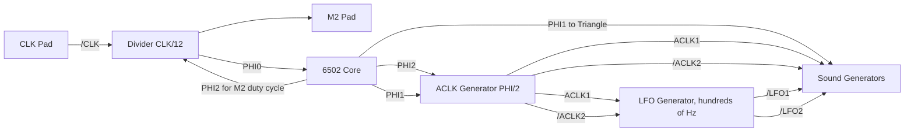

# APU

This section is simply a compilation of all subsections to make it easier to use in neural networks for their fine-tuning.

TODO: Duplicate all image in ASCII art so that they are understood by LLMs which can't analyse pictures.

## APU Contents

- [Overview](Readme.md)
- [Pinout](pads.md)
- [Common elements of APU circuitry](common.md)
- [6502 Core Binding](core.md)
- [Timing Generator](clkgen.md)
- [Register Operations](regs.md)
- [Sound Generators](sound.md)
	- [Length Counters](length.md)
	- [Square Channels](square.md)
	- [Triangle Channel](triangle.md)
	- [Noise Channel](noise.md)
	- [Delta Modulation Channel (DPCM)](dpcm.md)
	- [DAC](dac.md)
- [Sprite DMA](dma.md)
- [Test Pattern](test_pattern.md)

Appendix:

- [Visual 2A03 Signal Mapping]()
- [Waves](waves.md)
- [Cycles](cycles.md)
- [Synchronous analysis](whatwhen.md)

# APU Overview

:warning: At this moment our Wiki is massively renaming /ACLK=ACLK1 and ACLK=/ACLK2 signals to comply with Visual2A03, so there is no misunderstanding. Please be understanding if you find the old signal designations somewhere (/ACLK and ACLK). This will all be renamed in time.

**APU** is the unofficial name for the specialized NES CPU.

The official name is just CPU, but we will stick to the unofficial term.

The chip was developed by [Ricoh](../Ricoh.md), chip names are RP2A03 for NTSC and RP2A07 for PAL.


The APU includes:
- MOS 6502 processor core, with disabled decimal correction (BCD) circuit
- Input clock frequency divider
- Software Timer (commonly known as `Frame counter`)
- Sound generators: 2 square channels, 1 triangle, 1 noise generator, Delta PCM
- DMA for sampling DPCM samples
- DACs to convert digital outputs of synthesized sound to analog levels
- DMA to send sprites (hardwired to external PPU register $2004) and dedicated DMA controller
- I/O ports (which are usually used to receive data from controllers in NES)
- Debug registers (not available on Retail consoles)

The DAC makes the APU a semi-analog circuit.

Also to be taken into account is the fact that the 6502 core which is part of the APU is controlled by a DMA controller and therefore is a "common" device sharing the bus with other devices which use DMA.


## Note on Transistor Circuits

The transistor circuits for each component are chopped up into component parts so that they don't take up too much space.

To keep you from getting lost, each section includes a special "locator" at the beginning that marks the approximate location of the component being studied.

An example of a locator:


## Note on Logic Circuits

The logic circuits are mostly made in the Logisim program. The following element is used to denote DLatch:

|DLatch (transistor circuit)|DLatch (logic equivalent)|
|---|---|
|||

For convenience, the logical variant of DLatch has two outputs (`out` and `/out`), since the current value of DLatch (out) is often used as an input of a NOR operation.

# APU Pinout

The study of any IC begins with the pinout.

|Our wiki|Official designations|
|---|---|
|||

|Name|Number|Direction|Description|
|---|---|---|---|
|AUX A|1|APU =>|DAC output of square channels|
|AUX B|2|APU =>|DAC output for the remaining channels (triangle, noise, and DPCM)|
|/RES|3|APU =>|Reset signal|
|A0-A15|4-19|APU =>|Address bus|
|GND|20| |Ground|
|D0-D7|28-21|APU <=>|Data bus|
|CLK|29|=> APU|Master clock|
|DBG|30|=> APU|Debug mode (DBG=1: Enable debug registers, DBG=0: Disable debug registers)|
|M2|31|APU =>|Modified PHI2 6502 core output|
|/IRQ|32|=> APU|Maskable interrupt signal|
|/NMI|33|=> APU|Non-maskable interrupt signal|
|R/W|34|APU =>|Data bus direction (R/W=1: read, R/W=0: write)|
|/IN1|35|APU =>|Read I/O port associated with register $4017|
|/IN0|36|APU =>|Read I/O port associated with register $4016|
|OUT2|37|APU =>|Write to the I/O port associated with register bit $4016\[2\]|
|OUT1|38|APU =>|Write to the I/O port associated with register bit $4016\[1\]|
|OUT0|39|APU =>|Write to the I/O port associated with register bit $4016\[0\]|
|VCC|40| |Power +5V|

## AUX A/B

Considered in the [DAC](dac.md) section.

## /RES


From the external `/RES` signal you get the internal reset signal `RES`.

## A0-A15


The value from the internal address bus is directly output to pins A0-A15 (without buffering). During reset (`RES` = 1) - pins A0-A15 are disabled (`z`).

## D0-D7


- `RD` and `WR` are two complementary signals
- When `RD` equals 1 pins D0-D7 act as input
- When `WR` is 1 pins D0-D7 act as output

The internal and external data buses are connected directly (without buffering).

## CLK


## M2


Circuit for obtaining the `NotDBG_RES` signal:


For some reason the circuit contains a disabled "comb" of transistors, which is a chain of inverters of the internal `RES` signal.

In debug mode (when DBG=1) - the external signal M2 is not touched during reset. In regular mode (for Retail consoles) - during reset the external signal M2 is in `z` state (Open-drain).

The M2 duty cycle is made so that the top level of M2 becomes active 1.5 CLK (3 half cycles) before the top level of the PHI2 core. Thus external devices start their bus activity before the built-in 6502 core. When set to read mode, external devices can "advance" the data for the processor. When write mode is set, external devices can "preemptively" free the bus for the processor.

## DBG


## /IRQ


The logic design of this contact is a bit redundant. The value of the /IRQ input terminal generates the value of the internal signal /IRQ (with the same name).

## /NMI


The /NMI contact design is not different from the /IRQ terminal design.

## R/W


The output value of the R/W contact is derived from the internal `RW` signal, and during reset R/W is disabled (when /RES contact = 0 and internal RES line = 1), that is, it has a Z (high-impedance) value.

A small tri-state logic controls the disconnection of the R/W pin.

Some of the push/pull inverters used to delay the R/W line are disabled. Apparently the designers adjusted the propagation delay to trigger the signal.
This same delay line also slows down the internal R/W signal a bit.

## Input/Output Ports

|/INx|OUTx|
|---|---|
|||

The design is not different from the D0-D7 terminals design, except that the analog of the `RD` signal is the internal reset signal (`RES`) and the analog of the `WR` signal is always connected to VCC (equal to 1, i.e. the pin always works as output).

During reset (RES = 1) the In/Out terminals are disconnected. During reset the terminal circuit operates similarly to the D0-D7 terminal circuit, with RD = WR = 1, and this signal value disconnects the terminal (`z`).

- The output value for pins `OUT0-2` is derived from the internal signals `OUT0-2` (with the same name).
- The output value for pins `/IN0-1` is the internal signals `/R4016` and `/R4017` from the register selector.

Circuit for producing OUTx signals:


## Pads Schematics

Truly unidirectional terminals:


Terminals using BIDIR circuit:


As mentioned above, only the data bus uses all the features of the bidirectional terminal. The other pads based on the BIDIR circuit are redundant.

BIDIR pad schematic:


# Common elements of APU circuitry

This section describes APU modules that are used relatively often in different units.

## Register Bit

The register bit:


Used in:
- IO Ports ($4016)
- SoftCLK Regs ($4017)
- Square 0/1 Freq Regs ($4002/$4003, $4006/$4007)
- Square 0/1 Shift/Control Reg ($4001, $4005)
- Square 0/1 Volume/Control Reg ($4000, $4004)
- Triangle Reg ($4008)
- Noise Regs ($400C, $400E)
- Noise Random LFSR
- DPCM Regs ($4010, $4012, $4013)
- DPCM Sample Buffer
- OAM DMA Address (high bits)

## Counters

|Counter name|Counter direction|Bit depth|Counter reset|Output carry|Output value|
|---|---|---|---|---|---|
|Square Sweep|Down|3|yes|yes|no|
|Square Freq|Down|11|yes|yes|no|
|Square Duty|Down|3|yes or W4003(7)|no|yes|
|Square Decay|Down|4|yes|yes|no|
|Square Envelope|Down|4|yes|yes|yes|
|Triangle Freq|Down|11|yes|yes|no|
|Triangle Linear|Down|7|yes|yes|no|
|Triangle Output|Up|5|yes|no|yes|
|Noise Decay|Down|4|yes|yes|no|
|Noise Envelope|Down|4|yes|yes|yes|
|DPCM Address|Up|15|yes|no|yes|
|DPCM Sample bit|Up|3|yes|yes|no|
|DPCM Sample length|Down|12|yes|yes|no|
|DPCM Output|Reversible|6|yes|yes|yes|
|OAM DMA (low bits)|Up|8|yes or W4014|yes|yes|
|Length|Down|8|yes|yes|no|

### Up Counter

The bit of the `up` counter:


### Down Counter

The bit of the `down` counter:


### Reversible (Up/Down) Counter

The bit of the `reversible` counter:


## Load/Step Circuit

This typical circuit is often used to produce "Load" and "Step" signals for various counters.


# 6502 Core Binding


This section describes the features of the core and the surrounding auxiliary logic designed to integrate with the rest of the components.

The 6502 core and surrounding logic includes the following entities:
- Master clock signal and clock divider
- Binding the terminals of the 6502 core to the rest of the APU
- 6502 core

## Signals

|Signal|From|Where to|Description|
|---|---|---|---|
|CLK|CLK Pad|Divider|Input CLK|
|/M2|Divider|M2 Pad|Intermediate signal for M2 terminal ( inverse polarity)|
|DBG|DBG Pad|Test|1: Activation of test mode. In 2A03 the debug registers become available. In 2A07 it is converted to RDY2 signal (DBG=1 -> RDY2=0), essentially acting as a debugging WAIT|
|NotDBG_RES|Test|M2 Pad|Intermediate signal for controlling the M2 terminal under reset and test mode conditions|
|RES|/RES Pad|All|Global reset signal. Spreads to almost all corners of the APU|
|R/W|CPU Core|DMABuffer, Reg Select, OAM DMA, DPCM DMA|6502 core terminal. When applied to DMA it is used to detect CPU read cycle, to set RDY terminal appropriately|
|/NMI|/NMI Pad|CPU Core|From the /NMI terminal, the signal goes almost immediately to the core (not counting the intermediate inverters)|
|INT|SoftCLK|IRQ Combine|Combined DPCM and/or Timer interrupt from SoftCLK (which acts also as a Daisy Chain)|
|/IRQ|/IRQ Pad|IRQ Combine|The external interrupt signal is combined with the INT signal from SoftCLK|
|/IRQ_INT|IRQ Combine|CPU Core|Combined interrupt signal for the core|
|PHI0|Divider|CPU Core|Base clock signal for the core|
|PHI1|CPU Core|SoftCLK, Triangle|The first half of the core cycle|
|PHI2|CPU Core|SoftCLK|The second half of the core cycle|
|RW|DMABuffer|R/W Pad|The external R/W terminal is controlled by the DMABuffer circuit|
|WR|DMABuffer|External DataBus Pads|1: Write mode for external data bus terminals|
|RD|DMABuffer|External DataBus Pads|1: Read mode for external data bus terminals|
|RDY|OAM DMA|CPU Core|Readiness signal for the core. The core readiness is controlled by the OAM DMA circuit|
|RDY2|Test|CPU Core|An additional test signal for core readiness. In 2A03 it is always 1. In 2A07 it can be controlled externally using the DBG Pad|
|SPR/PPU|OAM DMA|DMABuffer|DMABuffer mode (1: Write to register $2004, 0: Read the next byte for OAM DMA from memory)|
|/DBGRD|Reg Select|DMABuffer|0: The APU register is read and the test mode is enabled (DBG=1)|
|CPU_A\[15:0\]|CPU Core|Reg Predecode, Address Mux|The 6502 core address bus. Participates in selecting the APU registers address space and for address multiplexing|
|A\[15:0\]|Address Mux|External Address Pads|Output value from the address multiplexer for AB terminals. Also involved in selecting a specific APU register|
|D\[7:0\]|Internal DataBus|External DataBus Pads|Internal data bus, to which the 6502 core is also connected|

As you can see the signals associated with the core are very tightly twisted. Yes, this part in APU is the most complicated, in sound generators everything is much simpler and more straightforward.

## Divider

The divider is a Johnson counter.


(The diagram is placed "on its side" for convenience).

General purpose schematic:


Schematic for 2A03:


The shift register bit of the divider:


## Connecting the 6502 and APU

This section discusses the connections between the 6502 core terminals and the APU.

### /NMI and /IRQ

Auxiliary logic for NMI and IRQ processing:

|Circuit|Description|
|---|---|
||Just intermediate inverters|
||/IRQ_INT: Combination of external and internal interrupt.|

/NMI terminal:


/IRQ terminal:


### RDY


Next to the RDY input there is another transistor, which in the NTSC APU is always open (RDY2=1). The PAL APU uses the /DBG signal (inversion of the signal from the external DBG terminal) instead of the constant RDY2 signal.

### /RES


There is an inverter on the /RES terminal input to invert the internal `RES` signal.

### PHI0, PHI1, PHI2

Generation of internal PHI signals:


Generation of external PHI signals:

|PHI1|PHI2|
|---|---|
|||

Nothing unusual.

### SO


The SO terminal is always connected to `1`. Technically this is fine, because the SO input has a falling edge detector.

### R/W


Nothing unusual.

The `RW` signal does not come directly from the terminal `R/W` of the 6502 core, but is obtained in the buffer circuit for sprite DMA (see below).

### SYNC

The SYNC terminal is not connected to anything (floating):


### D0-D7

The 6502 core terminals connect directly to the internal data bus D0-D7.

Signal `RD` schematic:


Buffer for sprite DMA:


Not very appropriate, but I have to say it here, because in addition to storing data for the sprite DMA this circuit also produces the `WR` signal for the external data bus pads, as well as the `RW` signal.

:warning: It just so happens that the 6502 core signal `R/W` is very similar in name to the `RW` signal which goes to the external R/W pad. Don't get confused :smiley:


### A0-A15

The outputs of the 6502 core address bus are associated with the internal CPU_A0-15 signals.

For CPU_A14 there is additionally an inverter that is used in the APU register address predecoding circuitry.

## Embedded 6502 Core

The 6502 core looks like a downsized copy of the original MOS processor.

After detailed study of 2A03 circuit following results were obtained:
- No differences were found in the instruction decoder
- Flag D works as expected, it can be set or reset by CLD/SED instructions; it is used in the regular way during interrupt processing (saved on stack) and after execution of PHP/PLP, RTI instructions.
- Random logic, responsible for generating the two control signals `/DAA` (decimal addition adjust) and `/DSA` (decimal subtraction adjust) works unchanged.

The difference lies in the fact that the control signals `/DAA` and `/DSA`, which enable decimal correction, are disconnected from the circuit, by cutting 5 pieces of polysilicon (see picture). Polysilicon marked as purple, missing pieces marked as cyan.

|Original circuit of the 6502|Missing poly in the APU|
|---|---|
|||

As result decimal carry circuit and decimal-correction adders do not work. Therefore, the embedded processor of APU always considers add/sub operands as binary numbers, even if the D flag is set.

The research process: http://youtu.be/Gmi1DgysGR0

The key parts of the analysis (decoder, random logic, flags and ALU) are shown in the following image:


To understand more about the differences in the operation of the BCD circuit, it is recommended to study the design of the [6502 ALU](/BreakingNESWiki_DeepL/6502/alu.md).

# Timing Generator


The timing generator contains the following components:
- ACLK generator
- Software timer (also known as `Frame Counter`)
- Also implements Daisy-chain interrupt forwarding from DPCM and mixing in its own timer interrupt if needed

## Clock Distribution

The following are the distinctive features of the APU clocks distribution.


|Feature|Description|
|---|---|
|1|/CLK signal from the CLK pad for the divider|
|2|Divider, to obtain the PHI0 clock signal for the core|
|3|PHI0 clock signal (CLK ÷ 12)|
|4|PHI1 clock signal ("left" half of the CPU cycle: "Set Read/Write mode and address")|
|5|PHI2 clock signal ("right" half of the CPU cycle: "Read/Write data")|
|6|PHI2 signal for modulation of M2 signal duty cycle|
|7|M2 signal for external devices|
|8|PHI1 signal for register operations (register operations are inactive during PHI1)|
|9|Output of ACLK1 and /ACLK2 signals from the ACLK generator (PHI ÷ 2)|
|10|Output of low frequency oscillation signals /LFO1 and /LFO2 for audio generators|
|11|PHI1 signal is additionally used by the triangle channel to smooth out the "steps" of the signal|
|12|"Others ACLK2"|

Full size image: https://github.com/emu-russia/breaks/blob/master/Docs/APU/2A03_ACLK_Distrib.png

Simplified chart:




## ACLK Generator

The ACLK generator is used to generate an internal ACLK clock signal (APU CLK), based on the 6502 CPU clock frequency.


The `ACLK1` and `/ACLK2` signals are not complementary and do not overlap:


|APU|OSC frequency|CLK|PHI|ACLK|
|---|---|---|---|---|
|2A03|21477272 Hz|~46.56 ns|~558.73 ns|~1117.46 ns|
|2A07|26601712 Hz|~37.59 ns|~601.46 ns|~1202.93 ns|

## Software Timer

From the official documentation we know that this component is called `Soft CLK`.

The purpose of this device is to provide the programmer with a tool to add periodic actions to the game program, repeated about every frame.

Soft CLK features:
- Operating modes (normal and extended)
- Generating interrupts
- Timing the remaining APU tone generators with low-frequency signals (`/LFO1`, `/LFO2`)


### Programming Model

Soft CLK is controlled by register $4017 (write-only):
- $4017\[6\]: Mask SoftCLK interrupt (1: interrupt disable, 0: enable)
- $4017\[7\]: LFO Mode (0: normal mode, 1: extended mode)

Bit $4015\[6\] contains the interrupt status.

### Soft CLK Control


- /R4015 and W4017: come from the register selector when reading $4015 and writing to $4017 registers respectively
- D6 and D7: bits 6 and 7 of the internal data bus
- /LFO1 and /LFO2: low frequency output signals
- DMCINT: DPCM interrupt signal
- INT: Joint SoftCLK or DPCM interrupt signal
- RES: internal reset signal (derived from /RES pin)

Soft CLK Counter Control:


Logic:


|Frequency of LFO signals|Mode=0|Mode=1|Where the signal is routed|
|---|---|---|---|
|LFO1|~240 Hz|~192 Hz|Square 0/1, Noise, Triangle|
|LFO2|~120 Hz|~96 Hz|Square 0/1, Length Counters|

### Soft CLK Counter (LFSR)


The outputs of the shift register (in complementary form) are fed to the decoder input (PLA).

### PLA

```
111110
000001
011100
100011
000110
111001
000100
111011
001100
110011
100000
011111
101000
010111
001010
110101
000010
111101
010100
101011
011000
100111
001100
110011
110010
001101
011010
100101
000010
111101
```

The placement is topological. 1 means there is a transistor, 0 means there is no transistor.


Features of using PLA:
- Output 3 is used to generate an interrupt and is simultaneously skipped in Mode=1. Therefore interrupts are only available in Mode=0
- Output 4 is used only in Mode=1
- Output 5 is used to protect against a value of 0 on the LFSR and does not affect the generation of LFO signals
- The PLA outputs, which are involved in the generation of LFO signals, are activated in turn (0,1,2,3 for Mode=0 and 0,1,2,4 for Mode=1)

Table of activation sequence of PLA outputs and duration between activations (number of PHI1 cycles):

|NTSC 2A03|||||
|---|---|---|---|---|
|nLFO1  mode4|PLA0   (7457 )|PLA1 (7457 )|PLA2 (7457 )|PLA3  (7457 )  (SET LFSR)|
|nLFO2  mode4|no|PLA1 (14913)|no|PLA3  (14913) (SET LFSR)|
|nLFO1  mode5|PLA0   (7457 )|PLA1 (7457 )|PLA2 (7457 )|PLA4  (14913) (SET LFSR)|
|nLFO2  mode5|no|PLA1 (14913)|no|PLA4  (22367) (SET LFSR)|

|PAL 2A07|||||
|---|---|---|---|---|
|nLFO1 mode4|PLA0  (8313)|PLA1 (8313)|PLA2 (8313)|PLA3  (8313)   (SET LFSR)|
|nLFO2 mode4|no|PLA1 (16625)|no|PLA3  (16625) (SET LFSR)|
|nLFO1 mode5|PLA0  (8313)|PLA1 (8313)|PLA2 (8313)|PLA4  (16625) (SET LFSR)|
|nLFO2 mode5|no|PLA1 (16625)|no|PLA4  (24939) (SET LFSR)|

(the table does not take into account the slightly floating number of cycles for the last output)

## Other ACLK2

There are "other" ACLK2 in different parts of the APU. This is essentially an inversion of the /ACLK2 signal used "in place". But to separate them, they are numbered in ascending order: 2, 3, etc.

At first a "other" ACLK2 was found in the DPCM/DMA circuit, but then it turned out that they are also found in other parts of the APU. Therefore, these signals are called in order of 2, 3, 4, etc.

In the diagrams :warning: sign marks the places where other `ACLK2` is used.

## ACLK2

In the very center of the DPCM circuitry is a circuit to produce the "other" ACLK2 that is used in [DPCM](dpcm.md) as well as in [sprite DMA](dma.md).
This signal can be found in our circuits as `ACLK2`.


### ACLK3

Used for [square wave sound generators](square.md), and more specifically for the $4002/$4003/$4006/$4007 registers.


For the first square channel (Square 0 = A), the signal is called `ACLK3A`.

For the second square channel (Square 1 = B) the signal is called `ACLK3B`.

But in the general schematic for the two channels, the signal is simply marked as `ACLK3`.

### ACLK4

Used in the [noise generator](noise.md) and [length counter](length.md) control circuitry.


### ACLK5

Used in I/O latches that generate OUTx signals for the corresponding output terminals.


# Register Operations


|Signal|From|Where to|Description|
|---|---|---|---|
|R/W|CPU Core|DMABuffer, Reg Select, OAM DMA, DPCM DMA|6502 core terminal. When applied to DMA it is used to detect CPU read cycle, to set RDY terminal appropriately|
|/DBGRD|Reg Select|DMABuffer|0: The APU register is read and the test mode is enabled (DBG=1)|
|CPU_A\[15:0\]|CPU Core|Reg Predecode, Address Mux|The 6502 core address bus. Participates in selecting the APU registers address space and for address multiplexing|
|A\[15:0\]|Address Mux|External Address Pads|Output value from the address multiplexer for AB terminals. Also involved in selecting a specific APU register|
|/REGRD|Reg Predecode|Reg Select|0: The APU register is being read from the 6502 core side|
|/REGWR|Reg Predecode|Reg Select|0: Writing to the APU register on the 6502 core side|
|/R4015|Reg Select|SoftCLK, DMABuffer, Length, DPCM|0: Read register $4015. Note that this operation is additionally tracked in the DMABuffer.|
|/R4016|Reg Select|IOPorts|0: Read register $4016|
|/R4017|Reg Select|IOPorts|0: Read register $4017|
|/R4018|Reg Select|Test|0: Read debug register $4018 (2A03 only)|
|/R4019|Reg Select|Test|0: Read debug register $4019 (2A03 only)|
|/R401A|Reg Select|Test|0: Read debug register $401A (2A03 only)|
|W4000|Reg Select|Square0|1: Write register $4000|
|W4001|Reg Select|Square0|1: Write register $4001|
|W4002|Reg Select|Square0|1: Write register $4002|
|W4003|Reg Select|Square0|1: Write register $4003|
|W4004|Reg Select|Square1|1: Write register $4004|
|W4005|Reg Select|Square1|1: Write register $4005|
|W4006|Reg Select|Square1|1: Write register $4006|
|W4007|Reg Select|Square1|1: Write register $4007|
|W4008|Reg Select|Triangle|1: Write register $4008|
|W400A|Reg Select|Triangle|1: Write register $400A|
|W400B|Reg Select|Triangle|1: Write register $400B|
|W400C|Reg Select|Noise|1: Write register $400C|
|W400E|Reg Select|Noise|1: Write register $400E|
|W400F|Reg Select|Noise|1: Write register $400F|
|W4010|Reg Select|DPCM|1: Write register $4010|
|W4011|Reg Select|DPCM|1: Write register $4011|
|W4012|Reg Select|DPCM|1: Write register $4012|
|W4013|Reg Select|DPCM|1: Write register $4013|
|W4014|Reg Select|OAM DMA|1: Write register $4014|
|W4015|Reg Select|Length, DPCM|1: Write register $4015|
|W4016|Reg Select|IOPorts|1: Write register $4016|
|W4017|Reg Select|SoftCLK|1: Write register $4017|
|W401A|Reg Select|Test, Triangle|1: Write debug register $401A (2A03 only)|
|SQA\[3:0\]|Square0|AUX A|Output digital value of the Square0 sound generator|
|SQB\[3:0\]|Square1|AUX A|Output digital value of the Square1 sound generator|
|TRI\[3:0\]|Triangle|AUX B|Output digital value of the Triangle sound generator|
|RND\[3:0\]|Noise|AUX B|Output digital value of the Noise sound generator|
|DMC\[6:0\]|DPCM|AUX B|Output digital value of the DPCM sound generator|
|LOCK|Lock FF|Square0, Square1, Triangle, Noise, DPCM|To lock the volume of the audio generators so that you can read the value using the debug registers|

Pre-decoder, to select the address space of the APU registers:


- PDSELR: Intermediate signal to form the 12-nor element to produce the `/REGRD` signal
- PDSELW: Intermediate signal to form the 12-nor element to produce the `/REGWR` signal

R/W decoder for register operations:


Selecting a register operation:


:warning: The APU registers address space is selected by the value of the CPU address bus (`CPU_Ax`). But the choice of register is made by the value of the address, which is formed at the address multiplexer of DMA-controller (signals A0-A4).

Bitmask:

```
101010110100
110010110100
101100110100
001100110101

110011001100
010100101011
001100101011
010101001011
010010101011

001011001011
010011001011
001011010011
001101001011
001010101011

001010110011
010011001101
001100110011
010010101101
010100110011

010101010011
001101010011
110101001100
010100101101
101101001100

001100101101
001101001101
001010101101
010101001101
001011001101
```

The bit mask is topological. 1 means there is a transistor, 0 means no transistor.


## Debug Interface

:warning: The debug hookup is only available in 2A03. The PAL version of the APU (2A07) does not contain any debugging mechanisms (except RDY2).

Auxiliary circuits for internal `DBG` signal:

|Amplifying inverter|Intermediate inverter|/DBGRD Signal|
|---|---|---|
||||

Transistor circuits for reading debugging values of sound generators:

|Channel|Circuit|Register operation|Value|Where|
|---|---|---|---|---|
|Square 0||/R4018|SQA\[3:0\]|D\[3:0\]|
|Square 1||/R4018|SQB\[3:0\]|D\[7:4\]|
|Triangle||/R4019|TRI\[3:0\]|D\[3:0\]|
|Noise||/R4019|RND\[3:0\]|D\[7:4\]|
|DPCM||/R401A|DMC\[6:0\]|D\[6:0\]|

Register operations with debug values are available only when DBG = 1.

Circuit for reading the debug value:


LOCK circuit:

|||
|---|---|

The `LOCK` signal is used to suspend or disconnect the audio generators from the output so that the current volume values are latched and can be read using the debug registers.

# Sound Generators

The APU contains the following audio channels (official designations):
- Sound A: Rectangular pulse tone generator (Square 0)
- Sound B: Rectangular pulse tone generator (Square 1)
- Sound C: Triangular tone generator
- Sound D: Noise generator
- Sound E: Channel for sample playback using delta modulation (direct playback of PCM samples is also available)

All circuits for generating sound are, for the most part, various counters controlled by simple control circuits.


(In addition to the audio generators themselves, the diagram also shows the OAM DMA, as it interacts closely with the DPCM DMA).

## Timing

The sound generators are clocked by the following signals:
- PHI1/2: CPU Core clock frequency
- ACLK: Audio CLK. Two times slower PHI, with a special non-overlapping phase pattern
- LFO1/2: Low frequency oscillation signals (on the order of hundreds of Hertz)

The developers decided to use PHI1 for the triangle channel instead of ACLK to smooth out the "stepped" signal.

## Sweep

Sweep is a time-constant increase or decrease in signal frequency (period). It affects pitch (tonality).

The word `Sweep` does not translate into other languages.

In APU it is used only in square channels.


## Envelope

Envelope is the constant fading of the signal amplitude (as applied to APU audio generators).

Envelope is a special case of ADSR, and specifically is a Decay component.

In APU it is used in square channels and noise generator.


## Duty

Duty is a change in the duty cycle of a square wave signal.

In APU it is used only in square channels.


# Length Counters


The schematics of all four counters are identical, the only difference is in the signals (see below). For this reason, only the Square0 counter is shown in the drawings.

## Signals

|Signal|From where|Where to|Description|
|---|---|---|---|
|/LFO2|SoftCLK|Length Counters|Low frequency oscillation signal|
|SQA_LC|Square 0|Length Counters|Input carry for Square0 LC|
|SQB_LC|Square 1|Length Counters|Input carry for Square1 LC|
|TRI_LC|Triangle|Length Counters|Input carry for Triangle LC|
|RND_LC|Noise|Length Counters|Input carry for Noise LC|
|NOSQA|Length Counters|Square 0|Square0 LC does not count / disabled|
|NOSQB|Length Counters|Square 1|Square1 LC does not count / disabled|
|NOTRI|Length Counters|Triangle|Triangle LC does not count / disabled|
|NORND|Length Counters|Noise|Noise LC does not count / disabled|

|Counter|Input carry signal|End of count signal|Load counter signal|
|---|---|---|---|
|Square0|SQA_LC|NOSQA|W4003|
|Square1|SQB_LC|NOSQB|W4007|
|Triangle|TRI_LC|NOTRI|W400B|
|Noise|RND_LC|NORND|W400F|

## Length Decoder


|Decoder In|Decoder Out|
|---|---|
|0|0x9|
|1|0xfd|
|2|0x13|
|3|0x1|
|4|0x27|
|5|0x3|
|6|0x4f|
|7|0x5|
|8|0x9f|
|9|0x7|
|10|0x3b|
|11|0x9|
|12|0xd|
|13|0xb|
|14|0x19|
|15|0xd|
|16|0xb|
|17|0xf|
|18|0x17|
|19|0x11|
|20|0x2f|
|21|0x13|
|22|0x5f|
|23|0x15|
|24|0xbf|
|25|0x17|
|26|0x47|
|27|0x19|
|28|0xf|
|29|0x1b|
|30|0x1f|
|31|0x1d|

The first stage of the decoder (5-to-32 demultiplexer):

```
1010101010
1001101010
1010011010
1001011010
1010100110
1001100110
1010010110
1001010110

1010101001
1001101001
1010011001
1001011001
1010100101
1001100101
1010010101
1001010101

0110101010
0101101010
0110011010
0101011010
0110100110
0101100110
0110010110
0101010110

0110101001
0101101001
0110011001
0101011001
0110100101
0101100101
0110010101
0101010101
```

The bit mask is topological. 1 means there is a transistor, 0 means no transistor.


The second stage of the decoder:

```
01000111
00100111
01100111
00010111
01010111
00110111
01110111
00001111

01001111
00101111
01101111
00011111
01011111
00111111
01111111
01000000

00000111
00001111
00011101
00000010
00000101
00001011
00010111
00101111

01100111
01001111
00100011
00000110
00001101
00011011
00110111
01101111
```

The bit mask is topological. 1 means there is a transistor, 0 means no transistor.


## Length Counter Control


## Length Counter

The usual down counter.


# Square Channels


The APU contains two square wave tone generators. The circuits mirror each other, so let's consider only the tone generator of the first square channel (SQUARE 0, located on the right side).

The difference between SQUARE0 and SQUARE1 is the input carry design for the adder:
- For SQUARE0, the input carry is connected to Vdd.
- For SQUARE1 the input carry is connected to the `INC` signal

Sometimes instead of Square0/Square1 we have the designation SquareA/SquareB.


## Frequency Reg


## Shift Reg

Contains the shift value for the shifter (0...7).


## Barrel Shifter

Shifts the 12-bit value to the right with the sign (the msb bit shifts to the right and fills all other bits). The most significant bit is then discarded, forming an 11-bit result.


## Adder

A distinctive feature of the adder is the complementary layout of the a/b signals between the bits and the complementary carry chain, as well as the inverse polarity of the result (`#sum`) and output carry (`#COUT`).


## Frequency Counter


## Envelope

Decay Counter:


Envelope Counter:


The circuit is identical to the Envelope circuit in the noise generator.


|EnvelopeUnit Signal|Square0 Channel|Square1 Channel|
|---|---|---|
|WR_Reg|W4000|W4004|
|WR_LC|W4003|W4007|
|LC|SQA/LC|SQB/LC|

## Sweep

|Signal/Group|From Where|Where To|Description|
|---|---|---|---|
|DO_SWEEP|Sweep|Freq Reg|The main signal that controls the Sweep process of the frequency value loaded in the Freq Reg. The signal is set only during PHI1, so as not to conflict with the register writes by the CPU, which only occur during PHI2.|
|SR\[2:0\], SRZ|Shift Reg|Sweep,Shifter|Determines the shift magnitude of the source frequency. If SR=0, the DO_SWEEP signal is never generated (obviously)|
|DEC (and its complement INC)|Dir Reg|Sweep,Shifter,Adder|Defines the direction of frequency step (DEC=1: frequency decreases, DEC=0: frequency increases)|
|#COUT|Adder|Sweep|Adder output carry (inverse polarity)|
|SW_OVF|Sweep|Sweep,Output|Equals 1 when INC=1 and adder output carry is active. When SW_OVF=1 - DO_SWEEP is 0. That is the Sweep process does not happen at frequency overflow (obviously)|
|SW_UVF|Adder|Sweep,Output|1: Frequency value is less than 4 (Freq Reg bits \[10:2\] are zeros). When SW_UVF=1 - DO_SWEEP is 0. That is, when the frequency is too low it makes no sense to do Sweep|
|NOSQ|Length Counter|Common|1: The length counter has finished counting/deactivated. When the length counter is disabled the DO_SWEEP signal is never generated (obviously)|
|/LFO2|SoftCLK|Common|Low-frequency oscillation signal (inverse polarity). When applied to Sweep - it resets the Sweep counter with a value from the Sweep Reg|
|SCO|Sweep|Sweep|Sweep Counter output carry. While Sweep Counter is counting - DO_SWEEP is 0|
|SWRELOAD|Sweep|Sweep|1: Perform a Sweep Counter restart|
|SWDIS|Register WR1\[3\]|Sweep|1: Disable Sweep process, DO_SWEEP is always 0|

By carefully examining and understanding all the signals that are used in the Sweep Unit you can get a picture of what is going on:
- The main driver of the Sweep process is the DO_SWEEP signal. When this signal is activated the frequency modulation process in the Freq Reg is started using the shift register and the adder
- The Sweep counter iterates with the low frequency oscillation signal `/LFO2`
- The Sweep counter is overloaded by itself with the value from the Sweep Reg register, at the same time the DO_SWEEP signal is triggered (if all conditions are met, see below)

Sweep does NOT occur under the following conditions (in the schematic it is a large NOR):
- Sweep is disabled by the appropriate control register (SWDIS)
- A square channel length counter has finished counting or has been disabled (NOSQ)
- The magnitude value of the Shift Reg is 0 (SRZ)
- Frequency value led to an overflow of the adder, in the frequency increase mode (SW_OVF)
- Frequency value is less than 4 (SW_UVF)
- Sweep counter has not completed its work (SCO=0)
- Low-frequency oscillation signal is not active (/LFO2=1)


Sweep Counter:


## Duty

Duty Counter:


Principle of operation:
- The FLOAD signal used to load the frequency counter is simultaneously used to iterate the Duty counter
- Loading the length counter clears the Duty counter of the corresponding square channel
- Frequency counter output carry (FCO signal) is the input carry for the Duty counter
- When the `DUTY` signal is 0 at the output of the square generator is also 0

Table of DUTY signal values depending on Duty counter values and Duty register settings (d):

|Duty counter value|d=0 (12.5%)|d=1 (25%)|d=2 (50%)|d=3 (75%)|
|---|---|---|---|---|
|7|1|1|1|0|
|6|0|1|1|0|
|5|0|0|1|1|
|4|0|0|1|1|
|3|0|0|0|1|
|2|0|0|0|1|
|1|0|0|0|1|
|0|0|0|0|1|

## Output


# Triangle Channel


## Signals

|Signal|Description|
|---|---|
|/LFO1|Low-frequency oscillation signal 1/4 period (inverse polarity)|
|NOTRI|Triangle LC does not count / is disabled|
|TRI/LC|Input carry for Triangle LC|
|TCO|Output carry from a Linear Counter|
|FOUT|Output carry from Frequency Counter|
|TLOAD|Load Linear Counter|
|TSTEP|Step Frequency Counter|
|FLOAD|Load Frequency Counter|
|FSTEP|Step Frequency Counter|
|TTSTEP|Step Output Counter|

The developers decided to use PHI1 for the triangular channel in some places instead of ACLK to smooth out the "stepped" signal.

## Triangle Control


## Linear Counter

7-bit DownCounter.


## Frequency Counter

11-bit DownCounter.


## Output

5-bit UpCounter. The most significant bit controls the direction of the "saw".


# Noise Channel


## Frequency Reg


A variation of the register with an additional reset (immediately on the latch) is used.

## Decoder


The first stage of the decoder (4-to-16 demultiplexer):

```
00000000 11111111
11111111 00000000
00001111 00001111
11110000 11110000
00110011 00110011
11001100 11001100
01010101 01010101
10101010 10101010
```

The second stage of the decoder:

```
11101111 11111111
10001011 11110111
00111100 11001111
11111110 11110011
01100111 00011111
11110010 00000011
11111111 11000111
11011110 11100001
11011001 01111111
11000001 00010000
11011010 00000111
```

The bit mask is topological. 1 means there is a transistor, 0 means no transistor.

|||
|---|---|

|Decoder In|Decoder Out|
|---|---|
|0|0x002|
|1|0x00a|
|2|0x0aa|
|3|0x2bb|
|4|0x139|
|5|0x173|
|6|0x063|
|7|0x067|
|8|0x1a9|
|9|0x106|
|10|0x227|
|11|0x062|
|12|0x642|
|13|0x20f|
|14|0x300|
|15|0x140|

## Frequency LFSR


## Random LFSR


The shift register design for Random LFSR is different in that the value is stored in a register (static memory), because significant time can pass between shifts of the value and therefore you can not use shift registers on a dynamic memory (DLatch).

## Envelope


The circuit is identical to the Envelope of square channels. On the transistor circuit the labels of the intermediate signals may be different, but don't pay attention to this, the context should be clear.


|EnvelopeUnit Signal|Noise Channel|
|---|---|
|WR_Reg|W400C|
|WR_LC|W400F|
|LC|RND/LC|

## Output


# Differential Pulse-code Modulation (DPCM) Channel


This device is used to generate PCM audio:
- The $4011 output register is a reverse counter that counts down if the next bitstream bit is 0 or up if the next bitstream bit is 1
- It is also possible to load a value directly into the $4011 register for Direct Playback
- Everything else is a set of counters and control logic to organize the DMA process
- DPCM DMA does not use [sprite DMA](dma.md) facilities, but instead arranges its own buffer to store the selected PCM sample. The `RUNDMC` control signal is used to intercept control over sprite DMA.

The difference between DMC DMA and Sprite DMA is that DMC DMA interrupts the processor (RDY = 0) only while the next sample is fetched.


Inputs:

|Signal|From where|Description|
|---|---|---|
|ACLK1|Soft CLK|APU Clock (first core cycle)|
|/ACLK2|Soft CLK|APU Clock (second core cycle, complement)|
|PHI1|CPU|First half of the CPU cycle. It is used only to detect the Read Cycle of the 6502 core and to load samples. All internal counters and most of the control circuits are clocked by ACLK.|
|RES|RES Pad|External reset signal|
|R/W|CPU|CPU data bus mode (1: Read, 0: Write)|
|LOCK|Core|The LOCK signal is used to temporarily suspend the sound generators so that their values can be fixed in the debug registers|
|W401x|Reg Select|1: $401x register write operation|
|/R4015|Reg Select|0: $4015 register read operation|

Outputs:

|Signal|Where|Description|
|---|---|---|
|#DMC/AB|Address MUX|0: Gain control of the address bus to read the DPCM sample|
|RUNDMC|SPR DMA|1: DMC is minding its own business and hijacks DMA control|
|DMCRDY|SPR DMA|1: DMC Ready. Used to control processor readiness (RDY)|
|DMCINT|Soft CLK|1: DMC interrupt is active|
|DMC Out|DAC|Output value for DAC|
|DMC Address|Address MUX|Address for reading the DPCM sample|

DMC internal state control signals:

|Signal|From where|Where to|Description|
|---|---|---|---|
|DSLOAD|DPCM Control|Sample Counter, DPCM Address Counter|Load value into Sample Counter and simultaneously into DPCM Address Counter|
|DSSTEP|DPCM Control|Sample Counter, DPCM Address Counter|Perform Sample Counter decrement and DPCM Address Counter increment simultaneously|
|BLOAD|DPCM Control|Sample Buffer|Load value into Sample Shift Register|
|BSTEP|DPCM Control|Sample Buffer|Perform a Sample Shift Register bit shift|
|NSTEP|DPCM Control|Sample Bit Counter|Perform Sample Bit Counter increment|
|DSTEP|DPCM Control|DPCM Output|Increment/decrement the DPCM Output counter|
|PCM|DPCM Control|Sample Buffer|Load new sample value into Sample Buffer. The signal is active when PHI1 = 0 and the address bus is captured (imitating CPU reading)|
|LOOP|$4010\[6\]|DPCM Control|1: DPCM looped playback|
|/IRQEN|$4010\[7\]|DPCM Control|0: Enable interrupt from DPCM|
|DOUT|DPCM Output|DPCM Control|DPCM Out counter has finished counting|
|/NOUT|Sample Bit Counter|DPCM Control|0: Sample Bit Counter has finished counting|
|SOUT|Sample Counter|DPCM Control|Sample Counter has finished counting|
|DFLOAD|LFSR|DPCM Control|Frequency LFSR finished counting and reloaded itself|
|n_BOUT|Sample Buffer|DPCM Output|The next bit value pushed out of the Sample Buffer shift register (inverted value)|

The majority of control signals are of the same nature:
- xLOAD: Load new value
- xSTEP: Perform some action
- xOUT: Counter finished counting

An exception is the DFLOAD command: Frequency LFSR reloads itself after counting, but at the same time signals to the main control unit.

## DPCM Control Summary


## DPCM Control Register ($4010)

|||
|---|---|

## DPCM Interrupt Control

|||
|---|---|

## DPCM Enable Control

|||
|---|---|

## DPCM DMA Control

|||
|---|---|

## DPCM Sample Counter Control


(The second part of the circuit also controls the Sample Bit Counter)


## DPCM Sample Buffer Control


## DPCM Sample Counter Register ($4013)

|||
|---|---|

## DPCM Sample Counter

Down counter is used.

|||
|---|---|

## DPCM Sample Buffer

|||
|---|---|

Shift register:

|||
|---|---|

## DPCM Sample Bit Counter

Up counter is used.

|||
|---|---|

## DPCM Decoder


PLA1 is a regular 4-in-16 demultiplexer and PLA2 generates the input value to load into the LFSR.

|Decoder In|Decoder Out|
|---|---|
|0|0x173|
|1|0x08A|
|2|0x143|
|3|0x0DB|
|4|0x1EE|
|5|0x03F|
|6|0x07D|
|7|0x1D1|
|8|0x009|
|9|0x0DC|
|10|0x0F1|
|11|0x0F9|
|12|0x08D|
|13|0x189|
|14|0x18E|
|15|0x156|

|PLA1|PLA2|
|---|---|
|||

The first stage of the decoder (4-to-16 demultiplexer):

```
10101010
01101010
10011010
01011010
10100110
01100110
10010110
01010110

10101001
01101001
10011001
01011001
10100101
01100101
10010101
01010101
```

The second stage of the decoder:

```
100101010
100011100
011011100
010011101
011000001
011100001
110001001
011011111

011101000
010000011
000000111
100010000
001001001
001111010
101011101
001100010
```

The bit mask is topological. 1 means there is a transistor, 0 means no transistor.

## DPCM Frequency Counter LFSR

|||
|---|---|

LFSR:

|||
|---|---|

## DPCM Address Register ($4012)

|||
|---|---|

## DPCM Address Counter

Up counter is used.

|Low|High|
|---|---|
|||

DMC_A15 input is connected to Vdd in the address multiplexer:


## DPCM Output ($4011)

Reversible counter is used.


# DAC


The DAC does not use separate pins for "analog" VDD/GND, but uses common VDD/GND. The DAC power supply is wired in a star topology.

@ttlworks made a good description of the DAC:


Source: http://forum.6502.org/viewtopic.php?p=94693#p94693

## AUX A/B Terminals

Inside the microcircuit the pads for the terminals are not loaded in any way and are just pads.

Outside on the board there are usually small pull-down resistors to GND (usually 100 ohms on each AUX output).

## Square 0/1


Maximum amplitude measurements of DAC AUX A:
- RP2A03G chip
- External resistance 75 Ohm (unusual, but does not affect the essence of what is happening much)
- The dac_square.nes demo was used (https://github.com/bbbradsmith/nes-audio-tests)
- SQA = 0xf, SQB = 0xf


Results:
- Maximum AUX A voltage: 272 mV
- You can see that the lower level also has a small voltage relative to ground (the moment is controversial, because the probe can introduce its own distortions)

Credits: @HardWrMan

## Triangle/Noise/DPCM


TBD.

# Sprite DMA (OAM DMA)


This component acts as a small DMA controller, which besides sprite DMA also handles address bus arbitration and processor readiness control (RDY).


The sprite DMA is very closely tied in with the [DMC DMA](dpcm.md) and is "slave" to it (as long as the RUNDMC signal is `1` the sprite DMA is in standby mode).

Unfortunately, the sprite DMA destination address cannot be configured and is hardwired to PPU register $2004.

Note on PHI and ACLK: PHI1 is only used to detect the Read Cycle of the 6502 core and PHI2 (PHI1 complement) to load data into the DMA Buffer. All other parts (registers, counters and control circuits) are clocked by ACLK.

## OAM DMA Address

Low address bits:

|||
|---|---|

High address bits:

|||
|---|---|

The :warning: sign mark the places where the constant address of the PPU $2004 register is formed.

## OAM DMA Control


The :warning: sign indicate "Other ACLK2".

Logic:


Control signals for interaction with DMC:
- RUNDMC: The DMC is doing its thing. Until it finishes, the sprite DMA is in standby mode
- #DMC/AB: DMC occupies the address bus
- DMCRDY: DMC Ready. If the DMC is not ready - the RDY signal is also forced to 0.

Processor control signals:
- PHI1 and R/W: Sprite DMA can only start if the processor goes into a read cycle (PHI1 = 0 and R/W = 1). Without this condition the `DOSPR` control signal will not be active. This is done to delay the start of the DMA because the RDY clearing is ignored on the 6502 write cycles.


|STA T0 PHI1|STA T0 PHI2|STA T1 PHI1|STA T1 PHI2|
|---|---|---|---|
|||||

Signals affecting the DMA process:
- W4014: Writing to register $4014 clears the lower part of the address and puts the value to be written into the higher part. The DMA process then starts.
- SPRS: Increment the low-order part of the address ("Step")
- SPRE: End DMA execution ("End")

Immediately after the start of sprite DMA the SPR/PPU and SPR/CPU control signals alternate their values so that the value is first read from memory into the sprite buffer and then written to the PPU register $2004.

## OAM DMA Buffer


Logic:


## Address MUX

The address multiplexer is used to arbitrate the external address bus. The control signals are used to select who is "using" the address bus now:

- SPR/CPU: Memory address to read during sprite DMA
- SPR/PPU: A constant address value is set for writing to the PPU register $2004
- #DMC/AB: The address bus is controlled by the DMC circuitry to perform DMC DMA
- Default (CPU/AB): The address bus is controlled by the CPU

Address multiplexer control:


The multiplexer itself consists of 16 repeating circuits, for each bit:


Logic:


# Test Pattern


## 2A03G

The test pattern for the 2A03G does not stand out as interesting:


## 2A07A

The test pattern for the 2A07A does not stand out in any interesting way:


# Visual 2A03 Signal Mapping

Visual 2A03: http://www.qmtpro.com/~nes/chipimages/visual2a03/

|Breaks signal name|Visual 2A03 signal name|
|---|---|
|External terminals||
|CLK|node: 11669 clk_in|
|/NMI|node: 10331 nmi|
|/IRQ|node: 10488 irq|
|/RES|node: 10004 res|
|DBG|node: 11214 dbg|
|/IN0|node: 10006 joy1|
|/IN1|node: 10029 joy2|
|OUT0|node: 10007 out0|
|OUT1|node: 10008 out1|
|OUT2|node: 10005 out2|
|M2|node: 10743 phi2|
|R/W|node: 10092 rw|
|D0-7|db0-7|
|A0-15|ab0-15|
|Internal signals||
|/CLK|node: 11267|
|PHI0|node: 11235 clk0|
|PHI1|node: 10357 clk1out|
|PHI2|node: 10843 clk2out|
|RDY|node: 10758 rdy|
|RDY2| |
|ACLK1|node: 11434 apu_clk1|
|/ACLK2|node: 10533 apu_/clk2|
|RES|node: 10057 _res|
|/M2|node: 11200|
|/NMI|node: 10458 _nmi|
|/IRQ|node: 10701 _irq|
|INT|node: 10775 irq_internal|
|/LFO1|node: 10293 frm_quarter|
|/LFO2|node: 10563 frm_half|
|R/W (Core)|node: 10756 __rw|
|SPR/CPU|node: 11099 ab_use_spr_r|
|SPR/PPU|node: 10764 ab_use_spr_w|
|RW (DMABuf)|node: 10844 _rw|
|RD|node: 11133 rw_buf|
|WR|node: 10938 dbe|
|#DMC/AB|node: 11411 /ab_use_pcm|
|RUNDMC|node: 11515|
|DMCINT|node: 10753 pcm_irq_out|
|DMCRDY|node: 11483 pcm_dma_/rdy|
|/R4015|node: 10749 /r4015|
|/R4016|node: 13474 /r4016|
|/R4017|node: 13444 /r4017|
|/R4018|node: 10527 /r4018|
|/R4019|node: 10759 /r4019|
|/R401A|node: 10763 /r401a|
|W4000|node: 13322 w4000|
|W4001|node: 10559 w4001|
|W4002|node: 10134 w4002|
|W4003|node: 13264 w4003|
|W4004|node: 13290 w4004|
|W4005|node: 10580 w4005|
|W4006|node: 10133 w4006|
|W4007|node: 13273 w4007|
|W4008|node: 13348 w4008|
|W400A|node: 13371 w400a|
|W400B|node: 13398 w400b|
|W400C|node: 13300 w400c|
|W400E|node: 13436 w400e|
|W400F|node: 13415 w400f|
|W4010|node: 13514 w4010|
|W4011|node: 13375 w4011|
|W4012|node: 13491 w4012|
|W4013|node: 13457 w4013|
|W4014|node: 13542 w4014|
|W4015|node: 13356 w4015|
|W4016|node: 10174 w4016|
|W4017|node: 13520 w4017|
|W401A|node: 10773 w401a|
|SQA/LC|node: 11748 sq0_len_reload|
|SQB/LC|node: 11752 sq1_len_reload|
|TRI/LC|node: 11750 tri_len_reload|
|RND/LC|node: 11747 noi_len_reload|
|NOSQA|node: 10524 sq0_silence|
|NOSQB|node: 10522 sq1_silence|
|NOTRI|node: 11346 tri_silence|
|NORND|node: 11696 noi_silence|
|DBG|node: 10946 dbg_en|
|/DBGRD|node: 10839|
|LOCK|node: 10658 snd_halt|
|SQA0-3|sq0_out0-3|
|SQB0-3|sq1_out0-3|
|TRI0-3|tri_out0-3|
|RND0-3|noi_out0-3|
|DMC0-6|pcm_out0-6|
|Internal buses||
|D0-7|_db0-7|
|DMC_A0-15|pcm_+a0-15|
|SPR_A0-15|spr_a0-15|
|CPU_A0-15|__ab0-15|
|A0-15|_ab0-15|

# Waves

This section contains signal timings for different APU units. Circuit engineers like to look thoughtfully at these.

The timeline is respected more or less accurately only for SoftCLK LFO signals, in other cases the timescale is chosen arbitrarily (it makes no sense to make it accurate).

The sources of all the tests that were used to make the diagrams are in the folder `/HDL/Framework/Icarus`.

## CLK Divider


The external `CLK` pad, the `PHI0` signal for the core, and the signal of the external `M2` pad are shown.

## ACLK Generator

Under reset conditions:


Without reset:


## SoftCLK counter (LFSR)


## SoftCLK PLA, low frequency oscillation signals (LFO) and interrupts

Mode = 0:


Mode = 1:


## Register Operations Decoder

Read Registers:


Write Registers:


## Length Counters Decoder


## Length Counter


The diagram shows the essence of the operation, with some peculiarities:
- The phase pattern for the ACLK is respected
- The LFO2 frequency that controls the counter counting is not scaled, but synthetically shortened
- The main purpose is to show that after the end of the countdown the circuit generates a `NotCount` signal (which corresponds to the NOSQA/NOSQB/NOTRI/NORND signals for the four real counters)
- Before starting the counter, the value 0b1001 (9) is loaded into the counter, which after processing on the decoder corresponds to the value 0x07.

## Envelope Unit


:warning: The simulation of LFO generation is artificially tweaked to trigger more frequently.

## Square Barrel Shifter


## Square Adder

Full Adder (single bit):


The summation result was somewhere in the middle:


The summation of the maximum values:


## Square Sweep Unit


With this test we are trying to get the Sweep Unit to generate the DO_SWEEP signal as it should be for the Sweep process to work.

That is, we need to organize the artificial generation of /LFO2 signal (not too slow, as in real conditions, to speed up the process)
and check that the DO_SWEEP signal is generated as it should be.

For this test it does not matter what happens to the Freq Reg, shifter, adder and all other parts of the square wave generator.


:warning: The simulation of LFO generation is artificially tweaked to trigger more frequently.

## Square Duty Unit


Check the DUTY signal generation, depending on the different Duty register settings and Duty counter values.

The generation of the FLOAD signal (to iterate the Duty counter) is artificially accelerated.


## DPCM Decoder


## Noise Decoder


## DPCM Output


## Square Output


```
W4015 <= 0000000 1  (SQA Length counter enable: 1)
W4000 <= 10 0 0 0110 (D=2, Length Counter #carry in=0, ConstVol=0, Vol=6)
W4001 <= 1 001 0 010 (Sweep=1, Period=1, Negative=0, Magnitude=2^2)
W4002 <= 0110 1001  (Freq Lo=0x69)
W4003 <= 11111 010  (Length=11111, Freq Hi=2)
```

## Triangle Output


```
W4015 <= 00000 1 00  (Triangle Length counter enable: 1)
W4008 <= 0 0001111 (Triangle length counter #carry in: 0, Linear counter reload: 0xf)
W400A <= 0110 1001  (Freq Lo=0x69)
W400B <= 11111 010  (Length=11111, Freq Hi=2)
```

## Noise Output


```
W4015 <= 0000 1 000  (Noise Length counter enable: 1)
W400C <= xx 0 0 0110 (Noise Length counter #carry: 0, Constant: 0, Env: 6)
W400E <= 0 xxx 0111 (Loop: 0, Period: 7)
W400F <= 11111 xxx (Length: 11111)
```

## OAM DMA

Test bench setup:


Start of OAM DMA (aligned to ACLK1):


Start of OAM DMA (unaligned to ACLK1, 1 additional CPU cycle required):


Completing an OAM DMA:


## Both DMA

Test bench setup:


Starting DPCM DMA (writing to registers $400x and several iterations of the process):


Start of OAM DMA (write to register $4014)


Moment of intersection of DPCM DMA and OAM DMA:


Moment of intersection of DPCM DMA and OAM DMA (close-up version of a particular moment):


Completing an OAM DMA:


Some lull after the OAM DMA ends and the next DPCM DMA begins:


Regular DPCM DMA versus interleaved OAM DMA:


It can be seen that part of the DPCM DMA cycles are reserved for a possible OAM DMA transfer, since it is impossible to do two reads simultaneously. Therefore there is a "window" at the beginning of the DPCM transfer after which a possible active OAM DMA is suppressed by the RUNDMC signal.

# APU Cycles

Cycles in circuit engineering are a "favorite" topic. While combinatorial circuits are a regular "cascade" of gates, some sequential circuits can be twisted as loops. Cycles are especially hard to debug, simulate, and generally understand.

This section is about cycles (or as we call them, "uroboros"). No categories, everything. The cycles are numbered for the convenience of discussion.

This section is recommended for thoughtful study after you have done all the basic APU chapters.

## Cycle 1


## Cycle 2


## Cycle 3


## Cycle 4


## Cycle 5


## Cycle 6


## Cycle 7


## Cycle 8


## Cycle 9


## Cycle 10


## Cycle 11


## Cycle 12


## Cycle 13


# Synchronous analysis

TBD.