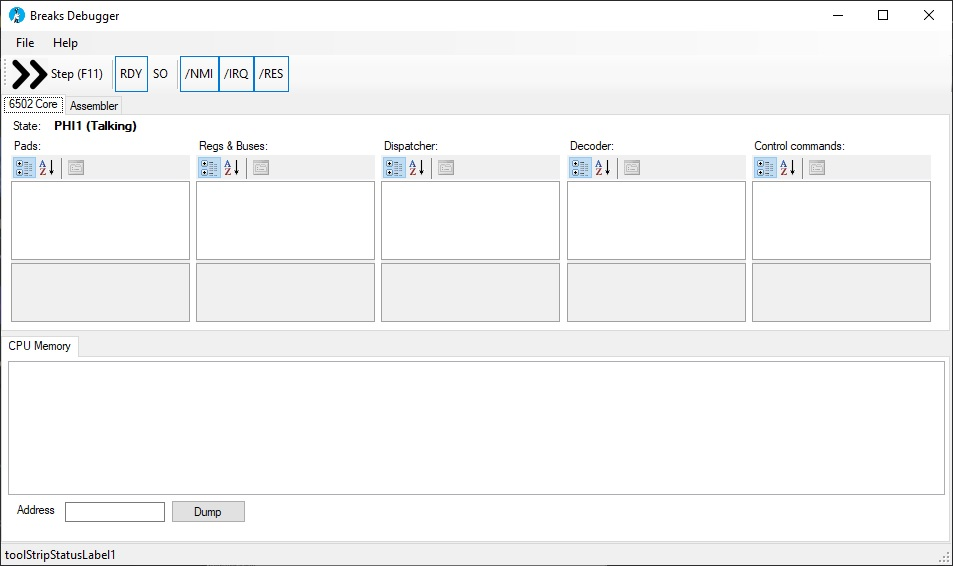

# Breaks Debugger

A simple GUI for checking the operation of the 6502 Core component (`M6502Core`).



The PropertyGrids shows signals, registers and rest of DebugInfo of the 6502 core.
Buttons above are manual control of the respective pins.
The CPU Memory tab displays the HexDump of the memory.
The Assembler tab shows a TextBox with the source, which will be assembled with the built-in Breakasm and loaded immediately into memory.

Breakasm and M6502Core are in their respective Interop DLLs.

## Build

You must use Debug/Release x86/x64 configuration to build. AnyCPU is not suitable because it uses native code in Interop DLLs.

Just don't forget to switch back to Any CPU when you need to edit forms. Microsoft has a problem with this.

It is also necessary to install all packages using NuGet (see packages.config).

## Processor State Dump for Wiki

To enable a detailed dump of all internals directly in Markdown and with pictures, you need to create the `WikiMarkdown` folder.

The state of the processor will be dumped every half-cycle. The dump will include the state of the internals as a Markdown table and a picture of what is going on at the bottom of the processor (connecting registers and internal buses).

About that:

### JSR (0x20), T1 (PHI1)

|Component/Signal|State|
|---|---|
|Dispatcher|T0: 0, /T0: 1, /T1X: 0, 0/IR: 1, FETCH: 0, /ready: 0, WR: 0, ACRL1: 0, ACRL2: 1, T5: 0, T6: 0, ENDS: 1, ENDX: 1, TRES1: 1, TRESX: 0|
|Interrupts|/NMIP: 1, /IRQP: 1, RESP: 0, BRK6E: 0, BRK7: 1, DORES: 0, /DONMI: 1|
|Extra Cycle Counter|T1: 1, TRES2: 1, /T2: 1, /T3: 1, /T4: 1, /T5: 1|
|Decoder|95: JSR (TX), 121: /IR6, 126: /IR7|
|Commands|S_ADL, SB_S, DB_ADD, Z_ADD, SUMS, ADD_SB7, ADD_SB06, ADH_PCH, ADL_PCL, ADH_ABH, ADL_ABL, DL_ADH, DL_DB|
|ALU Carry In|0|
|DAA|0|
|DSA|0|
|Increment PC|1|
|Regs||
|IR|0x20|
|PD|0x00|
|Y|0x00|
|X|0x05|
|S|0x0E|
|AI|0x00|
|BI|0xC0|
|ADD|0xFB|
|AC|0x6C|
|PCL|0x09|
|PCH|0xC0|
|ABL|0x0E|
|ABH|0xC0|
|DL|0xC0|
|DOR|0xC0|
|Flags|C: 1, Z: 0, I: 1, D: 0, B: 1, V: 0, N: 0|
|Buses||
|SB|0xFB|
|DB|0xC0|
|ADL|0x0E|
|ADH|0xC0|


## UnitTest

To run the debugger in unit test mode, you need to create a JSON like this:

```json
{
	"CompileFromSource": true,
	"MemDumpInput": "mem.bin",
	"AsmSource": "Test.asm",
	"RamStart": "0",
	"RamSize": "0x800",
	"RomStart": "0xc000",
	"RomSize": "0x4000",
	"RunUntilBrk": true,
	"RunCycleAmount": true,
	"CycleMax": 10000,
	"RunUntilPC": true,
	"PC": "0x3469",
	"TraceMemOps": false,
	"TraceCLK": true,
	"DumpMem": true,
	"JsonResult": "res.json",
	"MemDumpOutput": "mem2.bin"
}
```

And run with parameter: `BreaksDebugger Test.json`.

As input code, you can use 64 Kbytes memory dump (MemDumpInput) or assembly language source (AsmSource).

Simulator will run until it encounters instruction `BRK` (RunUntilBrk) or specified number of cycles (RunCycleAmount, CycleMax) (These are cycles, not half-cycles).

The output will be a memory dump after simulation (MemDumpOutput) and JSON with simulation results (JsonResult).
