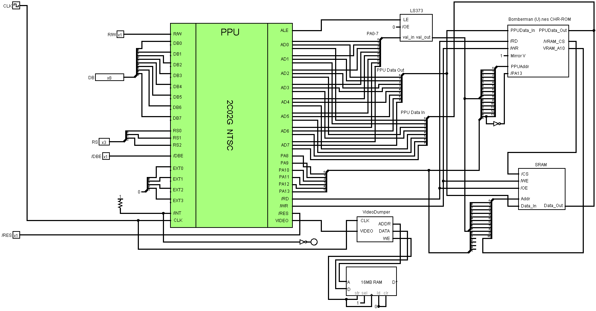
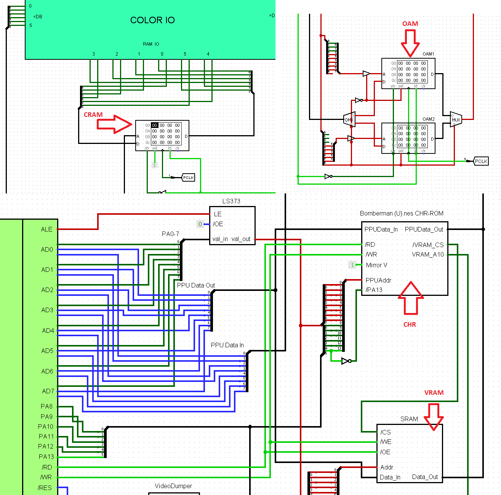
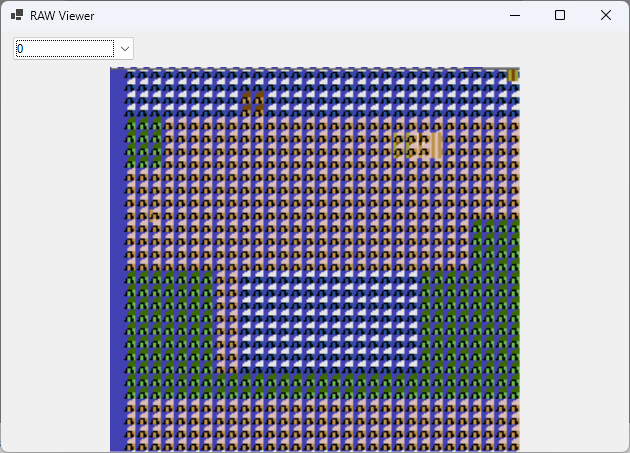

# Common

All sorts of general documentation and schematics of the general outline.

## NMOS Cheat Sheet

Typical NMOS circuits. (Logisim Evolution)

## PPUPlayer

Standalone PPU test circuit. (Logisim 2.7.1)



### Как подготовить PPU Player

Сделать следующие дампы:
- Дамп CHR (например mario_chr.bin)
- Дамп VRAM (например mario_vram.bin)
- Дамп CRAM (например mario_cram.bin)
- Дамп OAM (например mario_oam.bin)

Сделать дампы можно в любом эмуляторе или через PPU Player в меню PPU Dumps.

Конвертировать дампы в формат Logisim:

```
c:\Work\breaks\Docs\6502\6502_logisim>py -3 bin2hex.py mario_chr.bin mario_chr.hex

c:\Work\breaks\Docs\6502\6502_logisim>py -3 bin2hex.py mario_vram.bin mario_vram.hex

c:\Work\breaks\Docs\6502\6502_logisim>py -3 bin2hex.py mario_cram.bin mario_cram.hex

c:\Work\breaks\Docs\6502\6502_logisim>py -3 bin2hex.py mario_oam.bin mario_oam.hex
```

Загрузить HEX дампы в соответствующие блоки памяти:



Сделать /DBE = 1 (отключить CPU I/F).

Сделать /RES = 0, выполнить несколько циклов (сбросить PPU).

Теперь PPU готов к прожарке.

### Как дампить RAW Samples

Запускаем PPU на симуляцию и ждём пока память RAW Dump не заполнится примерно до адреса 60000 (это примерно 1 кадр).

Сохраняем дамп памяти RAW Samples (как например `mario_raw_dump.hex`).

Открываем сохраненный .hex в PPUPlayer, в меню Misc -> Load RAW Dump...

Выводится такое:



Чешем репу, исправляем схемы.

PS. Можно дампить больше одного кадра, выбирать их можно с помощью Combo Box. Если сдампится меньше кадра - то покажется "огрызок".
