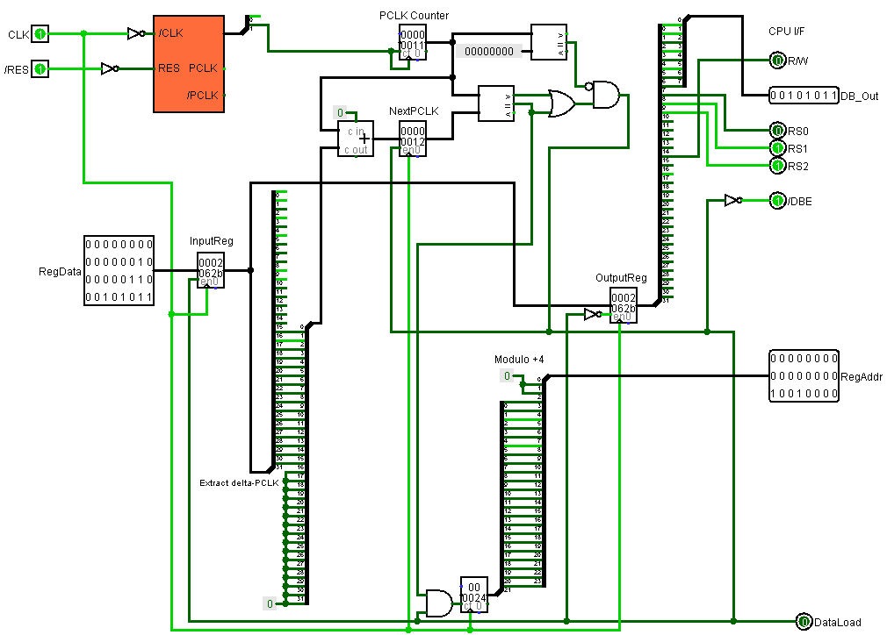

# Common

All sorts of general documentation and schematics of the general outline.

## NMOS Cheat Sheet

Typical NMOS circuits. (Logisim Evolution)

## PPUPlayer

Standalone PPU test circuit. (Logisim 2.7.1)




PPU RegDump entries format:

```c++
#pragma pack(push, 1)
struct PPULogEntry
{
	uint64_t	pclk;		// PCLK counter value at the time of writing to the register
	uint8_t 	reg; 		// PPU register index (0-7)
	uint8_t 	value;		// Written value
};
#pragma pack(pop)
```
