# Избранные фамиклоны

Раздел посвящен описанию избранных моделей фамиклонов с указанием какие чипы в них используются.

Мы отдаём отчёт что исследовать и покрыть схемами/симуляцией абсолютно все фамиклоны не представляется возможным, поэтому выбрали наболее популярные или памятные.

Список может пополняться избранными моделями из других стран и континентов, по мере возможности.

## Dendy

|Модель|Год появления (примерно)|Внешний вид|Материнская плата|Чипсет|
|---|---|---|---|---|
|Dendy Classic|1992|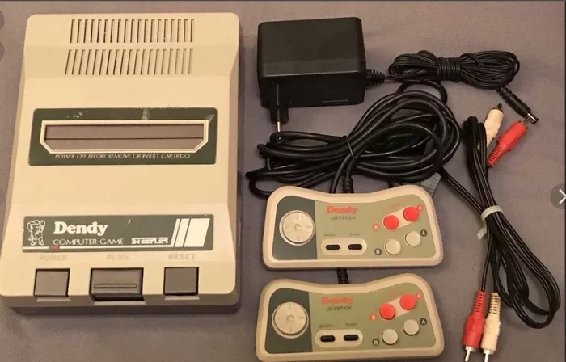| | |
|Dendy Junior|1994|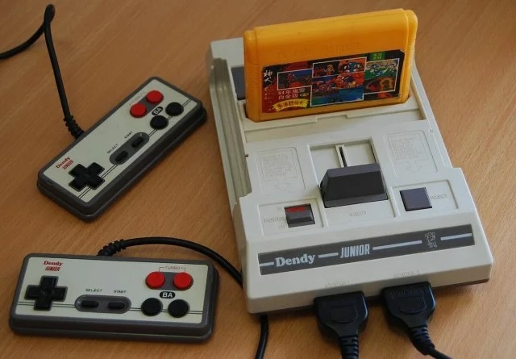| | |
|Dendy Junior II|Apr 1994|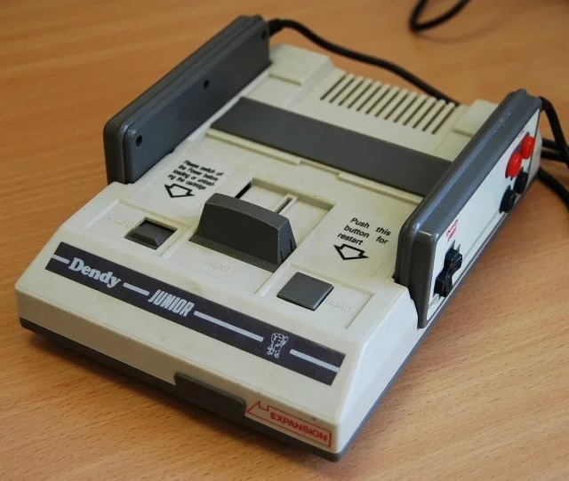| | |
|Dendy Classic II|1995|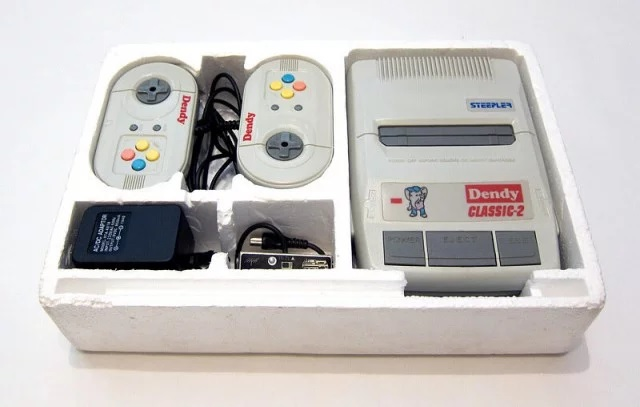| | |
|Dendy Junior IIP|???|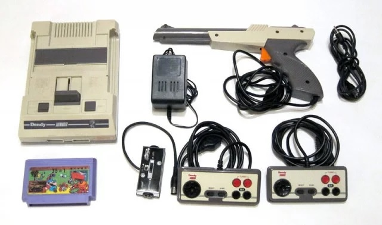| | |
|Dendy Junior IVP|Dec 1995|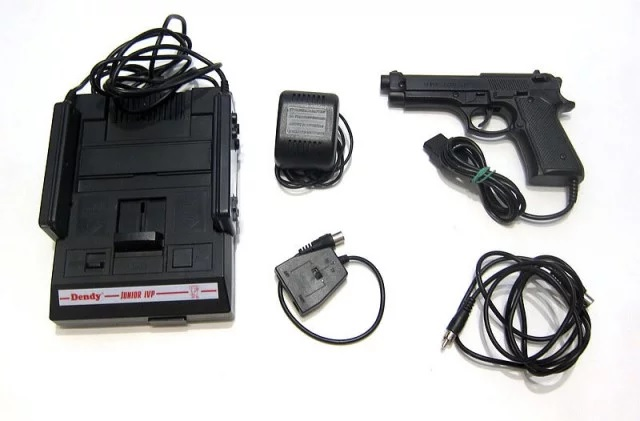| | |

Source: https://pikabu.ru/story/vse_modeli_dendy_8002424

## Lifa SM-888

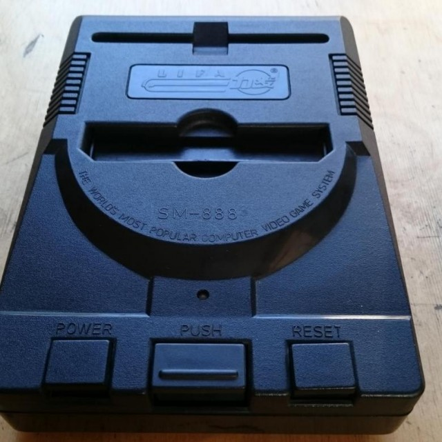

Чипсет: ??? Предположительно такой же как у Haili LM-888, т.к. сами платы и маркировки совпадают. Возможно тут мы имеем случай фамиклона-клона (но кто из них клон другого - не известно).

## Subor 225

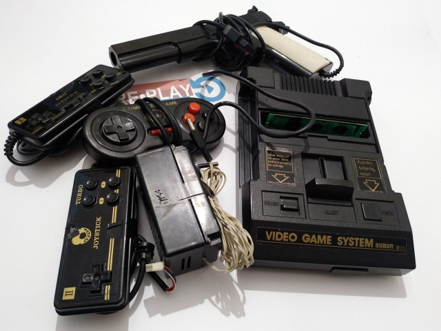

Чипсет: ???

## UFO A-5000 Space Hunter

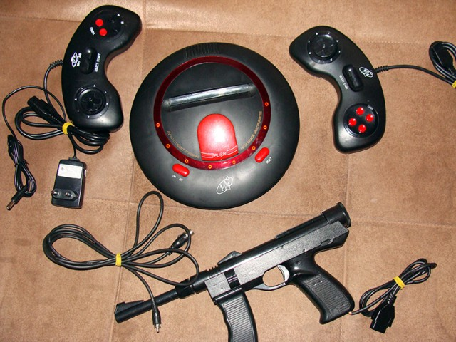

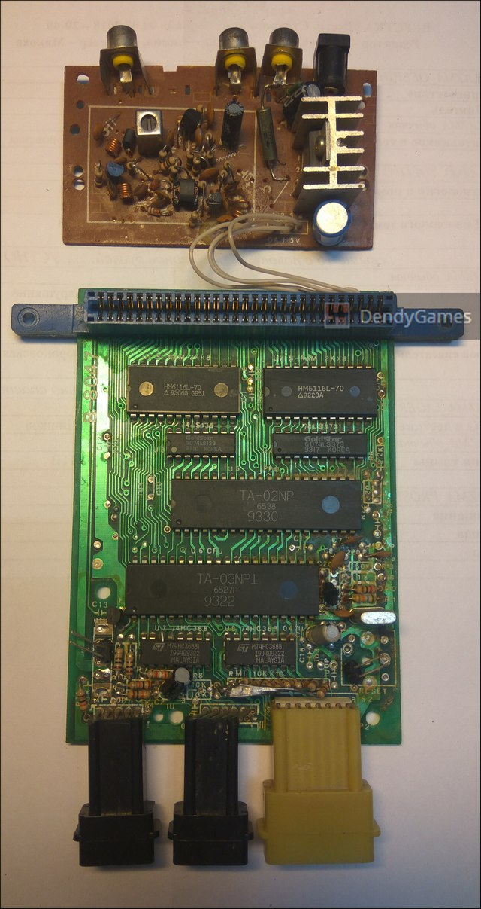

Чипсет:
- CPU: TA-03NP1 6527P
- PPU: TA-02NP 6538

https://drive.google.com/drive/u/0/folders/16vMTR6knk4e8tFodKEkxRLXA1pBfESEs

## Haili LM-888

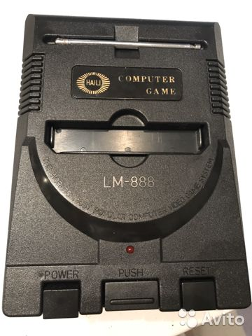

Чипсет:
- CPU+PPU: Кастомный (Unknown 5524)

https://drive.google.com/drive/u/0/folders/1U5OmcoPNSyg7ktS1RvQhBF6N_6K6oCgV

## Little Player ABC-1998

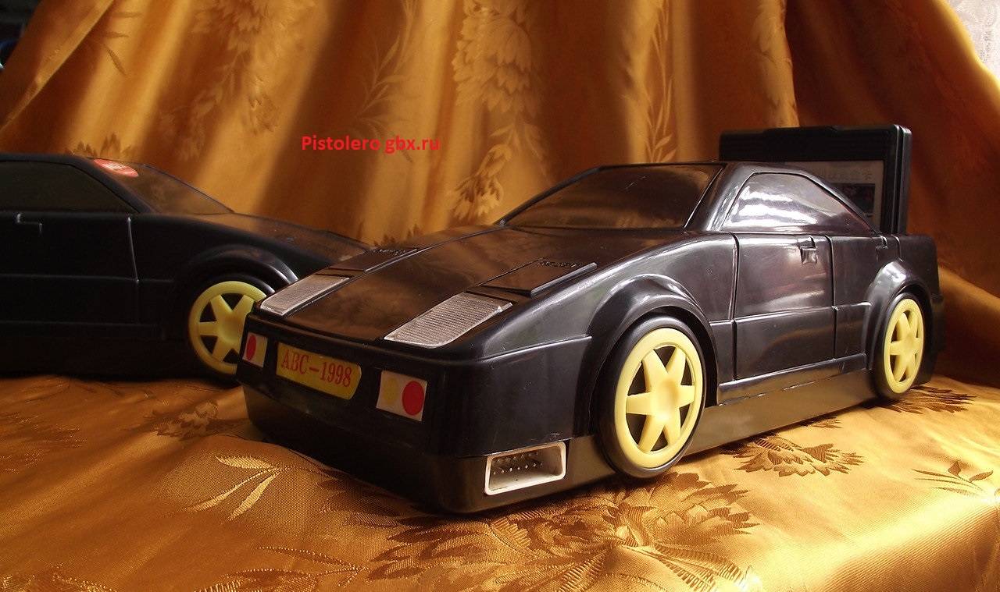

Чипсет:
- CPU+PPU: UMC A35212A

https://drive.google.com/drive/u/0/folders/1r0mNSYbnbs2wCgJb9s10NbC5BvO9k7-z
