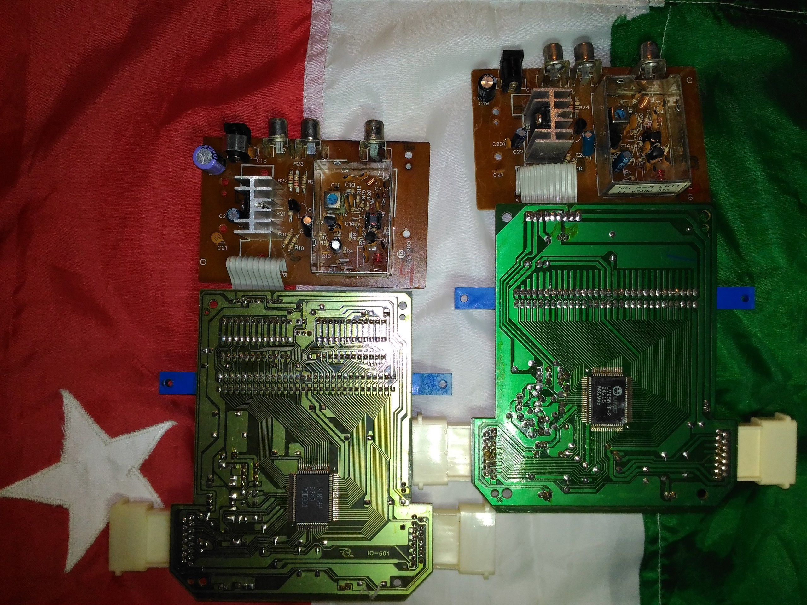
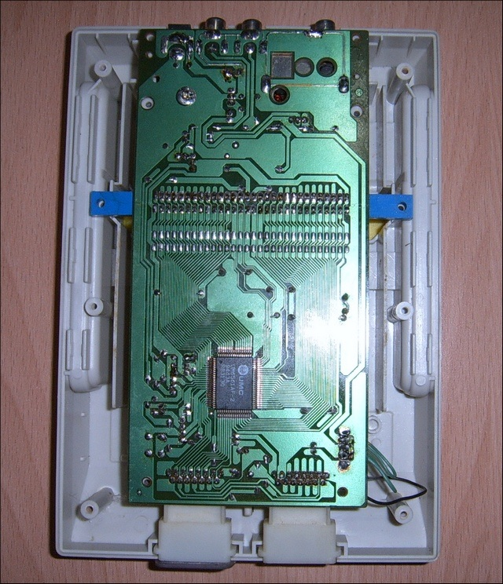
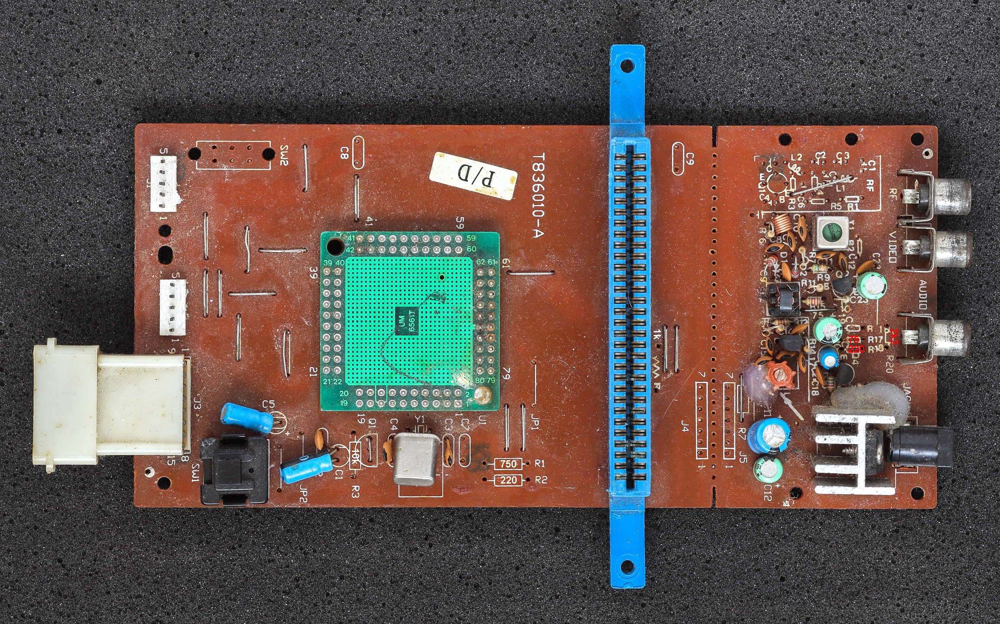
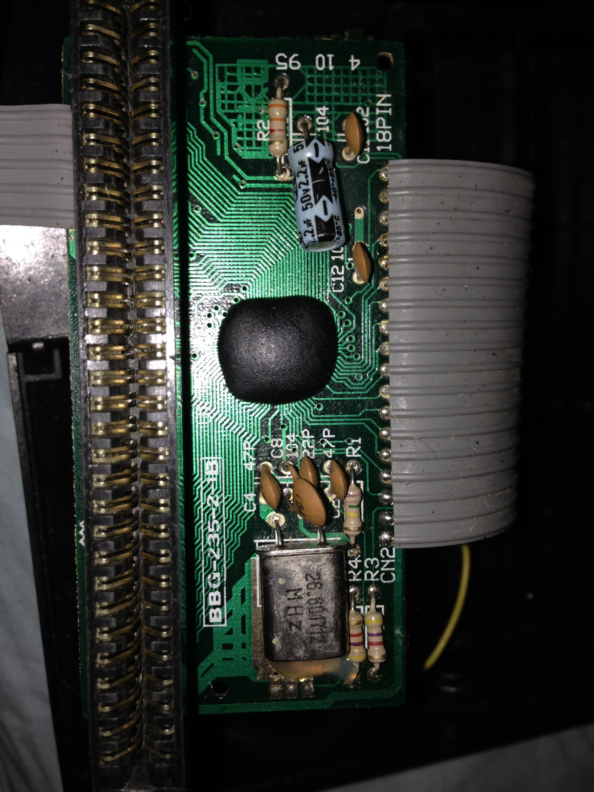

# Избранные фамиклоны

Раздел посвящен описанию избранных моделей фамиклонов с указанием какие чипы в них используются.

Мы отдаём отчёт что исследовать и покрыть схемами/симуляцией абсолютно все фамиклоны не представляется возможным, поэтому выбрали наболее популярные или памятные.

Список может пополняться избранными моделями из других стран и континентов, по мере возможности.

## Dendy

Для одинаковых моделей Dendy могли применяться разные чипсеты в разное время, поэтому выберем из них наиболее значимые варианты, а остальные будем игнорировать.

|Модель|Год появления (примерно)|Внешний вид|Материнская плата|Чипсет|
|---|---|---|---|---|
|Dendy Classic|1992|||6527P+6538 (изначально), T1818P, UM6561F-2, также был SECAM (6557+6558+6559)|
|Dendy Junior|1994|||UM6561F-2, UM6561AF-2|
|Dendy Junior II|Apr 1994|||6561A, 6561T|
|Dendy Classic II|1995|||UM6561AF-2|
|Dendy Junior IIP|???|||6561-A-4|
|Dendy Junior III| | | |Фирмой STEEPLER не выпускался, т.к. модель была выпущена другими пиратами|
|Dendy Junior IVP|Dec 1995|||??? Неидентифицированный блоб|

Как видно в модельном ряду наблюдается большой зоопарк чипсетов, поэтому при изучении чипов можно не привязываться к модели приставки. Скорее всего в разные модели ставили то что было "в тренде" (наличии) на текущий момент.

Sources:
- https://pikabu.ru/story/vse_modeli_dendy_8002424
- https://vk.com/wall-53076_294263
- https://www.emu-land.net/forum/
- https://dendygames.wordpress.com/

:warning: Dendy Classic SECAM, Dendy Junior IVP wanted dead or alive.

## Lifa SM-888

Чипсет:
- CPU+PPU: ??? Неизвестно. Предположительно такой же как у Haili LM-888, т.к. сами платы и маркировки совпадают. Возможно тут мы имеем случай фамиклона-клона (но кто из них клон другого - не известно).

## Subor SB-225

Чипсет:
- CPU+PPU: ??? Неизвестно

:warning: Wanted dead or alive.

[Source](https://dendygames.wordpress.com/2012/02/07/subor-%D1%81%D0%B0%D0%BC%D1%8B%D0%B9-%D0%BF%D0%BE%D0%BF%D1%83%D0%BB%D1%8F%D1%80%D0%BD%D1%8B%D0%B9-%D1%84%D0%B0%D0%BC%D0%B8%D0%BA%D0%BB%D0%BE%D0%BD-part-1/)

## UFO A-5000 Space Hunter

Чипсет:
- CPU: TA-03NP1 6527P
- PPU: TA-02NP 6538

https://drive.google.com/drive/u/0/folders/16vMTR6knk4e8tFodKEkxRLXA1pBfESEs

## Haili LM-888

Чипсет:
- CPU+PPU: 5524 (кроме цифр "5524" на чипе больше нет других пометок, подозрение что это даже не UMC).

https://drive.google.com/drive/u/0/folders/1U5OmcoPNSyg7ktS1RvQhBF6N_6K6oCgV

## Little Player ABC-1998

Чипсет:
- CPU+PPU: UMC A35212A

https://drive.google.com/drive/u/0/folders/1r0mNSYbnbs2wCgJb9s10NbC5BvO9k7-z

:warning: Wanted dead or alive.
