# Famicom Chipset

Always wondered what was inside the chipset of your beloved Famicom? Was it a pain to break it yourself? Nobody wanted to decap these "insignificant" chips? And here we are. We don't care.

Press F :-)

## Donor

Revision: HVC-CPU-GPM-01

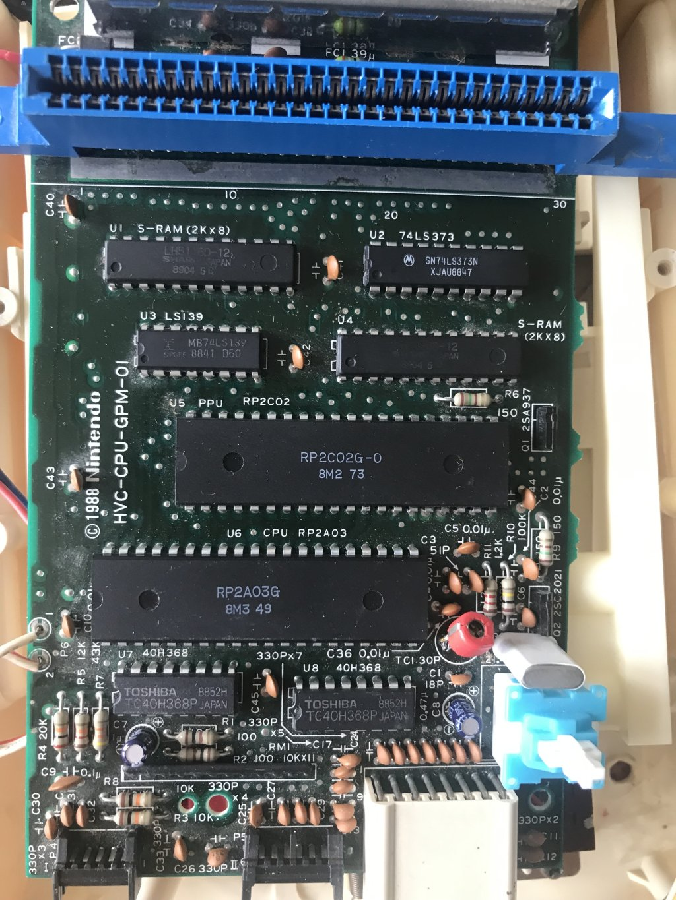

Following are photos of the chip package, a photo of the chip with DSLR in natural colours, and a microphotograph of the crystal.

## 40H368

A pair of these chips serves the Famicom's IO subsystem. Each chip is an array of inverting tristate buffers (`notif1` in Verilog terminology).
In addition, one of the tristates is used as an inverting amplifier for the main audio channel and another to invert the PA13 signal (to get its complement so that millions of cartridges will save on PA13 inverting).

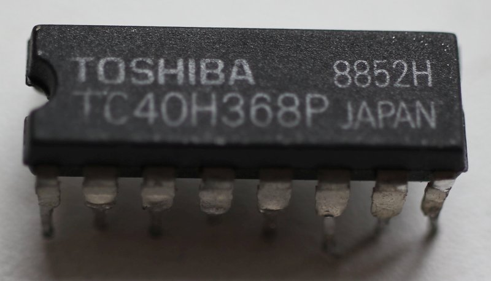

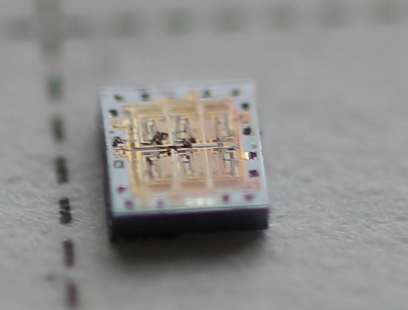

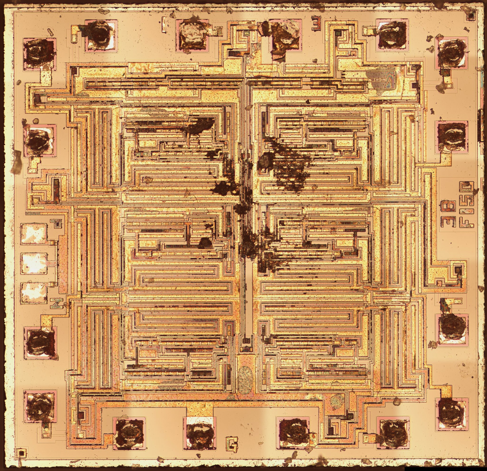

## LS139

Acts as a "bridge" for mapping different CPU memory areas (PPU registers, PRG memory located on the cartridge, internal RAM of the motherboard).

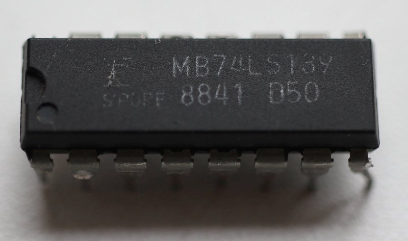

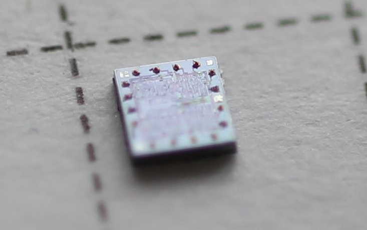

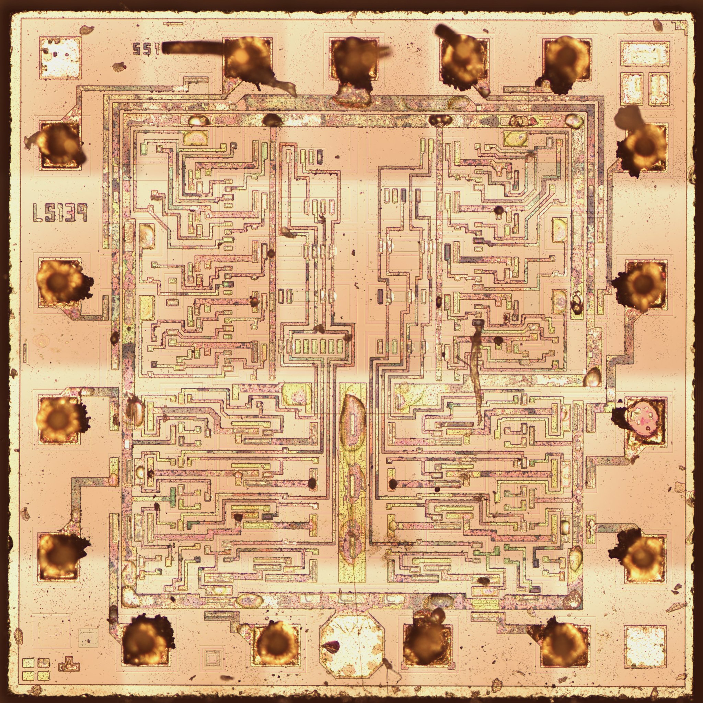

## LS373

This chip "remembers" (latches) the lower 8 bits of the PPU address, because the PPU address and data buses are multiplexed.

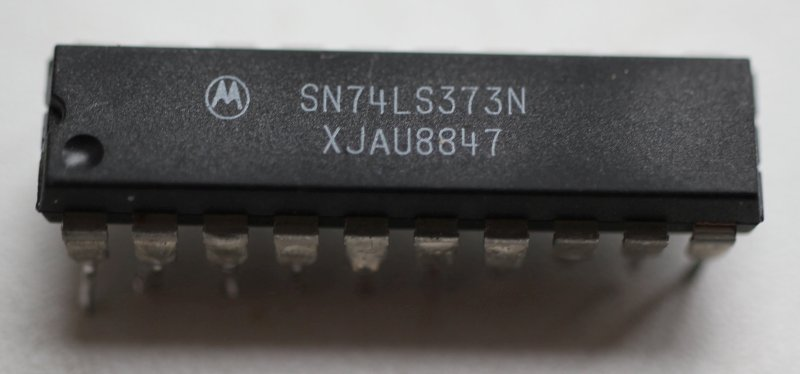

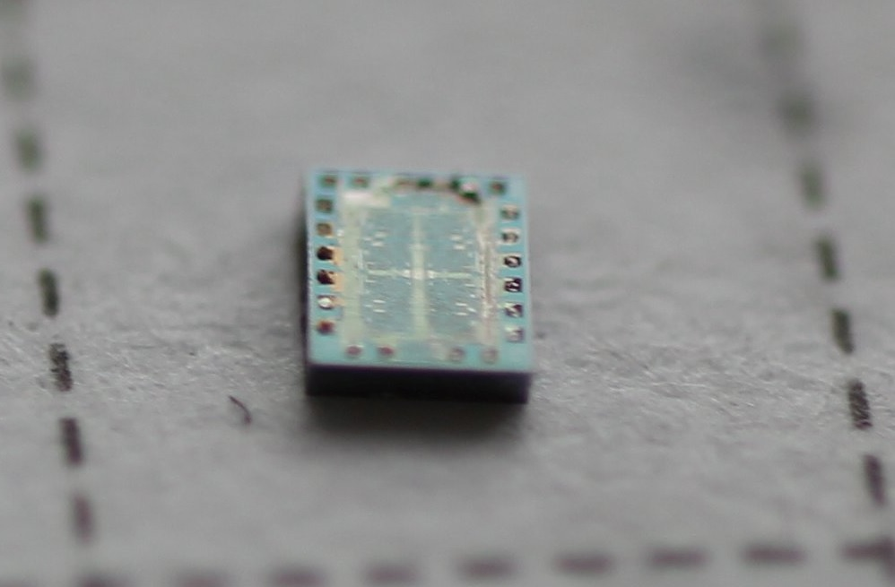

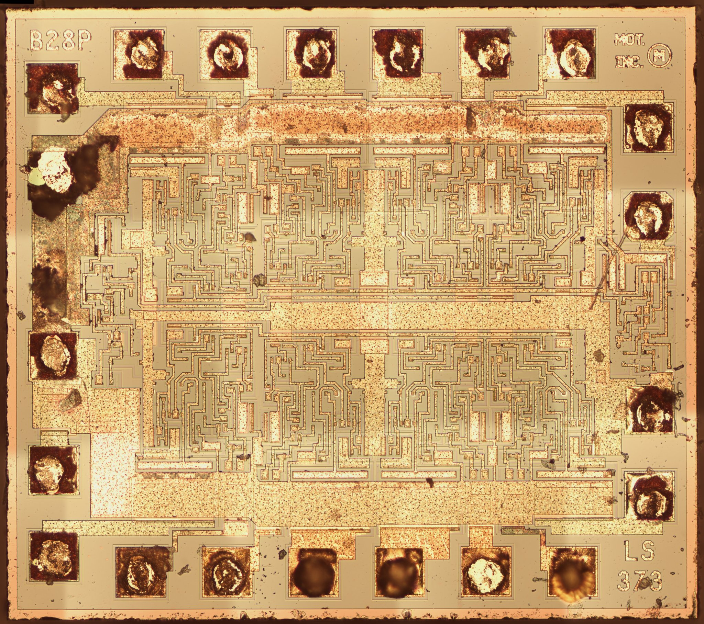

## S-RAM (LH5116D-12)

Typical static memory from the 80s/90s.

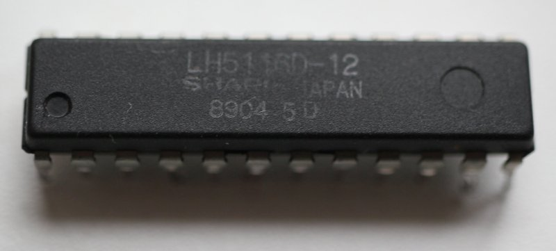

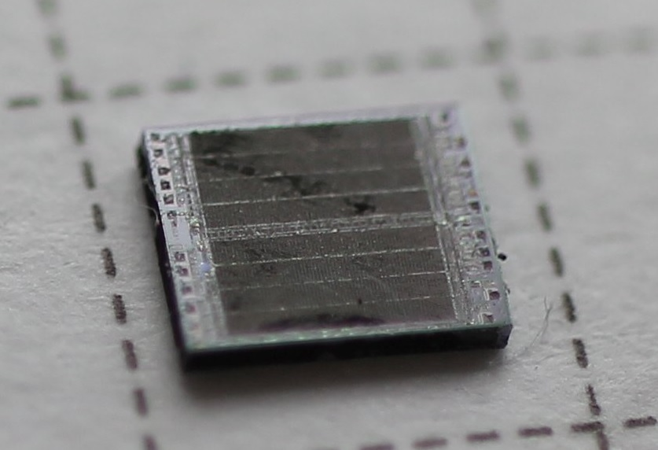

