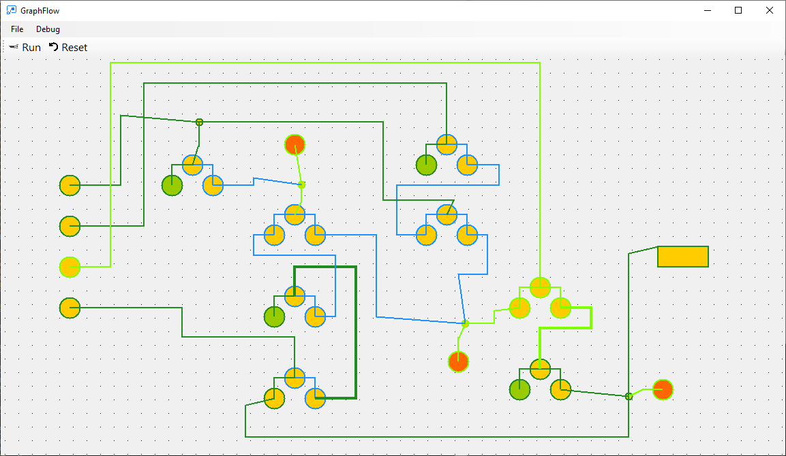
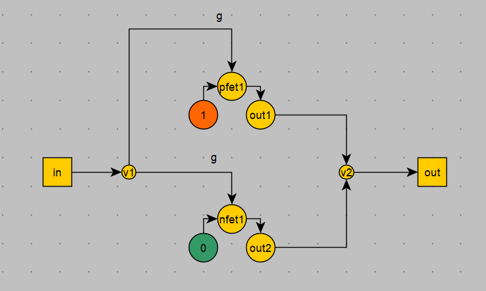

# GraphFlow

GraphFlow - симулятор цифровых схем с поддержкой виртуальных графов.

## Обзор

В основе работы GraphFlow лежит метод обхода графа (Graph::Walk), который имитирует базовую логику цифровых схем.

Формат графов - yEd GraphML. Программа yEd (https://www.yworks.com/products/yed) расширяет базовый формат GraphML геометрическим описанием вершин и ребер, т.е.
вместе с картой графа yEd .graphml файл содержит также положение, размеры, цвет, название и другие атрибуты.

GraphFlow использует эти дополнительные атрибуты следующим образом:
- Если у вершины имя содержит "pfet" или "nfet", то эта вершина считается затвором MOSFET (примеры названий: "nfet1", "nfet_alu2")
- Если в названии ребра встречается буква "g" и при этом ребро является входом для fet, то данный вход считается входом на затвор. Другой вход принимается за source.
- У транзистора может быть только один gate и только один source
- Если вершина называется "1" (точно), то она принимается за Power
- Если вершина называется "0" (точно), то она принимается за Ground

Все остальные элементы можно делать произвольными (цвет, размер, форму и проч.)

Пример транзистора:

Направление графа строго ориентированное, то же самое касается транзисторов.

## Хранение значений

Значения вершин и ребер хранятся как nullable int. 1 и 0 означают логические уровни. null соответствует значению z (отсоединено, floating).

## Вложенные графы

Если какая-то вершина соответствует названию какого-то графа, то исполнение заходит "внутрь" соответствующего графа.

При этом должно соблюдаться правило соотвествия в названиях входных/выходных вершин вложенного графа и входных/выходных ребер исходного графа.

Пример:

Если входов или выходов ровно 1, то называть ребра не обязательно (соответствие и так очевидно).

## Виртуальные графы

Существует (пока не существует) возможность симулировать работу вложенного графа, путём выполнения программного кода.

Для этого к основной программе подключаются дополнительные .DLL, которые содержат реализацию виртуальных графов.

Виртуальный граф принимает список входов и возвращает список выходов, а вся внутренняя логика работы зависит от реализации. То есть получается своего рода "черный ящик".

Виртуальные графы позволят значительно ускорить симуляцию цифровых схем, например для ускорения работы стандартных ячеек или целиком отдельных блоков микросхемы.

## Управление графами

Для загрузки дополнительного графа в коллекцию нужно выполнить File -> Load Graph...

Загруженный граф добавится к текущей коллекции (List<Graph>). Имя графа задается в соответствии с именем файла (без расширения).

Если граф с таким именем уже есть в коллекции, то он не добавляется.

Коллекция отображается в левой части экрана. Выбрать текущий (RootGraph) можно кликнув по графу из списка. Либо двойным кликом по вершине, которая соответствует вложенному графу.

Виртуальные графы добавляются в коллекцию сразу после запуска программы.

## Соединение графов (Xrefs)

При добавлении нового графа производится перебор всех вершин существующих графов и если встречается вершина с именем добавляемого графа,
то все ребра этой вершины соединяются с соответствующими ребрами добавляемого графа.

Затем производится перебор всех вершин добавляемого графа в поисках связей с уже существующими графами.

Для каждой связываемой вершины создается отдельная инстанция под-графа.
