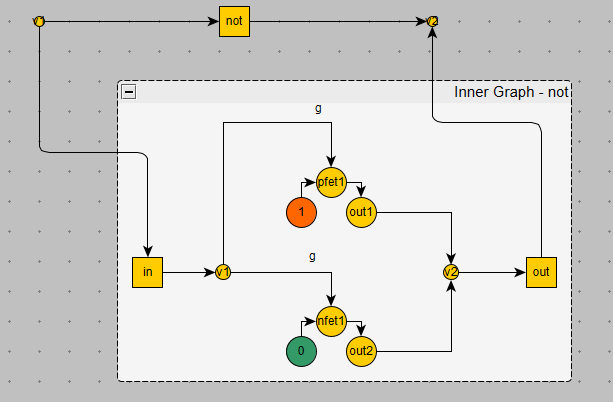

# GraphFlow

GraphFlow is a digital circuit simulator with virtual graph support.

## Overview

GraphFlow is based on the graph traversal method (`Graph::Walk`), which mimics the basic logic of digital circuits.

The graph format is yEd GraphML. The yEd program (https://www.yworks.com/products/yed) extends the basic GraphML format with a geometric description of nodes and edges, i.e.
along with the yEd graph map, the .graphml file also contains position, dimensions, color, name, and other attributes.

GraphFlow uses these additional attributes as follows:
- If a node has a name that contains "pfet" or "nfet", then that node is considered a MOSFET gate (examples of names: "nfet1", "nfet_alu2")
- If there is a "g" in the name of an edge and the edge is an input for a fet, then this input is considered to be a gate input. The other input is taken as source.
- A transistor can have only one gate and only one source
- If a node is named "1" (exact) then it is taken as power
- If the node is named "0" (exactly), then it is taken as Ground

All other elements can be made arbitrary (color, size, shape, etc.)

Example of a transistor:

The direction of the graph is strictly oriented, the same is true for the transistors.

## Storing Values

Node and edge values are stored as nullable int. 1 and 0 stand for logical levels. null corresponds to a z-value (disconnected, floating).

## Nested Graphs

If any node corresponds to the name of some graph, the execution goes "inside" the corresponding graph.

The rule of correspondence in names of input/output nodes of nested graph and input/output edges of source graph must be observed.

Example:

If the inputs or outputs are exactly 1, it is not necessary to name the edges (the correspondence is obvious).

## Virtual Graphs

It is possible (not yet) to simulate the operation of a nested graph by executing program code.

To do this, additional .DLLs are plugged into the main program that contain the implementation of virtual graphs.

The virtual graph accepts a list of inputs and returns a list of outputs, and all internal logic depends on the implementation. So it becomes a kind of "black box".

Virtual graphs can significantly speed up the simulation of digital circuits, for example to accelerate the operation of standard cells or entire individual blocks of the chip.

## Managing Graphs

To load an additional graph into the collection, execute File -> Load Graph...

The loaded graph will be added to the current collection (`List<Graph>`). The name of the graph is set according to the file name (without extension).

If a graph with this name already exists in the collection, it is not added.

The collection is displayed on the left side of the screen. You can select the current one (RootGraph) by clicking on the graph in the list. Or by double-clicking on the node that corresponds to the nested graph.

Virtual graphs are added to the collection immediately after you start the program.

## Connecting Graphs (Xrefs)

When a new graph is added all nodes of existing graphs are searched and if there is a node with the name of added graph,
all edges of this node are connected with corresponding edges of added graph.

Then all nodes of the added graph are searched for connections with already existing graphs.

For each connected node a separate instance of a sub-graph is created. This sub-graph is "glued" to the current graph, but all its elements are not displayed on the screen (have no visual elements).

## Why Orgraphs

A compelling reason to choose directional graphs is that all modern FETs are arranged so that they can work well in only one direction (Source -> Gate).
