# Module test waveforms (MOS6502 Core, issue #1337)

Screenshots of GTKWave itself (v3.3.128, window capture) for every module
testbench: the matching `waves/<test>.gtkw` save file is opened in GTKWave
with a zoomed time window so the waveforms are readable, and the window is
captured to `<test>.png`. Each `waves/<test>.gtkw` can also be opened in
GTKWave directly against the `<test>.vcd` dump.

Regenerate after a change (needs Windows GTKWave + PowerShell):

```
iverilog -D ICARUS -o <test>.run ../../../Common/*.v ../../../Core6502/*.v <test>.v
vvp <test>.run
Scripts/gtkw_capture_all.sh
```

| Test | Result | Waveform |
|---|---|---|
| clock_test | TEST PASS | 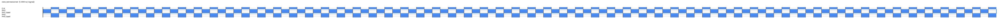 |
| addr_bus_test | TEST PASS | 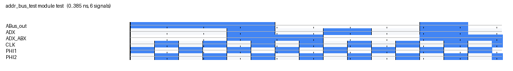 |
| data_bus_test | TEST PASS | 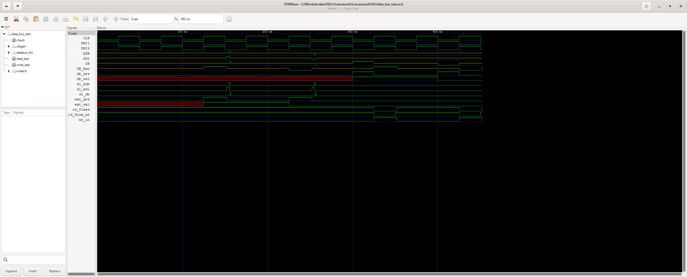 |
| busmux_test | TEST PASS (8 checks) | 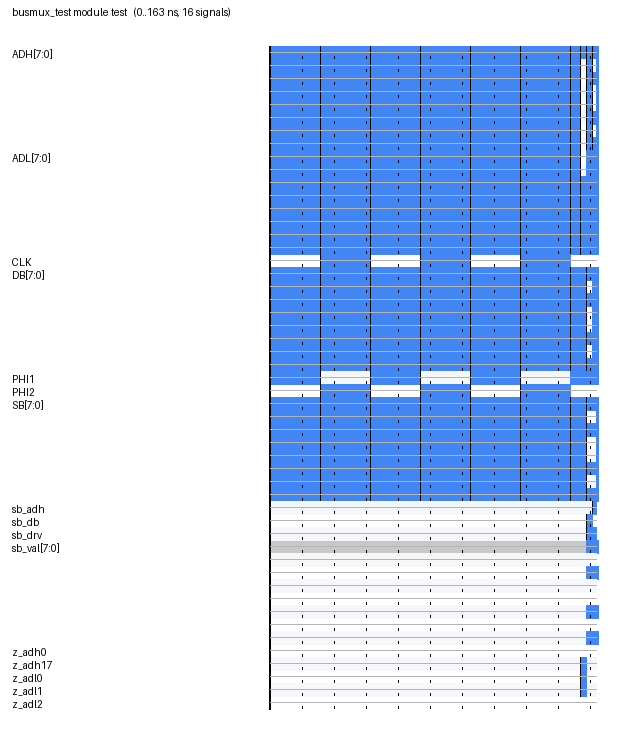 |
| alu_test | TEST PASS (24 checks) | 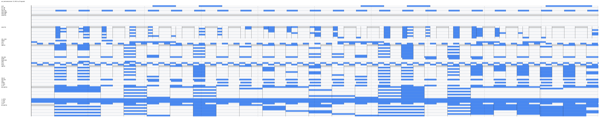 |
| flags_test | TEST PASS (6 checks) | 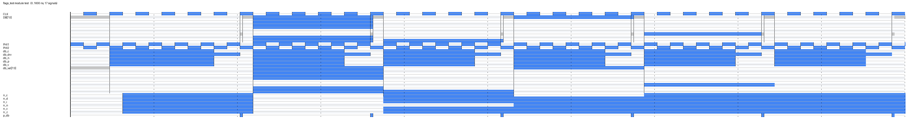 |
| pads_test | TEST PASS (12 checks) | 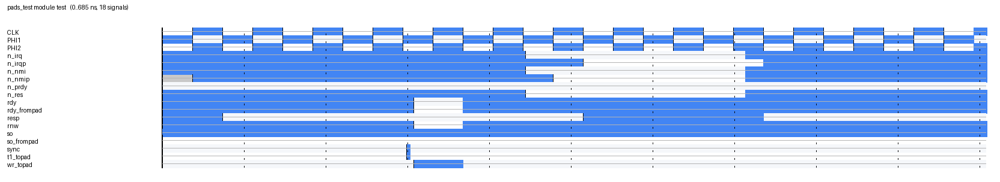 |
| ir_test | TEST PASS (7 checks) | 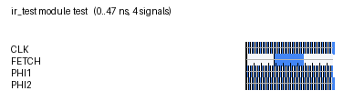 |
| predecode_test | TEST PASS (257 checks) | 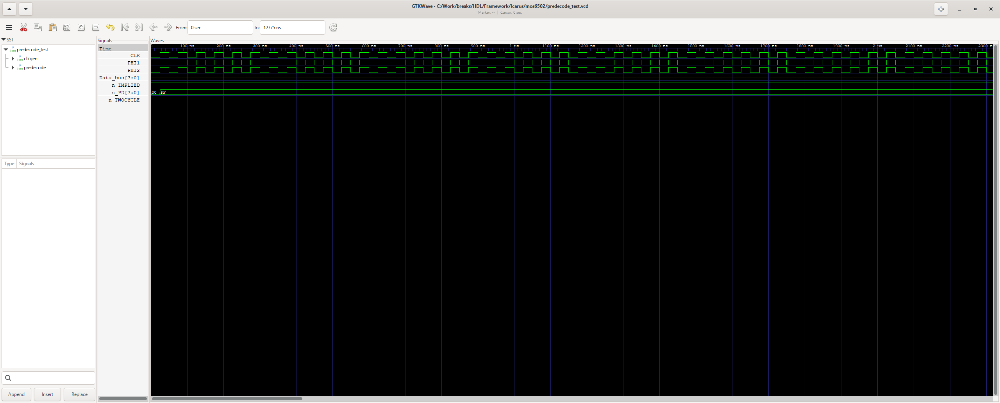 |
| decoder_test | waveform (CSV dump) | 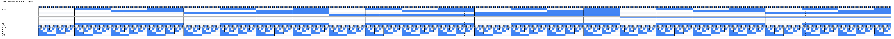 |
| extra_counter_test | TEST PASS (26 checks) | 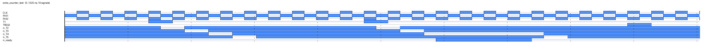 |
| branch_logic_test | TEST PASS (128 checks) | 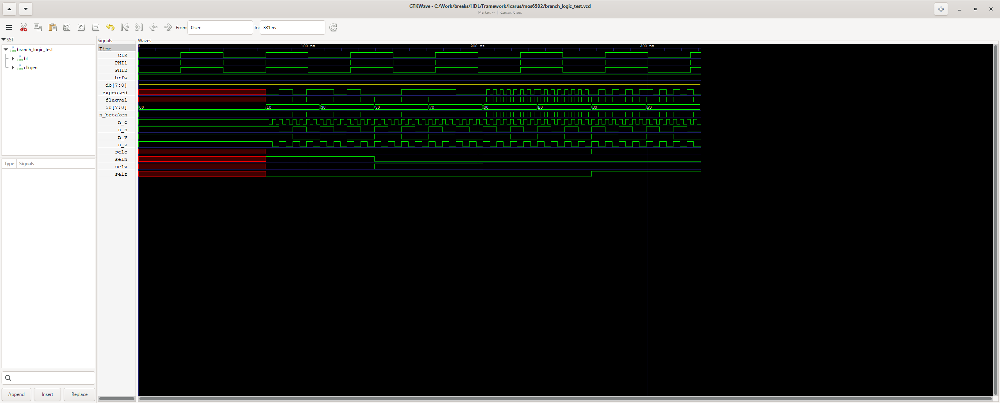 |
| brk_test | waveform | 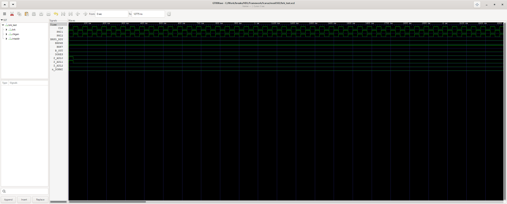 |
| dispatch_test | waveform | 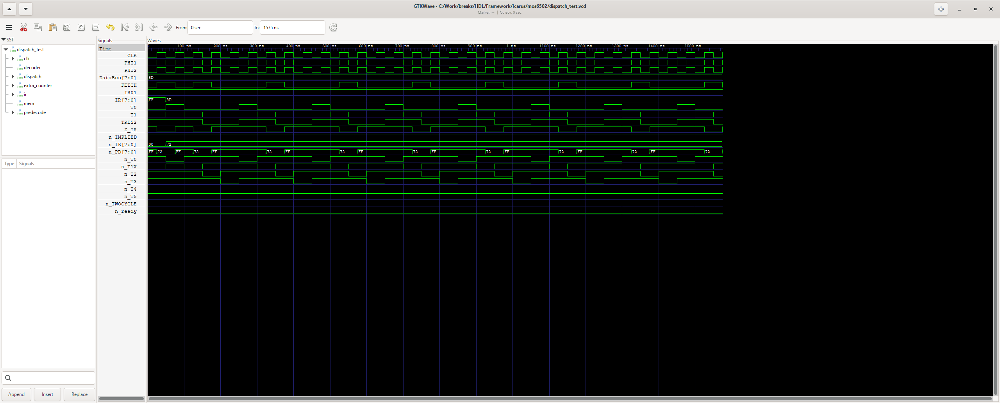 |
| alu_control_test | waveform | 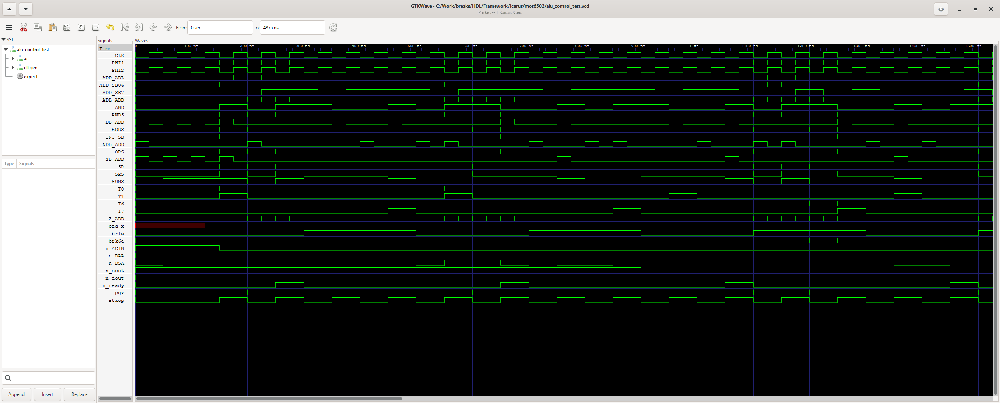 |
| bus_control_test | waveform | 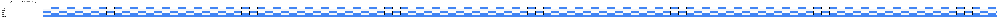 |
| flags_control_test | waveform |  |
| pc_control_test | waveform | 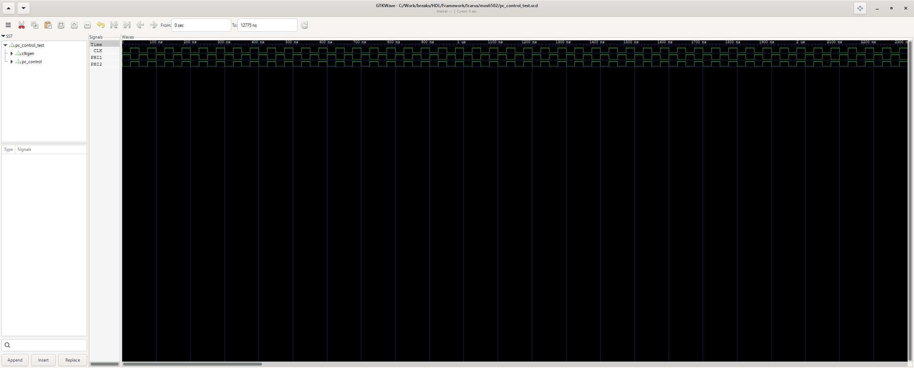 |
| regs_control_test | waveform | 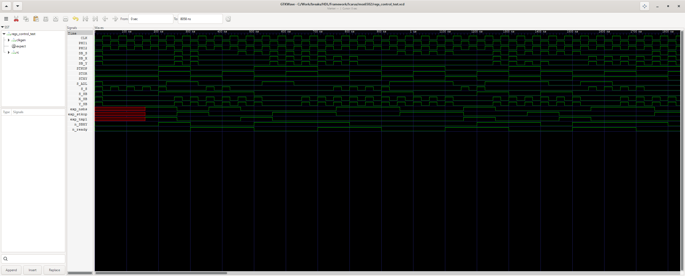 |
| pc_test | waveform |  |
| regs_test | TEST PASS (9 checks) | 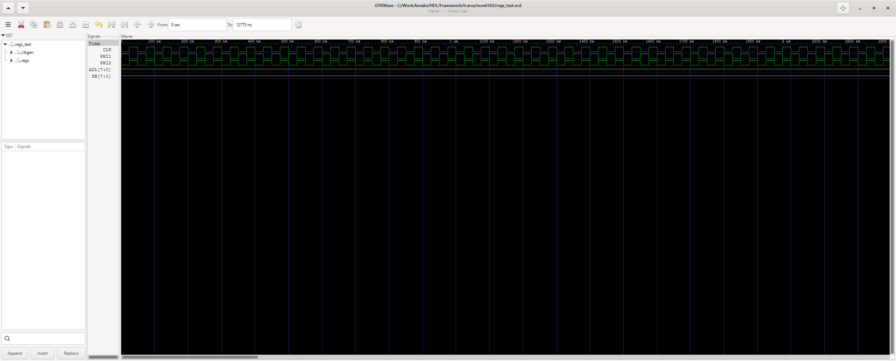 |
