# Module test waveforms (PPU HDL, issue #1388)

Self-checking Icarus Verilog testbenches for every module of `HDL/PPU`
(see `BreakingNESWiki/PPU/*.md` for the module documentation). Each test
prints `TEST PASS (N checks)` / `TEST FAIL`; the ones gated by the PPU
revision macro are verified for both `RP2C02` (NTSC) and `RP2C07` (PAL).

Every testbench writes a `.vcd` dump; the matching `waves/<test>.gtkw` save
file opens it in GTKWave (v3.3.128) with a zoomed time window, and the
`waves/<test>.png` is a capture of that window. "What to look at" tells you
which signals on the diagram carry the interesting behaviour.

Regenerate a waveform after a change (needs Windows GTKWave + PowerShell):

```
iverilog -g2012 -D RP2C02 -D ICARUS -o <test>.run ../../../Common/*.v ../../../PPU/*.v <test>.v
vvp <test>.run
Scripts/gtkw_capture_ppu.sh   # (or Scripts/gtkw_capture_ppu_retry.sh)
```

`run_module_tests.sh` in this directory runs every module testbench (it skips
the long whole-PPU/full-frame tests: fsm_test, vidout_test, ppu_top_test —
run their `*_ntsc.bat` / `*_pal.bat` wrappers directly).

## Test list and what to look at

| Module / test | Result | Waveform | What is shown / where to look |
|---|---|---|---|
| Pixel clock — `pclk_test.v` (`_ntsc.bat`, `_pal.bat`) | TEST PASS (351) NTSC+PAL |  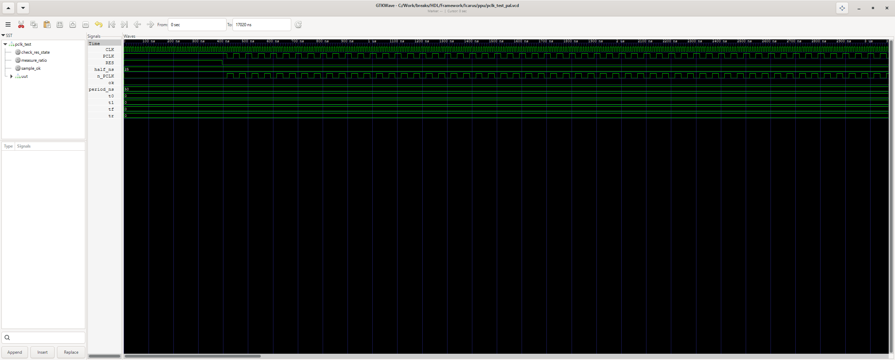 | CLK vs PCLK/n_PCLK: NTSC divides CLK by 4, PAL by 5; 50% duty, complementary phases, RES freeze/release. |
| H/V counters — `hv_test.v` (`hv_test.bat`) | TEST PASS (219971) | 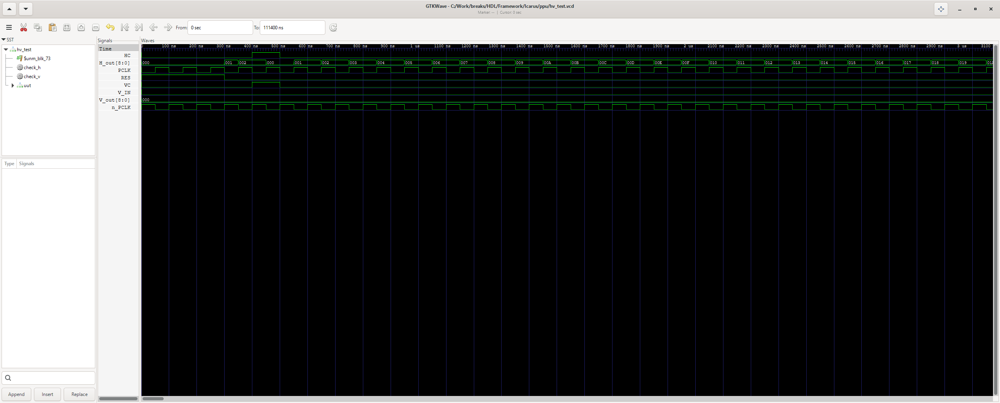 | H_out stepping +1 per PCLK, HC/VC clears, V_IN gating, RES clear. |
| H/V decoder — `hv_decoder_test.v` (`_ntsc.bat`, `_pal.bat`) | TEST PASS (35356/35856) |  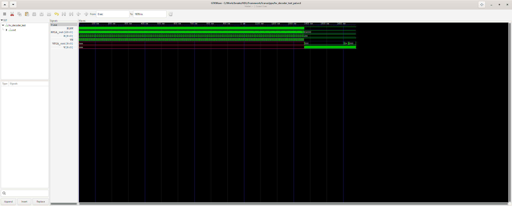 | Full H/V sweep: every HPLA output fires only on its wiki-table pixels; VB/BLNK gating kills CLIP//VIS rows. |
| H/V FSM — `fsm_test.v` (`fsm_test_ntsc.bat`, `fsm_test_pal.bat`) | TEST PASS (1586/1886) | 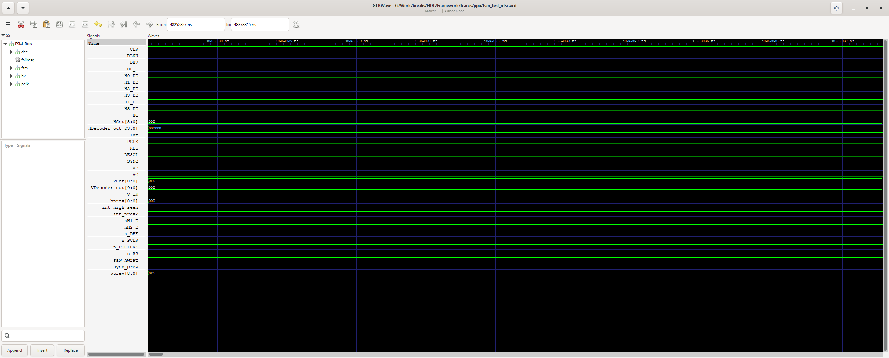 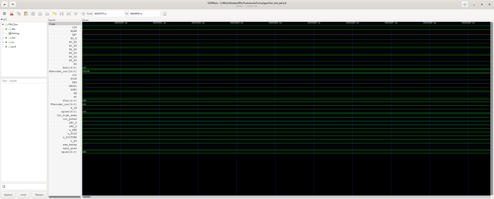 | "PPU Zero": HCnt/VCnt stepping and line/frame lengths, one SYNC per scanline, VB/BLNK up in vblank, INT set at vblank + $2002 read-clear. |
| Pads / CPU I/F — `pads_test.v` (`pads_test.bat`) | TEST PASS (71) NTSC+PAL | 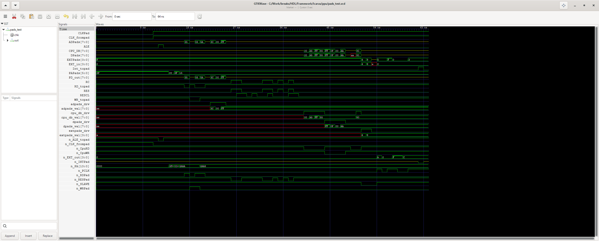 | D0-D7 read/write/idle tri-state, ALE/AD/A//RD//WR pads, EXT master/slave, RC=RES register-clear, open-drain /INT. |
| Registers $2000-$2007 — `regs_test.v` (`regs_test.bat`) | TEST PASS (55) | 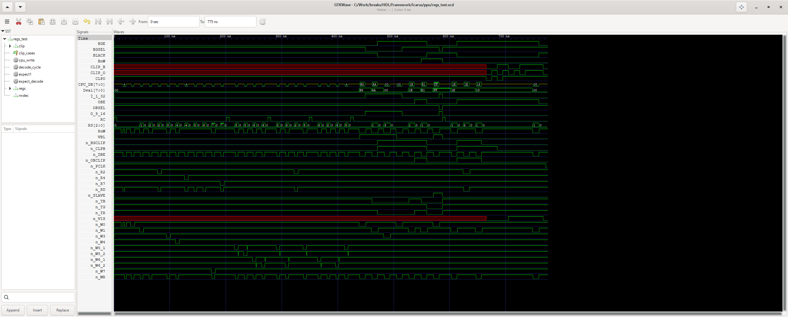 | RS/R/W decode pulses n_W0..n_R7, SCC first/second toggle, $2000/$2001 bit mapping incl. inverted outputs, RC clear, Clipper truth. |
| Scroll registers — `scroll_regs_test.v` (`scroll_regs_test.bat`) | TEST PASS (21) | 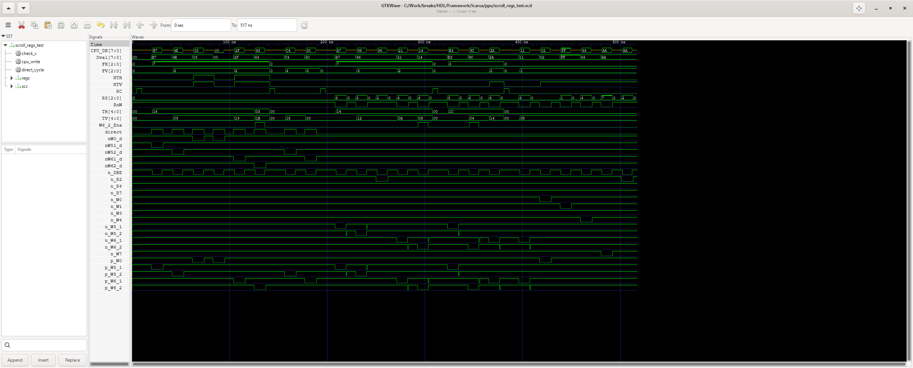 | $2005/$2006 first/second write order: FH/FV/TH/TV/NTH/NTV latches + full VRAM address reconstruction v={FV,NTV,NTH,TV,TH}. |
| OAM (sprite RAM) — `oam_test.v` (`oam_test.bat`) | TEST PASS (778) | 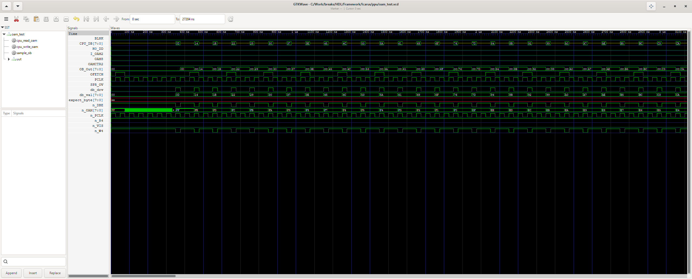 | 256-byte round trips via the $2004 port (posedge-PCLK capture), OB_Out mirror, CPU_DB tri-state. |
| Sprite evaluation — `obj_eval_test.v` (`obj_eval_test.bat`) | TEST PASS (45) | 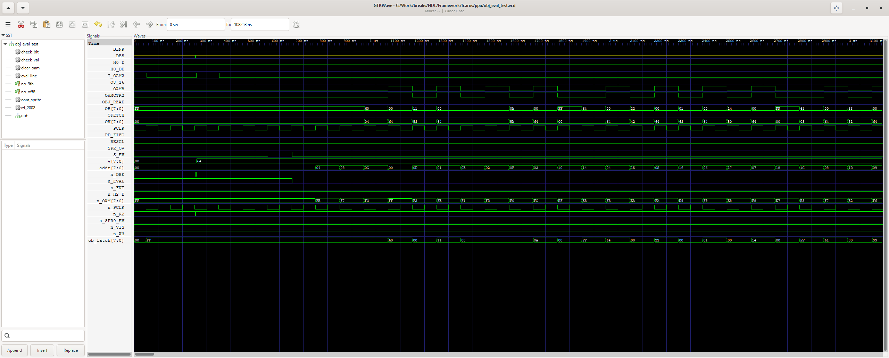 | A full 64-sprite evaluation pass: Y-range copies to temp OAM in order, sprite-0 detect, 9-on-line overflow (SPR_OV/DB5), fetch-window PD_FIFO/OV. |
| Object FIFO — `fifo_test.v` (`fifo_test.bat`) | TEST PASS (78) | 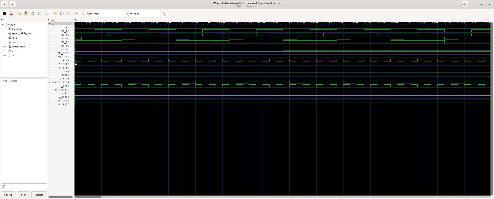 | Sprite pixels: lane load from H3''..H5''/OBJ_READ, X countdown, 8-pixel shift-out, priority lane0-wins, CLPO left-8 clip, n_SPR0HIT, n_OBJ_RD_ATTR. |
| CRAM (palette RAM) — `cram_test.v` (`cram_test.bat`) | TEST PASS (460) | 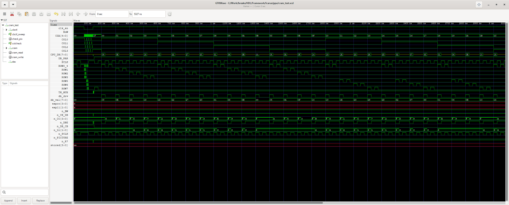 | CRAM_Decoder column/row decode, CB_Control palette-$2007 decode, 32-entry CPU write/read round trips, 6-bit storage, mono/colour output gating. |
| Picture mux — `mux_test.v` (`mux_test.bat`) | TEST PASS (44) | 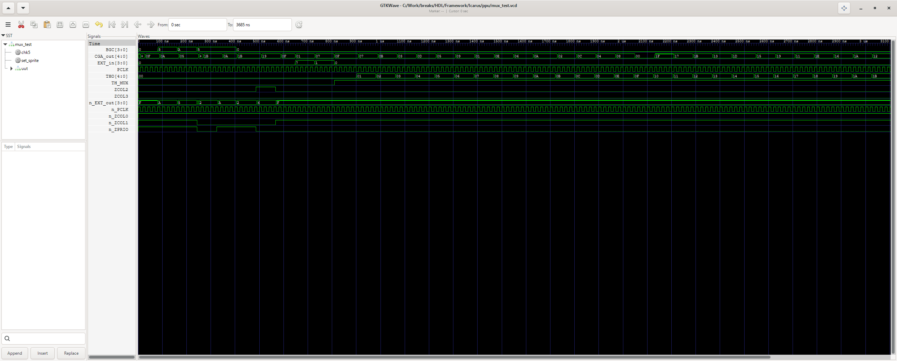 | BG vs sprite vs EXT pixel selection and priority, transparent sprite, TH_MUX direct-colour mode, n_EXT_out. |
| Sprite-0 hit — `spr0hit_test.v` (`spr0hit_test.bat`) | TEST PASS (11) | 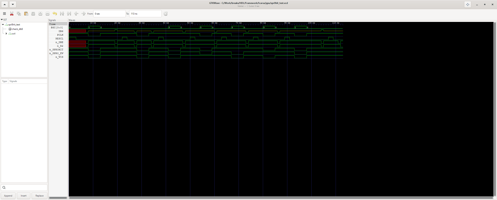 | Strike set/hold/clear, RESCL clear, DB6 ($2002[6]) readback. |
| PAMUX (VRAM address mux) — `pamux_test.v` (`pamux_test.bat`) | TEST PASS (6) | 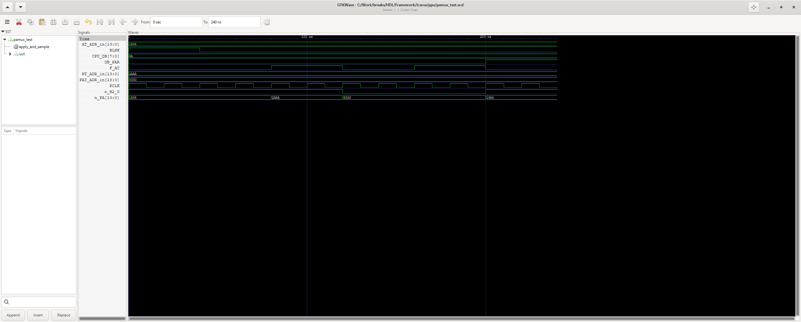 | NT/AT/PAT/CPU-DB source selection per fetch control; active-low n_PA outputs. |
| PAR (pattern address) — `par_test.v` (`par_test.bat`) | TEST PASS (9) | 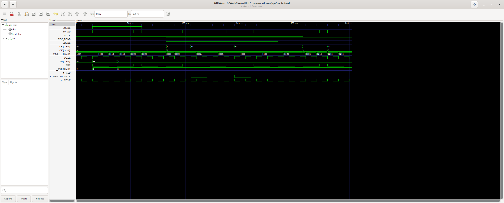 | Pattern address assembly for BG and 8x8/8x16 sprites incl. V-flip (par.md bit roles). |
| BG colour / pattern shifters — `bgcol_test.v` (`bgcol_test.bat`) | TEST PASS (983) | 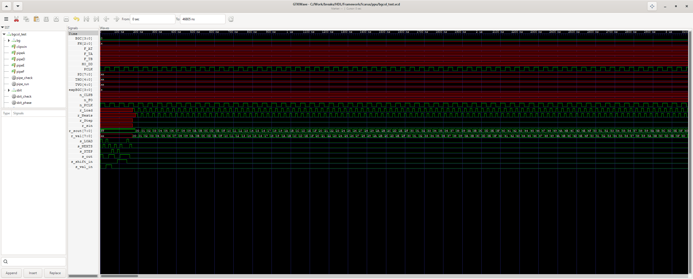 | Pattern load (F_TA/F_TB) + per-pixel shift of both bitplanes with fine-H rotation, attribute quadrant bits, /CLPB clip; per-pixel BGC asserted against the fed pattern/attribute model on the real FSM fetch schedule. |
| Tile counters — `tilecnt_test.v` (`tilecnt_test_ntsc.bat`, `tilecnt_test_pal.bat`) | TEST PASS (66390/56404) | 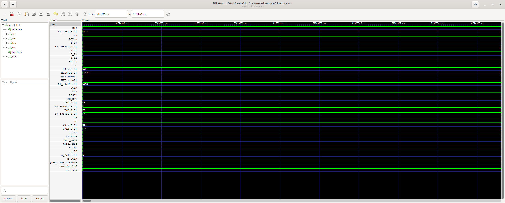 | THO coarse-X full 32-cycle per line with dot-256 reload, TVO/fine-Y vertical walk with NTY wrap, NT fetch address decode. |
| VRAM controller — `vram_ctrl_test.v` (`vram_ctrl_test.bat`) | TEST PASS (193) | 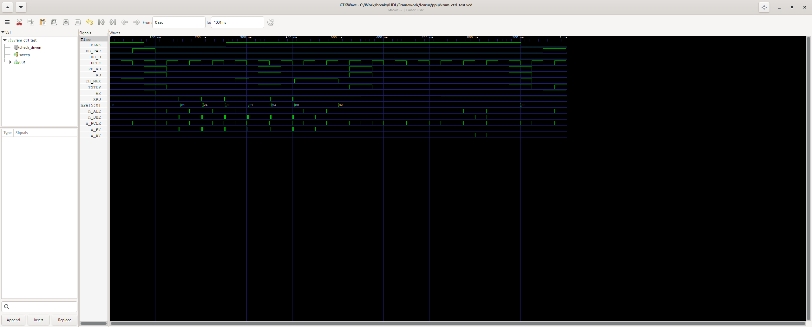 | TH_MUX decode, XRB read-buffer handshake (buffer open only on non-palette $2007 reads), outputs never x/z. |
| Read buffer — `readbuffer_test.v` (`readbuffer_test.bat`) | TEST PASS (10) | 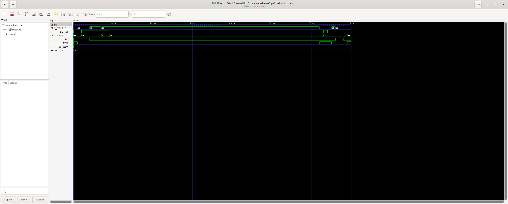 | RC reset dominance, PD_RB load/hold, XRB=1 disconnects DB. |
| Video generator — `vidout_test.v` (`vidout_test_ntsc.bat`, `vidout_test_pal.bat`) | TEST PASS (32930/56055) | 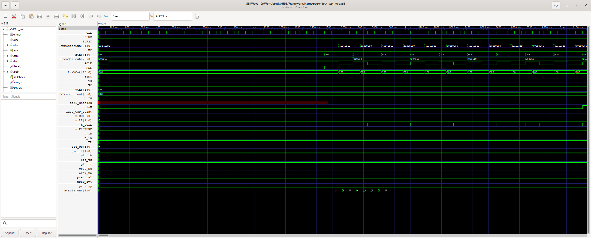  | RawVOut levels vs the wiki table for all 16 chroma x 4 luma on real FSM timing: sync level during SYNC, burst during BURST, per-line phase alternation (PAL V0). |
| Composite DAC — `dac_test.v` (`dac_test.bat`) | TEST PASS (3093) | 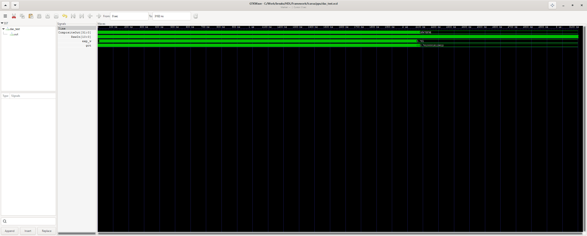 | Full 2048-word level sweep: float32 CompositeOut vs the documented level table; emphasis factor, sync override, monotonicity. |
| Whole PPU — `ppu_top_test.v` (`ppu_top_test.bat`) | TEST PASS (13) | 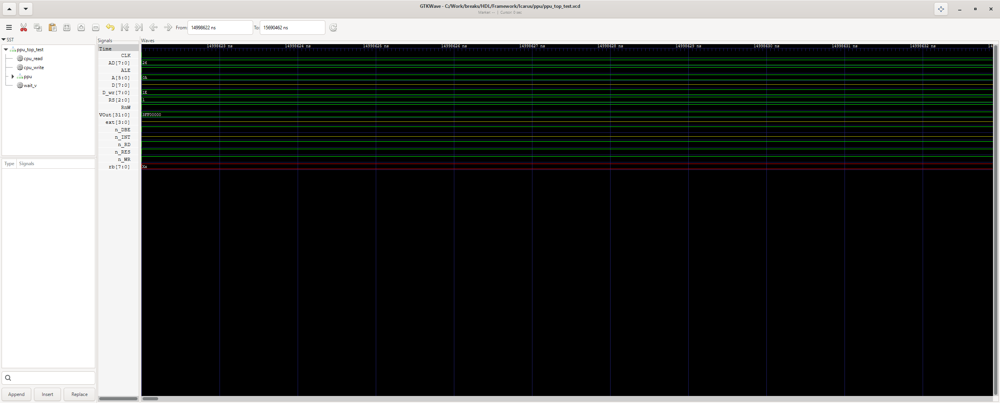 | Reset, CPU register writes ($2000/$2001), OAM $2004 store, $2002 vblank flag + read-clear, INT/n_INT, H/V ranges, VOut defined. |
| Whole PPU render reference — `ppu_render.v` (`ppu_render.bat`) | runs (waveform) | 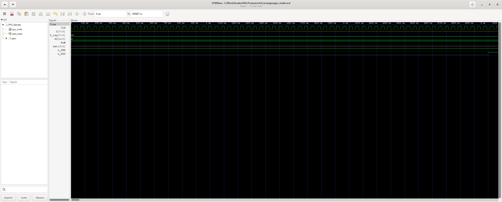 | Full-PPU run with rendering enabled ($2001=0x1E) and 64 OAM sprites: register bus writes, then fetch/rendering activity on the datapath signals and VOut. |

## Notes

- All `waves/*.gtkw` reference the VCD with an absolute Windows path
  (`C:/Work/breaks/...`), so open them from this checkout (GTKWave v3.3.128).
- `*.vcd` / `*.run` files are git-ignored; the tracked artefacts are the
  `*_test.v` benches, the `.bat` wrappers and `waves/*.gtkw|png`.
- Bugs found while writing these tests were fixed in `HDL/PPU/*`:
  dead translated wiring (pamux/par/fifo/obj_eval/tilecnt/bgcol/cram/scroll_regs),
  inverted decode logic (regs $2005/$2006 order, mux sprite-opacity,
  ReadBuffer XRB polarity, pads RC, vram DAC float width), unconnected nets
  (`ppu_top` PpuRegs.n_DBE, fsm VBlankInt vset_latch2.q, obj_eval DB5 enable)
  — see the git history and the comments in the touched module files.
