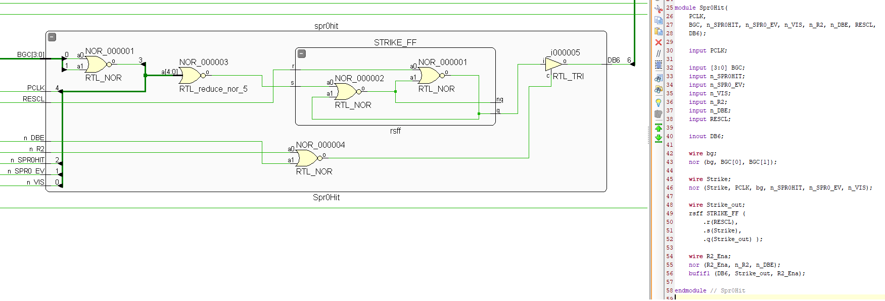

# NES/Famicom Chips HDL

This folder contains HDLs for the main NES chips: APU(+6502 Core) and PPU.

TBD: Right now only _TOP_ circuits, we will add more as we go.

## Approach

We take a chip-perfect approach. This means that all the circuit elements of the original NMOS chips are repeated in the verilog design.

Example:

We are aware of the fact that this approach is not modern because for the most part all circuits remain asynchronous and this can lead to various problems with jitter and timing.

But you want to keep the original.

All such special "legacy" blocks are placed in the `Common` folder, where all elements can be changed to synchronous if desired.
