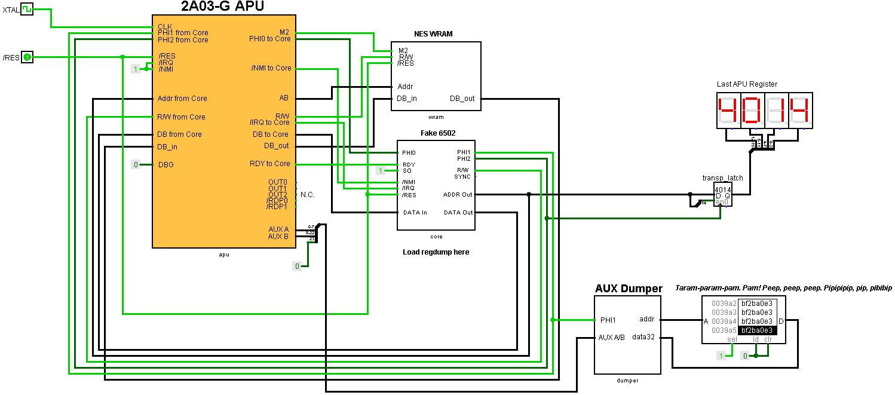

# Logisim

All sorts of general documentation and schematics of the general outline for Logisim.

## NMOS Cheat Sheet

Typical NMOS circuits. (Logisim Evolution)

## PPUPlayer

Standalone PPU test circuit. (Logisim 2.7.1)


### Как подготовить PPU Player

Сделать следующие дампы:
- Дамп CHR (например mario_chr.bin)
- Дамп VRAM (например mario_vram.bin)
- Дамп CRAM (например mario_cram.bin)
- Дамп OAM (например mario_oam.bin)

Сделать дампы можно в любом эмуляторе или через PPU Player в меню PPU Dumps.

Конвертировать дампы в формат Logisim:

```
c:\Work\breaks\Docs\6502\6502_logisim>py -3 bin2hex.py mario_chr.bin mario_chr.hex

c:\Work\breaks\Docs\6502\6502_logisim>py -3 bin2hex.py mario_vram.bin mario_vram.hex

c:\Work\breaks\Docs\6502\6502_logisim>py -3 bin2hex.py mario_cram.bin mario_cram.hex

c:\Work\breaks\Docs\6502\6502_logisim>py -3 bin2hex.py mario_oam.bin mario_oam.hex
```

Загрузить HEX дампы в соответствующие блоки памяти:


Сделать /DBE = 1 (отключить CPU I/F).

Сделать /RES = 0, выполнить несколько циклов (сбросить PPU).

Сделать /RES = 1 (отменить сброс)

Зайти внутрь PPU и нажать кнопку рядом с сигналом RC для мануального сброса Reset_FF, чтобы не ждать целый кадр сигнала RESCL.

Через CPU I/F установить: R/W = 0, DB = 0b00011000, /DBE = 0, RS = 0b001. Выполнить несколько циклов. Это включит рендеринг PPU ($2001 = 0x18).

По аналогии можно дополнительно установить регистр $2000 для выбора банка CHR, как этого требует игра (биты OBSEL / BGSEL).

Сделать снова /DBE = 1 (отключить CPU I/F).

Теперь PPU готов к прожарке.

### Как дампить композитный видеосигнал

Запускаем PPU на симуляцию и ждём пока память VideoDumper не заполнится примерно до адреса 9E000 (это примерно 1 кадр).

Сохраняем дамп памяти VideoDumper (как например `mario_ntsc_dump.hex`).

Открываем сохраненный .hex в PPUPlayer, в меню Misc -> Load Composite Dump...

PS. Можно дампить больше одного кадра, выбирать их можно с помощью Combo Box. Если сдампится меньше кадра - то покажется "огрызок".

## APU Player

Standalone APU test circuit. (Logisim 2.7.1)




