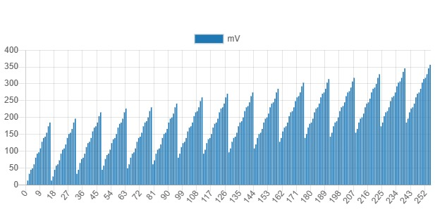
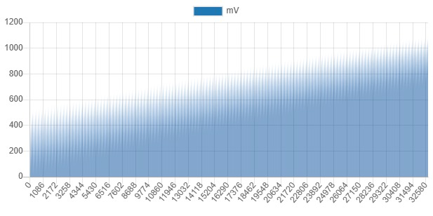

# Scripts

Various scripts, to automate the chip researcher's activities.

## APU_DAC_Generator

APU DAC table generator, separately for AUX A/B channels.

Produced by simple calculations based on the internal resistance of the APU DAC transistors and external resistance on the motherboard.

|||
|---|---|

:warning: A simplified FET model with linear resistance is used. Actually there is some tricky formula with cubic relationship to input voltage, but for low voltages this will do.

To run:
```
python3 APU_DAC_Generator.py
```

## bin2hex

A script to convert a binary file into HEX Logisim format (+modified version that works with 32-bit data).

## TopoShredder

A script for slicing the topology/tran pictures into small pieces. I'm tired of doing it by hand every time.

To run:
```
python3 TopoShredder.py -apu
python3 TopoShredder.py -ppu
```
